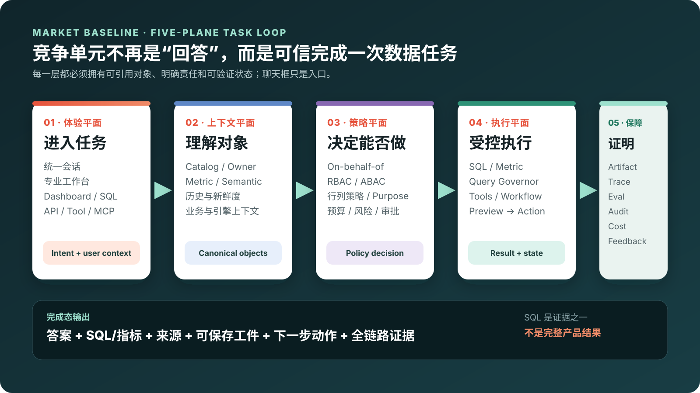

# 数据智能、Databricks 与数据库 Agent 产品决策研究

[](https://github.com/zcimon57-svj/databricks-lakehouse-agent-demo/actions/workflows/pages.yml)

一套面向领导、产品和数据/数据库/Agent 团队的决策与演示包。项目不再只回答“Databricks 怎么用”，而是用三层证据回答一个更重要的问题：数据智能竞争的新基线是什么，华为云的差距发生在哪些产品接缝，以及应由 DataArts 迭代、数据库新建，还是双平面共建。

> 当前总目标与展示契约见 [V2 决策 Brief](docs/02-data-intelligence-decision-brief.md)。原 [Databricks 项目 Brief](docs/00-project-brief.md) 保留为 Phase 1 实测与演示记录，不被覆盖。

[在线决策首页](https://zcimon57-svj.github.io/databricks-lakehouse-agent-demo/) · [67 项能力全集](https://zcimon57-svj.github.io/databricks-lakehouse-agent-demo/independent_exploration_2026-08-19/vendor-entry-atlas.html#capabilities) · [内容索引](index.md) · [友商可视报告](https://zcimon57-svj.github.io/databricks-lakehouse-agent-demo/independent_exploration_2026-08-19/agent-entry-governance-visual-report.html) · [华为产品决策专题](https://zcimon57-svj.github.io/databricks-lakehouse-agent-demo/site/huawei-rds-agent.html) · [Genie 专题](https://zcimon57-svj.github.io/databricks-lakehouse-agent-demo/site/genie.html) · [全部录屏](https://zcimon57-svj.github.io/databricks-lakehouse-agent-demo/site/details/recordings.html)



## 三条证据线

| 研究线 | 解决的问题 | 当前状态 |
|---|---|---|
| Databricks 真实演示 | 领先产品如何把数据、治理、语义、Genie 和外部入口串成用户旅程 | 已在 Free Edition 工作区用合成数据验证，并保留 11 段真实录屏 |
| 11 家厂商公开资料研究 | 市场共同基线、领先样本和 Agent 入口演进是什么 | 已形成 67 项能力、10 个维度、证据账本、入口图谱和可视报告 |
| 华为产品决策 | DataArts、AgentArts、RDS/DAS 的领域权威和产品归属如何确定 | 当前为公开资料研究与方案假设；需通过 G1–G6 账号、技术、客户和商业验证 |

当前结论不是固定产品路线，而是优先验证“双平面、一条客户旅程”：DataArts 管数据与语义，RDS/DAS 管数据库执行，AgentArts 管任务编排，共享对象、OBO 身份、策略、任务/工件/动作状态、Trace、Eval、Audit 与 Cost。任何一项都必须保留为待验证假设，直到拿到端到端证据。

## 推荐入口

| 入口 | 适合对象 | 核心内容 |
|---|---|---|
| [领导决策首页](https://zcimon57-svj.github.io/databricks-lakehouse-agent-demo/site/index.html) | 领导、产品委员会、跨团队评审 | 一屏结论、三类证据、五平面基线、华为接缝、四种产品归属、G1–G6、业务故事与精选录屏 |
| [67 项能力全集](https://zcimon57-svj.github.io/databricks-lakehouse-agent-demo/independent_exploration_2026-08-19/vendor-entry-atlas.html#capabilities) | 产品、竞品、架构与实施团队 | 按能力域、厂商和证据状态筛选 67×11 矩阵，并查看 12 类数据源、前置准备、责任边界与 CSV |
| [Agent 入口与治理可视报告](https://zcimon57-svj.github.io/databricks-lakehouse-agent-demo/independent_exploration_2026-08-19/agent-entry-governance-visual-report.html) | 战略、竞品、架构团队 | 11 家厂商入口、分层评分、差距与共享控制面研究 |
| [厂商入口图谱](https://zcimon57-svj.github.io/databricks-lakehouse-agent-demo/independent_exploration_2026-08-19/vendor-entry-atlas.html) | 产品经理、竞品研究 | 逐家查看入口、专业工作台、外部 Agent 与治理旅程 |
| [华为产品归属与验证](https://zcimon57-svj.github.io/databricks-lakehouse-agent-demo/site/huawei-rds-agent.html) | DataArts、AgentArts、RDS/DAS 和决策团队 | Databricks 对标清单、六个产品模块、PG-first 业务故事、目标架构、四种归属选项和 G1–G6 |
| [Genie 深度演示](https://zcimon57-svj.github.io/databricks-lakehouse-agent-demo/site/genie.html) | 数据分析、平台和 Agent 团队 | Genie 实现、多种用法、Sources/Instructions、Monitor/Benchmark、内嵌/API/外部 Agent |
| [云数据库到数据 Agent](https://zcimon57-svj.github.io/databricks-lakehouse-agent-demo/site/database-agent.html) | 数据库和云数据库架构团队 | Unity Catalog-like、语义、安全执行、评测、动作网关和三条数据库接入路线 |
| [14 段录屏与讲稿](https://zcimon57-svj.github.io/databricks-lakehouse-agent-demo/site/details/recordings.html) | 演示人、培训和复盘 | 普通话有声版、无声原版、时长、讲解重点和证据边界 |

## 重点业务故事

- 经营分析：从“为什么毛利下降”进入，复用权威指标和 Join，得到可复算答案、证据 SQL、可保存工件和后续任务；
- 智能售后：联查订单、退款、客户与工单，生成客户证据包和行动队列；退款、改订单、发消息保持独立审批；
- 业务影响与数据库诊断：把收入/成功率/延迟与慢 SQL、等待、告警、变更和拓扑放在同一时间线，降低业务损失窗口；
- SaaS 内嵌：外部用户或 Agent 带最终用户与租户上下文复用语义、执行、任务状态和证据，不获得共享高权限数据库连接。

## Databricks 实测交付

- 11 段真实 AWS Databricks Free Edition 工作区录屏和 3 段本地架构/历史方案演示；
- 14 段普通话有声 MP4，共 73 个按画面转场对齐的解说片段；
- 11 张可离线展示的 SVG，其中新增五平面任务闭环、华为共享控制面总架构和六模块内部架构图集；
- 14 份确定性合成数据，共 18,498 行；
- 14 张 Delta managed tables、3 个业务视图、1 个 Genie Benchmark 表和 9/9 个可信 SQL 查询；
- Genie 绑定 7 个受治理数据源，覆盖自然语言分析、智能售后和数据库运维案例。

配音校验见 [中文配音校验记录](evidence/workspace/zh-voiceover-validation.md)。H1 华为 RDS 双引擎 90 天录屏、旧 SVG 和早期研究稿保留为 **Phase 1 历史方案**；独立调研之后，它们不再代表当前立项承诺。

## 证据标签与边界

- **[工作区实测]**：仅覆盖 2026-08-18 本项目在 Databricks Free Edition 中实际观察和验证的路径；
- **[官方资料研究]**：证明公开可查的产品能力和入口，不证明目标账号、区域、版本或跨产品打通；
- **[分析推断]**：用于市场基线与差距优先级，评分不是权威排行、性能 Benchmark 或采购结论；
- **[方案假设]**：双平面、共享控制面、UI 原型、模块优先级和产品归属必须通过 G1–G6；
- 项目没有登录华为云目标账号验证 DataArts/AgentArts/RDS/DAS 的端到端连续性，也没有连接或修改任何生产数据库；
- 所有业务数据均为项目生成的合成数据；仓库不包含 Google 密码、Cookie、OAuth Token、PAT、用户邮箱、私有工作区主机或组织 ID；
- 外部视频只保留链接和摘要，版权归原作者和发布方所有。

## 目录结构

```text
site/                               精简决策 HTML、专题、详情 CSS 和 SVG
independent_exploration_2026-08-19/ 11 家厂商独立研究、证据账本、评分、可视报告和方案原型
docs/                               V2 决策 Brief、Phase 1 约定与完整研究稿
videos/recordings/                  14 段无声原版与 zh-voice/ 普通话有声版
videos/voiceover/                   中文讲稿时间轴、构建报告与校验哈希
videos/external/                    外部视频索引
data/synthetic/                     确定性合成数据
sql/                                Databricks SQL 初始化、案例与清理脚本
notebooks/                          可导入的 Notebook 源文件
scripts/                            数据生成、录屏、配音、渲染和校验脚本
evidence/workspace/                 本地验证记录和脱敏截图
```

## 本地预览与生成

```bash
python3 -m http.server 8765 --bind 127.0.0.1
```

访问 `http://127.0.0.1:8765/`。根页面会跳转到领导决策首页。

重新生成详情页和校验中文配音：

```bash
npm ci
npm run render:details
npm run validate:zh-voiceovers
```

确定性合成数据：

```bash
python3 scripts/generate_synthetic_data.py
python3 scripts/validate_synthetic_data.py
```

## GitHub Pages

`.github/workflows/pages.yml` 在 `main` 分支更新时发布筛选后的静态展示包：根入口、`site/`、完整独立调研目录、录屏及配音证明文件。它不会部署本地工具、依赖、浏览器状态或凭据。

## 技术与商标说明

本项目是独立研究和演示材料，不是 Databricks 或华为云官方项目。Databricks、Delta Lake、Unity Catalog、Lakeflow、Lakebase、Genie、DataArts、AgentArts、RDS 和 DAS 等名称及商标归其各自权利人所有。
