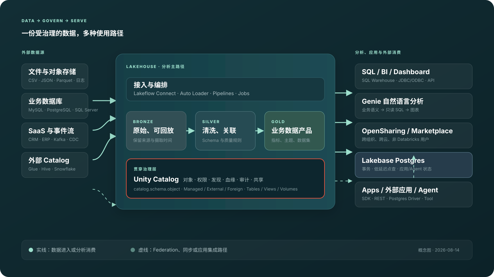

# Databricks Lakehouse、数据库与数据 Agent 演示

[](https://github.com/zcimon57-svj/databricks-lakehouse-agent-demo/actions/workflows/pages.yml)

一套面向领导、同事和数据平台团队的可复现演示包，聚焦 Databricks 的数据湖、Lakehouse、数据库、Genie 自然语言分析，以及云数据库接入治理型数据 Agent 所需的完整前置能力。

> 内容快照与工作区验证截止 2026-08-18。项目刻意弱化模型训练和通用推理基础设施，重点解释数据如何接入、治理、查询、分析并安全地交给 Agent 使用。

[在线演示](https://zcimon57-svj.github.io/databricks-lakehouse-agent-demo/) · [内容索引](index.md) · [完整录屏索引](https://zcimon57-svj.github.io/databricks-lakehouse-agent-demo/site/details/recordings.html) · [Genie 专题](https://zcimon57-svj.github.io/databricks-lakehouse-agent-demo/site/genie.html) · [云数据库专题](https://zcimon57-svj.github.io/databricks-lakehouse-agent-demo/site/database-agent.html) · [华为云 RDS 落地专题](https://zcimon57-svj.github.io/databricks-lakehouse-agent-demo/site/huawei-rds-agent.html)



## 可以演示什么

- 高频主线：数据接入 → Delta 表 → Unity Catalog 治理 → Job/Pipeline → SQL Warehouse → BI/Genie/应用；
- 对已有结构化数据进行中文自然语言分析，并展开生成的只读 SQL；
- 智能售后：从 700 条合成工单生成 18 条行动队列，并把退款、改订单和消息发送留在审批边界外；
- 数据库智能运维：关联指标、慢 SQL、告警、变更、事故和 Runbook，只做只读诊断；
- Genie 的业务问答、Sources、Instructions、可信示例、Monitor、Benchmark 和多轮使用方式；
- 工作区内嵌、iframe、Conversation API、Agent API/SSE 与外部多 Agent 的能力和责任差异；
- RDS MySQL/PostgreSQL、PolarDB、TaurusDB 类产品接入 Genie 类能力时，需要补齐的 Unity Catalog-like、语义、可信 SQL、评测、审计和动作网关。
- 华为云 RDS MySQL / PostgreSQL 专项：以客户事故故事串起 RDS、DAS、DRS、DataArts、智能体平台、IAM 与 APIG，给出复用/打通/新建矩阵、双引擎切片、六个 Gate 和 90 天 MVP 目标。

## 主要入口

| 入口 | 适合对象 | 内容 |
|---|---|---|
| [领导演示首页](https://zcimon57-svj.github.io/databricks-lakehouse-agent-demo/site/index.html) | 领导、产品、跨团队评审 | 一屏一结论，串起平台能力、案例、录屏和架构图 |
| [Genie 深度演示](https://zcimon57-svj.github.io/databricks-lakehouse-agent-demo/site/genie.html) | 数据分析、数据平台、Agent 团队 | Genie 实现、多种用法、质量闭环和内外部集成 |
| [云数据库到数据 Agent](https://zcimon57-svj.github.io/databricks-lakehouse-agent-demo/site/database-agent.html) | 数据库、云数据库、平台架构团队 | 传统数据库需要保留和新增的能力、三条接入路线与 G0–G8 |
| [华为云 RDS 受治理智能层](https://zcimon57-svj.github.io/databricks-lakehouse-agent-demo/site/huawei-rds-agent.html) | 华为云 RDS、DAS/DRS、DataArts、Agent 与产品团队 | MySQL/PG 客户故事、现有能力映射、五个新增服务、90 天 Gate 与 KPI |
| [14 段录屏与讲稿](https://zcimon57-svj.github.io/databricks-lakehouse-agent-demo/site/details/recordings.html) | 演示人、培训和复盘 | 14 段中文有声版、14 段无声原版、时长和讲解重点 |
| [外部视频索引](https://zcimon57-svj.github.io/databricks-lakehouse-agent-demo/site/details/external-videos.html) | 延伸学习 | 按模块整理的官方与独立讲解视频 |

## 已验证的交付

- 11 段真实 AWS Databricks Free Edition 工作区录屏和 3 段本地架构演示；
- 14 段普通话有声 MP4，共 73 个按画面转场对齐的解说片段；
- 8 张可离线展示的 SVG 架构图，其中两张专门描述华为云 RDS 目标架构与 90 天路线；
- 14 份确定性合成数据，共 18,498 行；
- 14 张 Delta managed tables、3 个业务视图、1 个 Genie Benchmark 表和 9/9 个可信 SQL 查询；
- Genie 绑定 7 个受治理数据源，覆盖自然语言分析、智能售后和数据库运维案例；
- HTML、SVG、视频、响度、站内链接、移动端宽度和隐私扫描均有本地验证记录。

配音媒体校验结果见 [中文配音校验记录](evidence/workspace/zh-voiceover-validation.md)，华为云方向的页面、SVG、H1 录屏与边界检查见 [专项校验记录](evidence/workspace/huawei-rds-agent-validation.md)。有声版为合成神经语音，不冒充真人录音；无声原版保持不变。

## 证据边界

- 账号与功能验证是 2026-08-18 的 Free Edition 快照，不代表当前商业版权益、SLA、容量、网络、合规或成本；
- G3、D1 和 H1 是明确标注的架构演示，不冒充该账号中的生产 API 或云数据库实调；
- 项目没有连接或修改 RDS、PolarDB、TaurusDB 或其他生产数据库；
- 所有写入 Databricks 的数据均为本项目生成的合成数据；
- 仓库不包含 Google 密码、Cookie、OAuth Token、PAT、私有工作区域名、用户邮箱或组织 ID；
- 外部视频只保留链接和摘要，版权归原作者和发布方所有。

## 目录结构

```text
site/                  精简演示 HTML、详情 HTML、CSS 和 SVG
docs/                  完整研究稿、项目约定与来源
videos/recordings/     14 段无声原版与 zh-voice/ 中文有声版
videos/voiceover/      中文讲稿时间轴、构建报告与校验哈希
videos/external/       外部视频索引
data/synthetic/        确定性合成数据
sql/                   Databricks SQL 初始化、案例与清理脚本
notebooks/             可导入的 Notebook 源文件
scripts/               数据生成、录屏、配音、渲染和校验脚本
evidence/workspace/    本地验证记录和脱敏截图
```

## 本地预览

```bash
python3 -m http.server 8765 --bind 127.0.0.1
```

然后访问 `http://127.0.0.1:8765/`。根页面会跳转到领导演示首页。

## 重新生成与校验

```bash
npm ci
npm run render:details
npm run validate:zh-voiceovers
```

重新生成中文配音：

```bash
npm run build:zh-voiceovers
```

配音脚本优先复用 `videos/voiceover/cache/`。缓存缺失时会通过 `uvx edge-tts` 获取指定普通话语音，因此需要网络环境。

确定性合成数据可使用以下命令重新生成和验证：

```bash
python3 scripts/generate_synthetic_data.py
python3 scripts/validate_synthetic_data.py
```

## GitHub Pages

`.github/workflows/pages.yml` 会在 `main` 分支更新时发布经过筛选的静态展示包，只包含根入口、`site/`、录屏及配音证明文件，不会部署本地工具、依赖或凭据状态。

## 技术与商标说明

本项目是独立的研究和演示材料，不是 Databricks 官方项目。Databricks、Delta Lake、Unity Catalog、Lakeflow、Lakebase 和 Genie 等名称及商标归其各自权利人所有。
