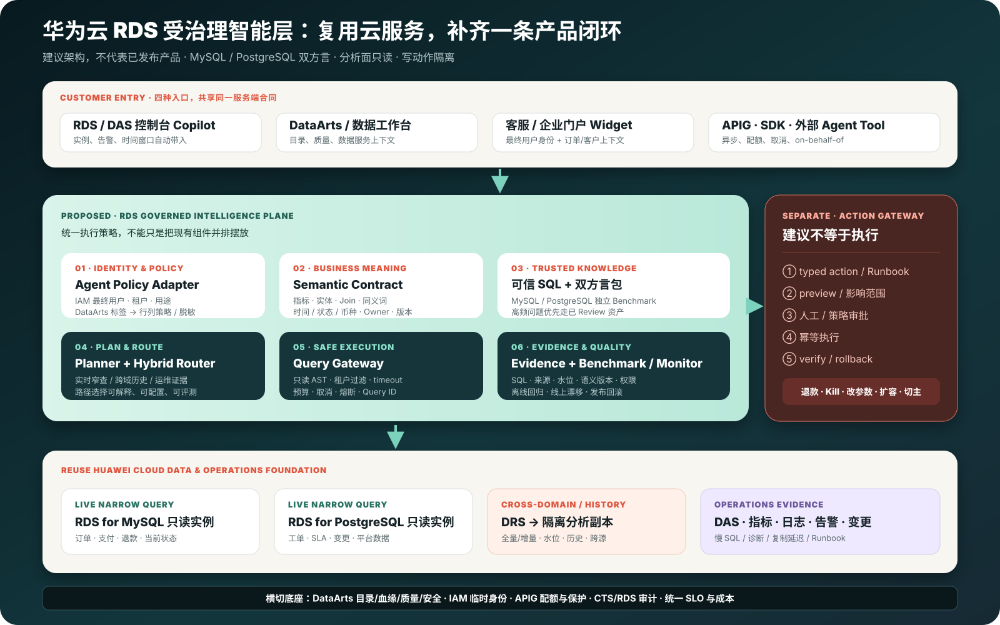
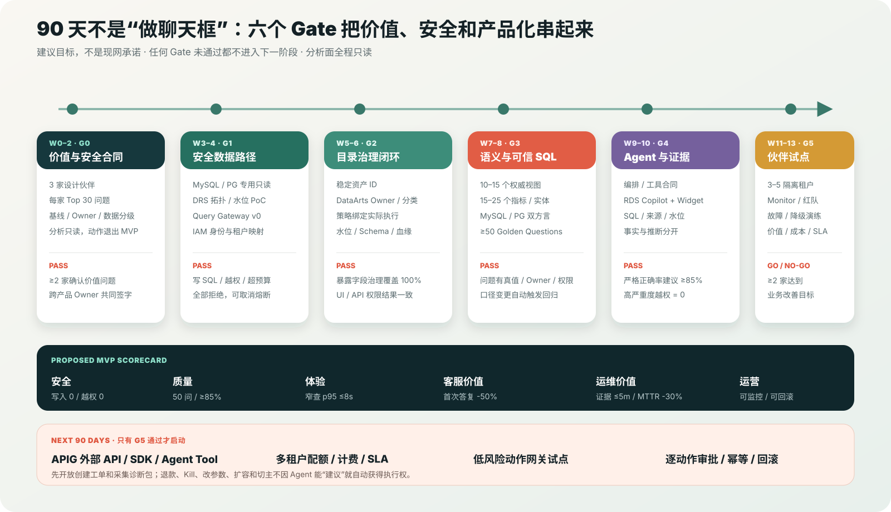

# 华为云 RDS MySQL / PostgreSQL 如何落地受治理的数据与运维 Agent

信息截止：2026-08-18
方向代号：**RDS 受治理智能层（RDS Insight Agent，产品建议）**
定位：基于公开资料的产品方向探索与 90 天落地计划，不代表华为云已经发布该产品，也不代表已经连接华为云生产租户
重点：客户故事、自然语言数据分析、智能售后、数据库智能运维、内嵌与外部 Agent 交付；不展开模型训练和通用推理基础设施



## 0. 给决策者的一页结论

### 0.1 不建议照搬 Databricks，而应建立一层可复用的“RDS 受治理智能层”

华为云 RDS MySQL / PostgreSQL 已经提供了数据库最难替代的部分：可靠 SQL 与事务、高可用、备份恢复、只读副本、监控、日志和审计；DAS 已经提供慢 SQL、SQL 诊断和智能运维入口；DRS 可以承担实时同步；DataArts Studio 覆盖数据集成、目录、质量、数据服务与安全；智能体开发平台、IAM、APIG 和 CTS 则能提供 Agent 编排、身份、API 暴露和云侧操作审计。

这些是非常好的地基，但从“多个产品都有功能”到“客户能放心用自然语言查询和诊断生产数据”，还缺一个统一的产品闭环：

```text
RDS / DAS / DRS / DataArts / AgentArts / IAM / APIG / CTS
                         ↓ 需要产品化打通
租户身份与数据策略 → 业务语义 → 可信 SQL → 查询防护 → 证据回答
                         ↓ 需要持续运营
Benchmark → 线上 Monitor → 反馈 → 版本发布 → 回滚
                         ↓ 写操作必须隔离
建议 → 预演 → 审批 → 执行 → 验证 → 回滚
```

建议先做三类高价值、低风险的**只读能力**：

1. **RDS 控制台 DBA Copilot**：把指标、慢 SQL、日志、告警、变更、复制延迟和 Runbook 串成证据链；
2. **受治理的业务问答**：让客服、运营和财务用自然语言查询 RDS 中经过授权的业务数据；
3. **智能售后助手**：联查订单、退款、客户与工单，生成解释和处理建议，但不直接退款或改订单。

90 天 MVP 的成功标准不是“聊天框能返回一段文字”，而是：三家设计伙伴、两个引擎各一套方言包、至少 50 个 Golden Questions、严格结果正确率达到建议门槛、所有答案带来源/SQL/新鲜度、分析面生产写入为零，并能量化客服处理时间或 DBA MTTR 的改善。

### 0.2 这条方向如何为云数据库客户服务

| 客户痛点 | 今天的真实工作 | 新能力给客户的结果 | 云数据库产品得到的价值 |
|---|---|---|---|
| 事故证据散落 | DBA 在监控、慢 SQL、日志、变更和工单之间切换 | 5 分钟内形成可追溯诊断包 | 提升 DAS / RDS 高阶版采用与客户粘性 |
| 客服查数依赖研发 | 复制订单号、请研发写 SQL、截图转发 | 在本人权限下直接得到有 SQL 和时效的答案 | 把 RDS 从存储资源升级为业务数据服务 |
| 数据口径不一致 | 多团队各写一份 SQL | 指标、Join、状态和时间口径版本化 | 带动 DataArts 目录、质量和数据服务使用 |
| SaaS 厂商反复自建 | 每个客户重复开发 NL2SQL、安全和审计 | 提供租户隔离的 API / SDK / Widget | 形成可嵌入的增值产品和生态入口 |
| 自动化风险高 | Agent 拿高权限账号直接执行 SQL | 分析面只读，动作面走审批和回滚 | 降低越权、误操作与合规风险 |

## 1. 先讲一个能让客户听懂的故事

> 以下“海岚零售”是用于产品设计和演示的**合成案例**，不是华为云真实客户背书。所有数字都是建议的演示真值，后续应由设计伙伴数据替换。

### 1.1 事故发生前：数据都在，但答案不在

海岚零售把交易核心放在 **RDS for MySQL**：订单、支付、退款、库存；把客服与平台运营放在 **RDS for PostgreSQL**：工单、SLA、知识条目、变更记录和事故复盘。

周一 10:05，华南区收银接口 p95 延迟突然升高，退款申请同步增长：

- 客服主管先在工单系统筛选 P1 工单，再复制订单号给研发；
- 研发在 MySQL 只读实例写临时 SQL，发现退款金额口径不确定；
- DBA 在监控页面看 CPU、连接数和复制延迟，在 DAS 看慢 SQL，在变更系统找上线记录；
- 运营把多张截图贴进群里，但没人能证明数字是不是同一时间窗口、同一地区和同一退款状态；
- 60–90 分钟后大家才拼出一个可能的原因，期间客服无法给客户一致答复。

问题不在“没有数据库、没有监控、没有 SQL”，而在**身份、业务语义、跨源路径、证据和协作流程没有被一个产品闭环串起来**。

### 1.2 上线受治理智能层后：同一事实服务两个角色

客服主管在企业客服台的内嵌组件中问：

> “华南地区仍未解决的 P1 工单涉及哪些订单？按已批准退款口径计算，总金额是多少？请列出超过 SLA 的客户。”

系统不把问题直接交给模型自由写 SQL，而是执行六步：

1. 用客服主管的企业身份换取短期代表用户凭证；
2. 从目录读取其可见的租户、区域、字段和脱敏策略；
3. 将“未解决、P1、华南、已批准退款、超过 SLA”绑定到版本化语义定义；
4. 路由器判断这是 PostgreSQL 工单与 MySQL 订单的跨域问题，优先查询 DRS 同步到分析副本的受治理视图；
5. Query Gateway 校验只读 SQL、成本、时间范围、结果行数和租户条件后执行；
6. 返回答案、SQL、来源对象、口径版本、数据新鲜度和 Query ID。

与此同时，DBA 在 RDS 控制台问：

> “10:00–10:20 收银接口变慢与哪些慢 SQL、变更、复制延迟和告警同时出现？按证据强弱给出前三个原因和下一步检查。”

运维 Agent 读取 RDS 指标、DAS 慢 SQL/诊断、日志、告警、变更记录和 Runbook，给出：

- **事实**：时间窗口、异常指标、Top SQL、执行计划变化、主从延迟、变更 ID；
- **推断**：原因候选和置信度，并明确哪些证据尚缺；
- **建议**：需要采集什么、回滚哪个发布、是否限流；
- **动作边界**：不会自动 Kill 会话、改参数、扩容或切主。

如果客服要退款，或 DBA 要执行变更，系统只生成结构化提案：

```json
{
  "action_type": "refund_order",
  "target": "order_ref",
  "reason": "approved_policy_and_p1_case",
  "preview": "amount_and_customer_impact",
  "approval_policy": "two_person_or_owner",
  "idempotency_key": "request_scoped_key"
}
```

提案进入独立 Action Gateway，经过预演、审批、幂等检查、执行、验证和失败回滚；数据库问答 Agent 本身没有生产写权限。

### 1.3 要向领导呈现的结果

```text
过去：5 个页面 + 3 个团队 + 临时 SQL + 群聊截图 → 60–90 分钟、口径不确定
目标：1 个问题 → 受治理查询/诊断 → 证据包 ≤ 5 分钟 → 人工批准后再行动
```

这不是“AI 替代 DBA 或客服”，而是把已经存在的 RDS、DAS、DRS 与治理资产组织成一个**可验证、可复用、可对外提供**的客户能力。

## 2. 华为云已经有什么：哪些直接复用

本节只列公开文档能支持的能力。实际可用范围随区域、版本、实例规格、计费模式和白名单变化，必须在试点 Gate 中逐项核验。

### 2.1 RDS for MySQL：交易事实与成熟诊断底座

官方 RDS for MySQL 用户指南列出备份恢复、只读实例、数据库代理读写分离、智能 DBA、全量 SQL 洞察、SQL 限流、SQL 审计、指标与告警等能力；实时监控页面可查看实例的实时和历史性能指标。[RDS for MySQL 用户指南 PDF](https://support.huaweicloud.com/usermanual-rds-mysql/rds-mysql-usermanual-pdf.pdf)、[查看监控指标](https://support.huaweicloud.com/usermanual-rds-mysql/rds_mysql_02_0005.html)

DAS 的 MySQL 慢 SQL 页面支持按用户、客户端 IP 和 SQL 模板等维度聚合；SQL 诊断会基于元数据与数据分布给出建议，但官方也提醒诊断可能给数据库带来影响，并对语句类型和引擎有约束。[MySQL 慢 SQL](https://support.huaweicloud.com/intl/zh-cn/usermanual-das/das_30_1008.html)、[MySQL SQL 诊断](https://support.huaweicloud.com/usermanual-das/das_30_1011.html)

**可直接复用：** SQL、事务、备份/PITR、只读实例、数据库代理、监控、慢 SQL、诊断、审计日志。
**仍需打通：** 这些诊断事实与业务变更、告警、Runbook、语义和最终回答的统一证据链。
**必须新建：** 面向自然语言的语义包、Query Gateway、回答契约、评测和租户化 API。

### 2.2 RDS for PostgreSQL：业务与平台数据底座

RDS for PostgreSQL 用户指南列出备份/PITR、只读实例、延迟只读实例、实例诊断、SQL 洞察、SQL 限流、日志、审计、指标和告警；只读实例通过原生复制从主实例同步，应用需要配置独立读连接，官方提醒复制延迟受网络等因素影响。[RDS for PostgreSQL 用户指南 PDF](https://support.huaweicloud.com/usermanual-rds-pg/rds-pg-usermanual-pdf.pdf)、[创建只读实例](https://support.huaweicloud.com/intl/zh-cn/usermanual-rds-pg/rds_add_read_replica_pg.html)

PostgreSQL SQL 审计依赖 `pgaudit`，可记录 READ、WRITE、DDL 等类型并上传 OBS；官方页面同时列出版本/区域约束和潜在性能影响，因此不能把“打开全量审计”当作无成本默认值。错误日志和慢日志还可接入 LTS。[PostgreSQL SQL 审计](https://support.huaweicloud.com/usermanual-rds-pg/rds_pg_auditing_log.html)、[日志接入 LTS](https://support.huaweicloud.com/usermanual-rds-pg/rds_pg_08_0036.html)

**可直接复用：** 丰富 SQL、Schema/Role、只读实例、备份/PITR、诊断、日志与审计。
**仍需打通：** PG 角色/Schema/行级策略与云侧最终用户身份、目录策略和 Agent 查询缓存的一致性。
**必须新建：** 独立 PostgreSQL 方言包、语义/Benchmark、查询防护和证据回答。

### 2.3 DRS：跨源与历史路径，不是语义层

DRS 将实时同步定义为源端和目标端之间持续的数据流，可用于实时分析、报表等场景，并支持全量、增量、全量加增量等模式。官方同时提供 MySQL 到 PostgreSQL 等拓扑的版本与对象约束；支持矩阵和部分能力可能存在限时开放或申请使用条件。[DRS 实时同步概述](https://support.huaweicloud.com/realtimesyn-drs/drs_05_0005.html)、[MySQL 到 PostgreSQL 实时同步](https://support.huaweicloud.com/realtimesyn-drs/drs_04_0103.html)、[DRS 支持场景](https://support.huaweicloud.com/productdesc-drs/drs_01_1303.html)

**可直接复用：** 数据复制、全量/增量同步、跨引擎迁移或分析副本路径。
**仍需打通：** Schema 演进、同步状态、延迟、水位和失败重放必须成为 Agent 答案的新鲜度证据。
**不能替代：** 目录、权限、业务指标、Join 语义、问答评测。

### 2.4 DataArts Studio：Unity Catalog-like 的重要基础，但不能只“接一个目录”

DataArts Studio 官方产品介绍覆盖数据集成、数据架构、开发、质量、数据资产/目录、数据服务和数据安全。数据目录可提供元数据、血缘和搜索；数据服务可生成、管理并发布数据 API，并支持认证、流控和动态脱敏。[DataArts Studio 产品介绍](https://support.huaweicloud.com/productdesc-dataartsstudio/dataartsstudio_07_001.html)、[数据服务概述](https://support.huaweicloud.com/usermanual-dataartsstudio/dataartsstudio_01_0301.html)

这使 DataArts 成为统一治理层的优先复用对象，但要满足 RDS Agent 仍需验证：

- MySQL / PostgreSQL 在目标区域与版本的元数据、血缘、质量、数据服务和数据安全支持是否完整；
- DataArts 中的 Owner、分类、策略是否能下推到最终 RDS/分析执行路径，而不是只停留在目录展示；
- 外部 Agent 代表用户调用时，策略、脱敏和审计是否与 DataArts Console 一致；
- DRS 水位、DAS 诊断、RDS Query ID 与 DataArts 资产 ID 是否能关联；
- 业务指标、Join、同义词和可信 SQL 是否有可版本化、可测试的专用模型。

官方数据源支持矩阵本身就显示不同数据库、模块、版本/区域可能存在差异，因此“DataArts 已有”不能直接推导为“两个 RDS 引擎的完整闭环已就绪”。[DataArts Studio 支持的数据源](https://support.huaweicloud.com/intl/zh-cn/ally-visitor-1-usermanual-dataartsstudio/dataartsstudio_01_0005.html)

### 2.5 智能体开发平台：复用编排，不把数据库安全交给 Prompt

华为云盘古大模型相关官方文档描述了智能体开发平台的模型、知识、插件/API、工作流、MCP、调试、发布和 API 调用能力；它适合作为对话、工具编排和发布入口。具体产品名、模块名与 Beta 状态应以目标区域控制台为准。[智能体开发流程](https://support.huaweicloud.com/usermanual-pangulm/pangulm_04_0423.html)、[智能体开发平台](https://support.huaweicloud.com/usermanual-pangulm/pangulm_04_0420.html)、[多智能体编排](https://support.huaweicloud.com/usermanual-pangulm/pangulm_04_0548.html)

建议复用它完成意图识别、会话、知识检索、工具选择和渠道发布；但以下能力必须由服务端权威组件负责：SQL 解析、权限、租户过滤、超时/成本、数据脱敏、Query ID、审计、动作审批和回滚。Prompt 不能成为安全边界。

### 2.6 IAM、APIG、CTS：外部交付所需的云侧基础

IAM 支持通过委托获得临时安全凭证；APIG 提供认证、流控、后端保护等能力；CTS 可记录云服务操作。它们适合构建外部应用或 Agent 的身份/API/审计基础。[IAM AssumeAgency](https://support.huaweicloud.com/intl/zh-cn/api-iam5/AssumeAgency.html)、[APIG 产品介绍](https://support.huaweicloud.com/productdesc-apig/apig-productdesc-pdf.pdf)、[APIG 审计](https://support.huaweicloud.com/intl/zh-cn/usermanual-apig/apig_03_0052.html)

但云 API 身份不自动等于数据库行列权限；必须建立 `最终用户 → 租户/角色/用途 → 目录策略 → 执行角色/过滤条件` 的可审计映射。

## 3. 不是组件清单，而是“复用—打通—新建”产品矩阵

| 能力域 | 当前可复用资产 | 需要打通 | 必须新建/产品化 | 建议 Owner | MVP 验收 |
|---|---|---|---|---|---|
| 数据库事实 | RDS MySQL / PG、只读实例、备份/PITR | 实例/Schema/Query ID 统一资产 ID | — | RDS 双引擎团队 | 两引擎只读路径可取消、可限流 |
| 运维证据 | CES/RDS 指标、DAS 慢 SQL/诊断、日志、告警 | 时间线、拓扑、变更、Runbook 关联 | Evidence Timeline API | DAS + RDS SRE | 3 类事故能生成可回放证据包 |
| 数据移动 | DRS 全量/增量同步 | 水位、Schema 演进、失败状态接入回答 | Hybrid Router | DRS + 数据平台 | 跨源问题显示路径和新鲜度 |
| 目录治理 | DataArts 目录、血缘、质量、安全 | RDS / DRS / DAS 资产与最终执行策略绑定 | Agent Policy Adapter | DataArts + 安全 | 暴露字段 100% 有 Owner/分类/策略 |
| 业务语义 | 数据架构、视图、数据服务可承载部分资产 | 指标、Join、同义词、时间/状态口径统一版本 | Semantic Contract Service | 数据平台 + 领域 Owner | 10–15 个视图、15–25 个指标可测试 |
| 可信 SQL | 视图、API、DAS 诊断能力 | 与语义版本、权限和 Benchmark 绑定 | Trusted Query Registry + 双方言包 | SQL/Agent 团队 | 30–50 个已 Review 查询资产 |
| 查询安全 | DB 角色、只读实例、SQL 限流能力 | 统一到所有 UI/API/Agent 路径 | Query Gateway / Workload Governor | RDS + 安全 | DDL/DML/越权/超预算测试全部拒绝 |
| Agent 编排 | AgentArts / 工作流 / 插件 / MCP | 标准化数据工具返回契约 | Planner + Evidence Composer | Agent 平台 | 所有事实引用 Query ID/来源/时效 |
| 质量运营 | 现有日志和监控 | 问题→SQL→结果→反馈全链路 | Benchmark / Monitor / Release Gate | Eval + SRE | 两引擎至少各 25 个 Golden Questions |
| 内嵌交付 | RDS/DAS/DataArts 控制台 | SSO、上下文、租户和深链 | Console Copilot / Customer Widget | 前端 + 产品 | 角色切换与越权回归通过 |
| 外部交付 | IAM、APIG、CTS | on-behalf-of、异步任务、取消、配额 | Data Agent API / SDK / Tool | 云平台 + Agent | 与内嵌入口权限、语义、结果一致 |
| 写动作 | 工单/运维 API、PITR 基础 | 审批系统、CMDB、变更窗口 | Action Gateway | 运维平台 + 安全 | 未批准动作 100% 无法执行 |

### 3.1 最关键的五个新增服务

#### A. Agent Policy Adapter

把 IAM 最终用户、租户、RDS 角色、DataArts 标签/分类、数据用途和脱敏规则编译成执行时策略。它必须参与每次查询，而不是仅供 Agent 检索。

最低输出契约：

```json
{
  "principal": "opaque_user_id",
  "tenant_scope": ["tenant_a"],
  "allowed_assets": ["semantic.sales_order_v3"],
  "row_predicates": ["tenant_id = :tenant"],
  "masked_columns": ["mobile", "id_number"],
  "purpose": "customer_support",
  "expires_at": "short_lived_timestamp"
}
```

#### B. Semantic Contract Service

目录只知道字段，语义服务要知道业务含义。每个指标和实体至少包含：定义、Owner、版本、来源、Join、过滤、时区、币种、有效期、权限、示例问题、反例和测试。

```yaml
metric: approved_refund_amount
version: 3
source: semantic.refund_case
expression: sum(approved_amount)
default_filters:
  refund_status: [APPROVED, SETTLED]
time_basis: approved_at
currency: CNY
owner: finance_domain
tests:
  - question: 华南本周已批准退款金额
    golden_query: trusted.refund_by_region_week_v3
```

#### C. Query Gateway / Workload Governor

这是安全和稳定性的核心，不应由通用 Agent 平台代替：

- 默认只连专用只读实例或分析副本；
- 解析 SQL AST，禁止多语句、DDL、DML、危险函数和未授权对象；
- 注入或校验租户/行过滤；
- `EXPLAIN` 估算先行，限制扫描、执行时间、返回行数和并发；
- 支持 cancel、熔断、kill switch 和租户配额；
- 返回 Query ID、数据源、水位、耗时、成本、策略版本；
- 缓存键必须包含身份、租户、策略与语义版本。

#### D. Trusted Query Registry + MySQL/PG Dialect Packs

不要用一套“通用 SQL Prompt”覆盖两个引擎。每个方言包需要：

- 元数据采集和类型映射；
- 日期/时区、JSON、窗口函数、字符串、大小写和 NULL 语义；
- 系统目录、权限和执行计划适配；
- 高风险函数与语法 allow/deny list；
- 引擎独立的 Golden SQL、错误修复样例和性能基线。

高频/复杂/受监管问题优先命中已 Review 的参数化 SQL 或 Data API，只有长尾问题才动态生成 SQL。

#### E. Benchmark / Monitor / Evidence Composer

离线 Benchmark 验证问题、口径、SQL、结果和拒绝行为；线上 Monitor 记录分布漂移、错误、延迟、成本、权限拒绝、用户反馈和无答案率。Evidence Composer 将数据库事实和模型推断分开输出：

```text
回答
├─ 结论和必要表格
├─ 数据来源、SQL/可信资产、Query ID
├─ 时间范围、数据水位、语义版本
├─ 权限/脱敏说明
└─ 推断、缺失证据和建议下一步
```

## 4. 目标架构与三条数据路径


### 4.1 路径 A：RDS 只读实例实时窄查询

适合：单域、当前状态、按主键/小范围过滤、复制延迟可接受的问题。
优点：新鲜、上线快、无需复制完整数据。
风险：生产相关负载、连接数、方言和延迟；必须有专用只读实例、Query Gateway 与明确 SLA。
示例：“订单 `O-123` 当前退款状态是什么？”

### 4.2 路径 B：DRS 同步到分析副本/湖仓

适合：跨 MySQL/PG、长时间窗口、大聚合、趋势与历史回放。
优点：隔离 OLTP、可保留历史、跨域 Join 更稳定。
风险：同步延迟、Schema 演进、重复/乱序、重放与额外成本；回答必须显示水位。
示例：“过去 90 天不同渠道的 P1 售后率和批准退款金额趋势？”

### 4.3 路径 C：混合路由（推荐）

```text
问题分类器
  ├─ 单订单 / 当前状态 / 小结果 → RDS 专用只读实例
  ├─ 跨域 / 历史 / 大聚合       → DRS 分析副本
  └─ 运维诊断                   → RDS + DAS + 监控/日志 API
               ↓
        共享同一身份、策略、语义、证据和评测
```

路由规则必须是可解释、可配置和可评测的产品能力，不应让模型根据感觉选择数据库。答案要明确标注“查询了哪里、数据截至何时”。

## 5. MySQL 与 PostgreSQL 必须分开落地

| 维度 | RDS for MySQL 重点 | RDS for PostgreSQL 重点 | 共同验收 |
|---|---|---|---|
| 典型客户场景 | 电商交易、订单、支付、库存、SaaS OLTP | 客服/工单、企业应用、复杂 Schema、平台元数据 | 先选一个高频域，不开放全库 |
| 读流量隔离 | 只读实例；数据库代理可支持读写分离场景 | 应用侧使用独立只读连接，关注复制延迟 | Agent 永不连接主写端点 |
| 变更数据路径 | 按 DRS 支持矩阵验证 MySQL 同步拓扑 | 按目标版本/区域核验 PG 同步与对象约束 | 水位、DDL 和失败状态进入证据 |
| 目录采集 | `information_schema`、索引/约束、大小写规则 | `pg_catalog`、Schema/Role、类型与扩展 | 映射为稳定跨实例资产 ID |
| SQL 方言 | 时间、JSON、字符串、隐式转换、执行计划 | 类型/Schema、JSON、数组、窗口、大小写与计划 | 各自至少 25 个 Golden Questions |
| 权限模型 | DB/User/Role 与云身份映射 | Role/Schema 以及可能的行级策略组合 | 最终用户策略在执行层强制 |
| 审计成本 | SQL 审计默认状态、区域/版本与负载需核验 | `pgaudit` 版本和性能影响需实测 | 采样、脱敏、保留和成本有方案 |
| 运维证据 | 慢 SQL、代理、连接、复制、锁等 | 慢 SQL、锁/等待、复制、日志等 | 三个事故场景可确定性回放 |

### 5.1 两个独立 MVP 切片

**MySQL 切片：智能售后**

- 8 个只读语义视图：订单、订单项、支付、退款、客户脱敏视图、产品、库存事件、区域；
- 15 个指标：订单量、支付成功率、批准退款额、退款率、超时订单等；
- 25 个 Golden Questions：事实、聚合、口径澄清、无权限、超范围、无数据；
- 10 个可信 SQL / Data API；
- 只开放专用只读实例或 DRS 分析副本。

**PostgreSQL 切片：客服与运维证据**

- 7 个语义视图：工单、SLA、客户映射、事件、告警、变更、Runbook；
- 12 个指标：P1 未解决、SLA 违约率、首次响应、MTTR、变更失败率等；
- 25 个 Golden Questions；
- 10 个可信 SQL / Evidence API；
- 运维数据与业务数据使用不同权限域。

## 6. 六类客户场景与产品包装

| 优先级 | 场景 | 谁使用 | 入口 | 价值故事 | 风险级别 | 推荐版本 |
|---|---|---|---|---|---|---|
| P0 | RDS 控制台 DBA Copilot | DBA/SRE | RDS/DAS 内嵌 | 从“找证据”变成“验证假设” | 中，只读 | RDS Enterprise Add-on |
| P0 | 智能售后 | 客服主管/一线 | 客服台 Widget | 一次联查订单、退款、工单与 SLA | 中，涉及 PII | Industry Template |
| P0 | 受治理业务问答 | 运营/财务/产品 | DataArts / Portal | 减少临时取数和口径争议 | 中 | Data Agent Workspace |
| P1 | 开发者 SQL/Schema 助手 | 应用研发 | DAS / IDE / API | 解释 Schema、生成只读查询、诊断问题 | 中 | Developer Pack |
| P1 | SaaS 内嵌数据助手 | ISV / SaaS 客户 | API / SDK / Widget | 厂商不用重复建设 NL2SQL 与租户安全 | 高，多租户 | Embedded Data Agent |
| P2 | MSP 多实例运维 | 服务商/集团 DBA | Fleet Console / Agent Tool | 跨账号实例汇总风险和容量趋势 | 高，跨租户 | Fleet Operations |

### 6.1 内嵌能力与外部 Agent 的差异

| 责任 | RDS/DAS/DataArts 内嵌 | 企业门户 Widget | 外部 API / Agent Tool |
|---|---|---|---|
| 用户身份 | 控制台已有登录和资源上下文 | SSO + on-behalf-of 映射 | 调用方必须传递最终用户/租户/用途 |
| 上下文 | 当前实例、时间范围、告警可自动带入 | 业务页面带订单/客户上下文 | 必须使用类型化参数，不能拼到 Prompt |
| UI | 原生指标、SQL、图表、反馈和深链 | 统一品牌、可回到原始业务记录 | 调用方负责流式、重试、取消和渲染 |
| 权限执行 | 仍由 Policy Adapter + Query Gateway 执行 | 同左 | 同左，API Key 不能替代最终用户权限 |
| 失败处理 | 平台可展示 Query ID 和诊断入口 | 需向用户解释无权/无数据/过期/失败 | 需要稳定错误码、幂等和异步状态机 |
| 独特点 | 上下文完整、上线快 | 最贴近客户工作流 | 可组合工单、知识、运维和其他 Agent |

建议只维护一套服务端 Capability Contract，三个入口做一致性测试：相同用户、相同问题、相同语义版本，应得到相同权限裁剪、SQL 结果和证据；差别只在体验和调用责任。

## 7. 90 天可落地计划



### 第 0–2 周：G0 — 价值与安全合同

**目标：** 不写代码先确定做给谁、回答什么、绝不做什么。

交付：

- 选择 3 家设计伙伴：电商/零售、SaaS、企业应用各 1 家；
- 每家收集 Top 30 问题、当前耗时、错误成本、使用角色和数据 Owner；
- 确定 MySQL 售后域与 PostgreSQL 工单/运维域；
- 定义分析面“只读”与动作面边界；
- 建立数据分类、脱敏、保留、审计和退出计划；
- 先用脱敏快照或合成数据，不要求生产连通。

**Gate G0：** 三家伙伴至少两家书面确认问题集与基线；业务、RDS、安全、DataArts 和 Agent Owner 共同签字；任何写动作不在 MVP。

### 第 3–4 周：G1 — 安全数据路径

**目标：** 证明两个引擎都有不会拖垮生产的只读执行路径。

交付：

- 为 MySQL / PG 各建立专用只读实例或隔离分析副本；
- 评估 DRS 跨域同步拓扑、版本、网络、延迟与成本；
- Query Gateway v0：只读 AST、超时、行数、并发、对象 allowlist、取消和 kill switch；
- IAM 临时身份与租户映射 PoC；
- 记录 Query ID、策略版本和数据水位。

**Gate G1：** DDL/DML、多语句、危险函数、未授权对象、全表大扫描和跨租户测试全部被拒绝；故障时可取消，分析流量不触达主写端点。

### 第 5–6 周：G2 — 目录与治理闭环

**目标：** 让“目录里看得到”变成“执行时真的受控”。

交付：

- 采集 RDS MySQL / PG 技术元数据，映射为稳定资产 ID；
- 将 DataArts Owner、分类、敏感标签、质量状态和血缘绑定到执行对象；
- 接入 DRS 水位和 Schema 变更状态；
- 建立最终用户 → 租户 → 用途 → 策略 → 执行角色映射；
- 定义缓存失效和权限撤销传播时间。

**Gate G2：** MVP 暴露字段 100% 有 Owner、分类与策略；五类权限回归通过；策略撤销在目标时间内影响 UI、API 和缓存。

### 第 7–8 周：G3 — 语义与可信 SQL

**目标：** 让系统先懂业务口径，再生成查询。

交付：

- 10–15 个权威视图，15–25 个指标/实体；
- MySQL / PG 独立方言包；
- 30–50 条已 Review 的可信 SQL / Data API；
- 50 个 Golden Questions，各引擎至少 25 个；
- 口径冲突时的澄清策略和“拒绝回答”样例。

**Gate G3：** 所有 Golden Question 有 Owner、真值 SQL、期望结果和权限上下文；口径变更会触发受影响问题的回归。

### 第 9–10 周：G4 — Agent 与证据回答

**目标：** 提供可演示但不依赖幻觉的端到端体验。

交付：

- AgentArts/编排层接入目录、语义、可信查询和 Query Gateway；
- 内嵌 RDS/DAS Copilot 原型和客服 Widget；
- 回答显示 SQL/可信资产、来源、时间范围、水位、Query ID、语义版本；
- 区分事实、推断、缺失证据和建议；
- 无权、无数据、数据过期、查询失败使用不同错误契约。

**Gate G4：** 严格结果正确率达到 MVP 建议门槛；所有回答可追溯；高严重度越权和不安全查询为零。

### 第 11–13 周：G5 — 设计伙伴试点与发布决策

**目标：** 证明业务结果，不只是技术连通。

交付：

- 3–5 个隔离租户灰度；
- 线上 Monitor：正确率代理指标、无答案、澄清、拒绝、延迟、成本、反馈；
- 事故回放、红队、权限撤销、故障降级和 DRS 延迟演练；
- 与原工作流对照客服处理时间和 DBA MTTR；
- 形成 GA 差距、成本模型、SLA 与支持手册。

**Gate G5：** 至少两家伙伴达到业务改善目标且愿意继续；安全 Gate 无红线；产品委员会再决定是否进入外部 API 和动作网关阶段。

### 后续 90 天：外部产品化与受控动作

- 通过 APIG 提供异步 Data Agent API、SDK 和标准 Agent Tool；
- 多租户配额、计费、SLA、区域/数据驻留和客户自带密钥；
- 与内嵌入口做身份/语义/结果一致性回归；
- Action Gateway 仅从低风险动作开始，如创建工单、采集诊断包；
- Kill、参数修改、扩容、切主、退款和改订单必须逐类完成 preview、审批、幂等、验证和回滚后才可灰度。

## 8. 可衡量目标：建议门槛，不冒充实测结果

| 目标域 | 90 天建议目标 | 证据 |
|---|---|---|
| 安全 | 分析面生产写入 0；高严重度越权/敏感泄露 0 | Query Gateway 日志、红队报告、DB 审计 |
| 治理 | 暴露字段 100% 有 Owner、分类、策略；回答新鲜度展示率 100% | DataArts/Policy 快照、回答抽样 |
| 质量 | ≥50 个 Golden Questions；严格结果正确率 ≥85%；SQL 执行成功率 ≥95% | Benchmark 版本报告 |
| 性能 | 窄查询 p95 ≤8 秒；混合/跨源回答 p95 ≤30 秒 | 分入口、分路由监控 |
| 新鲜度 | CDC 延迟建议目标 p95 ≤60 秒，超过 SLO 明确降级/拒答 | DRS 水位与回答证据；实际目标由拓扑校准 |
| 客服价值 | 首次取数/答复时间降低 ≥50%，人工转研发率降低 ≥30% | 试点前后工单对照 |
| 运维价值 | 首个证据包 ≤5 分钟，DBA MTTR 降低 ≥30% | 事故演练和真实试点统计 |
| 成本 | 每个租户有查询预算；记录每问成本与缓存命中率 | APIG/Query/Agent 计量 |
| 可运营 | 每次语义/Prompt/方言变更必须通过回归 Gate，可一键回滚 | 发布流水线与版本清单 |

不能只看“用户点赞率”。对数字问题，首要指标应是结果正确、权限正确、证据完整；自然语言流畅度只能排在其后。

## 9. 团队、投入与责任

建议 8–10 人核心小队，90 天保持一个产品 Backlog，而不是每个云服务各做一个 Demo：

| 角色 | 建议投入 | 核心责任 |
|---|---:|---|
| 产品负责人 | 1 | 设计伙伴、场景优先级、商业包装、Gate 决策 |
| RDS MySQL / PG 工程师 | 2 | 只读路径、方言、权限、性能、故障演练 |
| DAS / DRS 工程师 | 1–2 | 运维证据、同步水位、Schema 演进、失败恢复 |
| DataArts / 治理工程师 | 1 | Catalog/Owner/分类/血缘/策略映射 |
| Agent / Backend 工程师 | 2 | 规划、工具合同、Query Gateway、Evidence Composer |
| 前端 / 体验 | 1 | RDS/DAS 内嵌、客服 Widget、证据交互 |
| Security / Eval / SRE | 1–2 | 威胁模型、Benchmark、Monitor、发布 Gate 与值班 |

每个领域指标和可信 SQL 必须有业务 Owner。平台团队可以提供框架，但不能替业务部门决定“批准退款金额”的口径。

## 10. 试点 Backlog：可以直接拆成 Epic

### Epic 1 — Identity & Policy

- E1.1 IAM 短期身份与最终用户映射；
- E1.2 多租户策略模型和 DataArts 标签适配；
- E1.3 MySQL / PG 执行角色与行列裁剪；
- E1.4 权限撤销、缓存失效和审计回放。

### Epic 2 — Safe Query Plane

- E2.1 MySQL / PG 专用只读连接池；
- E2.2 SQL AST、allowlist、租户条件校验；
- E2.3 `EXPLAIN` 成本、超时、行数、并发和取消；
- E2.4 Query ID、水位、成本、熔断和 kill switch。

### Epic 3 — Catalog & Semantics

- E3.1 RDS / DRS / DAS 统一资产 ID；
- E3.2 15 个语义视图与 25 个指标；
- E3.3 Join、同义词、时间/状态/币种合同；
- E3.4 质量状态和 Schema 变更阻断。

### Epic 4 — Trusted SQL & Dialects

- E4.1 MySQL 方言/元数据适配；
- E4.2 PostgreSQL 方言/元数据适配；
- E4.3 30–50 个可信查询资产；
- E4.4 错误修复、澄清和拒答策略。

### Epic 5 — Agent & Evidence

- E5.1 问题分类和混合路由；
- E5.2 AgentArts 工具合同；
- E5.3 Evidence Composer；
- E5.4 RDS/DAS Copilot 与客服 Widget。

### Epic 6 — Eval & Operations

- E6.1 50 个 Golden Questions 与权限矩阵；
- E6.2 离线 Benchmark；
- E6.3 线上 Monitor、反馈和成本；
- E6.4 红队、降级、回滚和发布 Gate。

## 11. 关键风险与停止条件

| 风险 | 早期信号 | 缓解 | 停止/降级条件 |
|---|---|---|---|
| 查询影响生产 | 延迟、CPU、连接数或锁等待上升 | 专用只读实例、预算、熔断 | 无法隔离则只用 DRS 分析副本 |
| 目录有策略但执行未生效 | UI 看不到，SQL/API 仍可读取 | Policy Adapter + 路径一致性测试 | G2 不通过不得接真实数据 |
| 口径无人负责 | 同一问题多人给不同 SQL | 领域 Owner + 版本化语义 | 无 Owner 的数据不进入 Agent |
| CDC 过期却输出确定答案 | 水位缺失、延迟告警 | 强制展示时效，过期拒答 | 无水位不允许跨源答案上线 |
| MySQL 正确、PG 大量失败 | 通用 Prompt 过拟合一个引擎 | 双方言包和独立 Benchmark | 单引擎先发布，不假装通用 |
| 试点只有“新奇”没有价值 | 使用量高但处理时间无改善 | 前后基线、任务指标 | 两家伙伴无改善则重新选场景 |
| Agent 越权执行动作 | 通用服务账号带写权限 | 分离 Action Gateway | MVP 发现任一写路径立即停线 |
| 产品组合边界/区域不一致 | 目标区缺少必要模块 | Gate G0/G1 做支持矩阵 | 降级到单区/单引擎或停止 |

## 12. 领导与客户演示脚本（8 分钟）

1. **0:00–0:45，先讲事故：** 海岚零售 10:05 延迟与退款增长，五个页面、三个团队、90 分钟。
2. **0:45–1:30，给结果：** 同一份受治理事实，在客服台回答订单/退款，在 RDS 控制台解释慢 SQL/变更；五分钟证据包。
3. **1:30–2:30，承认已有基础：** RDS、DAS、DRS、DataArts、AgentArts、IAM/APIG/CTS 都能复用，方向不是推倒重做。
4. **2:30–3:45，展示缺口：** 重点指向 Policy Adapter、Semantic Contract、Query Gateway、双方言包、Benchmark/Monitor。
5. **3:45–4:45，展示架构：** 实时窄查询走只读实例，跨域历史走 DRS 分析副本，运维走 DAS/日志 API；共享治理和证据。
6. **4:45–5:45，解释内嵌与外部：** 服务端能力相同，外部 Agent 多承担最终用户身份、异步、配额和失败恢复责任。
7. **5:45–7:00，展示 90 天：** G0 价值合同 → G1 安全路径 → G2 治理 → G3 语义 → G4 Agent → G5 试点。
8. **7:00–8:00，收口：** 分析面零写入；先以客服时间和 DBA MTTR 证明价值，再决定外部 API 和动作自动化。

### 12.1 外部官方视频组合

这组视频用于补充“现有产品底座是什么、操作入口在哪里”，不用于证明本文拟议的受治理智能层已经在华为云现网交付：

1. 先播放本项目 H1（约 127 秒）：由中文配音完整讲述海岚零售事故、复用/打通/新建、双方言、六个 Gate 和建议 KPI；这是方案讲解录屏，不是生产租户实调。
2. 面向领导播放华为云官方 [RDS for MySQL 产品介绍](https://support.huaweicloud.com/video/mysql-zh.html)：快速建立 RDS 定位、价值和典型应用的共同语言。
3. 面向 MySQL 技术团队打开 [RDS for MySQL 视频帮助](https://support.huaweicloud.com/rds-mysql_video/index.html)，按当前目录选择产品介绍或操作指导。
4. 面向 PostgreSQL 技术团队打开 [RDS for PostgreSQL 视频帮助](https://support.huaweicloud.com/rds-pg_video/index.html)，避免用 MySQL 的产品画面代替双引擎差异验证。
5. 需要动手课时进入 [华为云数据库开发者中心](https://developer.huaweicloud.com/techfield/db.html)，选择 RDS 连接、快速入门或 DRS 迁移类课程与实验。

正式汇报应明确说出三条边界：官方视频证明当前公开的产品定位和操作材料；Policy Adapter、Semantic Contract、Query Gateway、Evidence Composer、Benchmark/Monitor 是本文建议补建的产品面；外部页面的日期、目录和 UI 会变化，试点仍须在 G0/G1 核验目标区域、版本、权限、网络、成本和负载。

## 13. 立项决策清单

### 建议立项，前提是以下问题都能回答“是”

- 是否有至少 3 家设计伙伴愿意提供 Top 30 问题和业务基线？
- 是否能为两个引擎提供不触达主写端点的只读/分析路径？
- 是否有领域 Owner 愿意负责指标和可信 SQL？
- DataArts / IAM 策略能否与实际查询执行闭环，而非只做展示？
- DRS 水位、DAS 诊断和 RDS Query ID 能否进入统一证据合同？
- 是否接受 90 天 MVP 只读、不承诺自动修库或自动退款？
- 是否有跨 RDS、DAS/DRS、DataArts、Agent、安全和前端的一体化小队？

### 暂不立项或缩小范围的信号

- 目标只是“快速做一个能聊天的 Demo”；
- 只能提供共享高权限数据库账号；
- 没有业务口径 Owner；
- 无法建立专用只读或隔离分析路径；
- 成功指标只有调用量，没有正确性、安全和业务结果；
- 要求 MVP 直接执行退款、Kill、改参数或切主。

## 14. 事实、建议与待验证边界

| 类型 | 本文内容 |
|---|---|
| 官方事实 | 上述 RDS、DAS、DRS、DataArts、智能体平台、IAM、APIG、CTS 能力以所链官方文档为准 |
| 架构建议 | “RDS 受治理智能层”、五个新增服务、混合路由、双方言包、Action Gateway |
| 建议目标 | 90 天、人员、正确率、延迟、CDC 水位、业务改善指标 |
| 合成演示 | 海岚零售故事、问题、事件和目标数字 |
| 当前未验证 | 目标华为云账号、区域、版本、网络、权限、成本、负载、真实客户数据与生产 SLA |

任何对外陈述都应把“官方已有能力”“方案组合建议”“试点目标”和“生产实测结果”分开。当前材料只完成公开资料核准、架构设计和可落地计划，不应被包装成华为云现网能力或客户案例。

## 15. 官方资料索引

- [RDS for MySQL 用户指南](https://support.huaweicloud.com/usermanual-rds-mysql/rds-mysql-usermanual-pdf.pdf)
- [RDS for MySQL 监控指标](https://support.huaweicloud.com/usermanual-rds-mysql/rds_mysql_02_0005.html)
- [DAS MySQL 慢 SQL](https://support.huaweicloud.com/intl/zh-cn/usermanual-das/das_30_1008.html)
- [DAS MySQL SQL 诊断](https://support.huaweicloud.com/usermanual-das/das_30_1011.html)
- [RDS for PostgreSQL 用户指南](https://support.huaweicloud.com/usermanual-rds-pg/rds-pg-usermanual-pdf.pdf)
- [RDS for PostgreSQL 只读实例](https://support.huaweicloud.com/intl/zh-cn/usermanual-rds-pg/rds_add_read_replica_pg.html)
- [RDS for PostgreSQL SQL 审计](https://support.huaweicloud.com/usermanual-rds-pg/rds_pg_auditing_log.html)
- [DRS 实时同步概述](https://support.huaweicloud.com/realtimesyn-drs/drs_05_0005.html)
- [DRS MySQL 到 PostgreSQL 实时同步](https://support.huaweicloud.com/realtimesyn-drs/drs_04_0103.html)
- [DRS 支持场景](https://support.huaweicloud.com/productdesc-drs/drs_01_1303.html)
- [DataArts Studio 产品介绍](https://support.huaweicloud.com/productdesc-dataartsstudio/dataartsstudio_07_001.html)
- [DataArts Studio 数据服务](https://support.huaweicloud.com/usermanual-dataartsstudio/dataartsstudio_01_0301.html)
- [DataArts Studio 支持的数据源](https://support.huaweicloud.com/intl/zh-cn/ally-visitor-1-usermanual-dataartsstudio/dataartsstudio_01_0005.html)
- [华为云智能体开发流程](https://support.huaweicloud.com/usermanual-pangulm/pangulm_04_0423.html)
- [华为云智能体开发平台](https://support.huaweicloud.com/usermanual-pangulm/pangulm_04_0420.html)
- [IAM AssumeAgency](https://support.huaweicloud.com/intl/zh-cn/api-iam5/AssumeAgency.html)
- [APIG 产品介绍](https://support.huaweicloud.com/productdesc-apig/apig-productdesc-pdf.pdf)
- [APIG 审计](https://support.huaweicloud.com/intl/zh-cn/usermanual-apig/apig_03_0052.html)
- [RDS 官方视频帮助总入口](https://support.huaweicloud.com/rds_video/index.html)
- [RDS for MySQL 产品介绍视频](https://support.huaweicloud.com/video/mysql-zh.html)
- [华为云数据库开发者中心](https://developer.huaweicloud.com/techfield/db.html)
