# 当用户用一句话启动数据任务：入口、治理、授权与厂商差距

> 独立探索专项，信息基准日与公开资料核验日均为 2026-08-19。

## 先用一个任务理解本报告

业务负责人问“最近 30 天华东退款率为什么上升”。如果所谓“统一 Agent”只能生成一段文字，用户随后仍要自己找数据、重建指标、复制凭据、确认权限和拼接证据，那么它只是一个新入口，还不是完整产品。

本文真正比较的是一条任务能否走完：

1. 用户从自然语言开始，不必先判断应该打开 BI、数据开发还是数据库控制台；
2. 系统沿用最终用户身份，找到受治理的数据和业务口径；
3. 系统调用查询、分析或数据库工具，并保留任务状态；
4. 回答形成可保存、可授权、可复算的结果，而不是一次性聊天文本；
5. 失败、权限不足和证据缺失都能被看到；动作必须经过审批和权威验证。

因此，“主入口”不等于“唯一页面”，“有 MCP”不等于“工具安全”，“有治理”也不等于答案正确。完整术语说明见 [`start-here.md`](./start-here.md)。

## 0. 研究边界与结论性质

- 唯一继承的问题定义是仓库根目录的 `DATAARTS_DATABRICKS_INDEPENDENT_EXPLORATION_BRIEF.md`。
- 本专项没有使用本仓库既有研究、历史 Session、先前方案或记忆作为事实依据。
- 所有产品事实来自本轮重新访问的官方公开资料；没有登录厂商账号，因此没有 `实际观察`。
- `官方声明` 只证明厂商公开描述；`推断` 是基于多个公开事实的竞争判断；`建议` 是产品决策输入；找不到证据一律标 `Unknown`。
- 路线图中的 Preview、Beta、planned、coming soon 只计入方向和速度，不计为当前 GA 能力。
- 分数是“截至基准日的公开证据评分”，不是实验室 benchmark，也不是采购结论；小于约 4 分的名次差通常不具统计意义。

配套材料：

- [逐条证据账本](./agent-entry-evidence-ledger.md)
- [机器可读评分表](./agent-entry-scorecard.csv)

## 1. 先给结论：判断大方向正确，但需要四处关键校正

### 1.1 对原判断逐句裁决

| 命题 | 裁决 | 研究置信度 | 为什么 | 必须补上的限定 |
|---|---|---:|---|---|
| 后续主要能力入口会成为 Genie One 一类 Agent 对话页 | **强成立** | 90% | Databricks、AWS、Snowflake、Microsoft、阿里、腾讯都在把对话置于统一消费/工作入口；AWS 文档甚至直接把 Chat 定义为 primary interface。 | “主要入口”不等于“唯一 UI”。治理、建模、复杂编辑、批量运营、审批和异常处理仍需要结构化界面。 |
| 用户会主要用自然语言启动任务 | **成立** | 85% | 产品从单次问答向多步分析、报告、仪表板、定时任务、外部系统动作扩展，入口从“找菜单”转向“表达意图”。 | 高风险动作、重复性生产流程和精确配置不能只靠自然语言；必须固化为版本化对象、参数和策略。 |
| 其他能力都会包在 CLI/MCP 中 | **部分成立，表述需改写** | 60% | 各家确实快速发布 MCP、CLI、API 和外部 Agent 接口。 | MCP 是 Agent 工具发现/调用协议，CLI 是开发与运维自动化外壳；**API、对象模型、Catalog、策略引擎和执行引擎才是权威底座**。把业务真相只放进 CLI/MCP 会造成权限漂移、版本漂移和审计断裂。 |
| Agent 返回可视化帮助理解结果 | **成立，但低估了结果形态** | 90% | 图表已是基线；领先者正在输出 cited answer、报告、Dashboard、文档、应用、计划、活动记录和定时任务。 | 可视化不只是回答的装饰，而应是可保存、可授权、可追溯、可复算和可继续行动的“结果工件”。 |
| 也会对接第三方 Agent | **强成立** | 90% | Databricks、Snowflake、Google、Microsoft、AWS、阿里、腾讯、Oracle 均公开 MCP/API/Skill/A2A 等路径。 | 第三方入口会放大身份委托、prompt injection、工具授权、数据外泄和责任归属问题。 |
| 关键仍是数据治理和授权管理 | **必要条件正确，但不是充分条件** | 95%/70% | 所有领先路径最终都落到用户身份、Catalog、语义、行列权限、工具权限和审计。 | 真正可形成产品壁垒的是 **治理与授权 + 语义上下文 + 工具/动作安全 + 正确性评测 + Trace/版本 + 成本可靠性** 的共同闭环。 |

这里的核心改写是：

> **人机交互正在从菜单驱动转为意图驱动；产品竞争也正在从“谁能生成一个回答”，转向“谁能以正确用户身份，在正确业务语义和策略下，调用正确工具完成任务，并给出可验证、可审计、可恢复的结果”。**

### 1.2 为什么“对话为主”与“结构化 UI 仍存在”并不矛盾

对话最适合处理：意图表达、目标拆解、跨产品路由、探索式追问、解释、摘要和下一步建议。结构化 UI 仍最适合处理：

- 大规模对象浏览、批量选择和对比；
- 指标/语义模型、权限、工作流和策略的精确编辑；
- 长时间任务的状态、失败分支和运营看板；
- 高风险动作的差异预览、审批、回滚和证据查看；
- 可重复流程的参数化、版本化和发布。

因此更可信的终态不是“所有 UI 消失”，而是：

> **一个对话主壳层 + 多种可交互结果工件 + 必要的专业工作台 + 可供第三方 Agent 调用的统一工具面。**

## 2. 本文用“五个平面”拆解完整产品

“五个平面”是本文为了比较厂商而定义的分析框架，不是行业标准，也不是任何厂商的官方架构。它把一条客户任务拆成体验、上下文、策略、执行和保证五个方面，避免只比较聊天页面或功能名称。

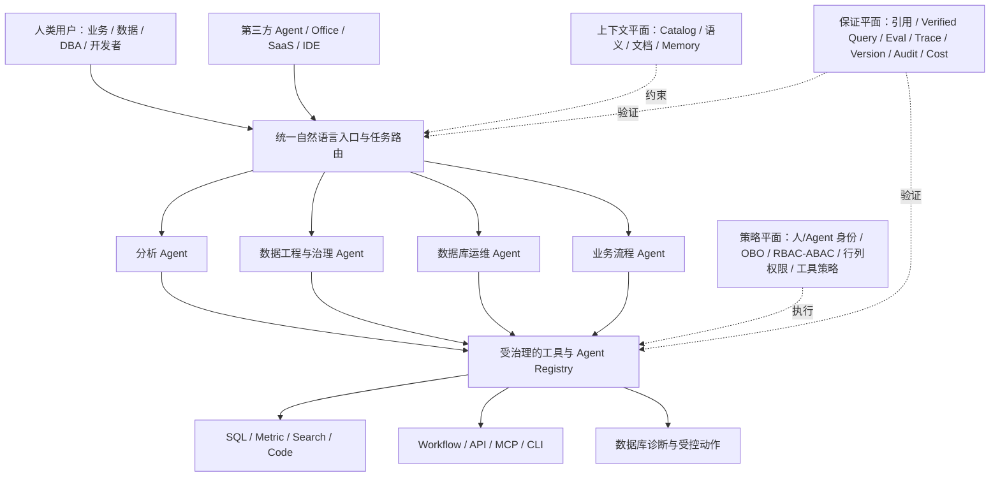

### 2.1 五个平面的竞争含义

| 平面 | 它真正解决什么 | 不能用什么替代 | 当前领先信号 |
|---|---|---|---|
| 体验平面 | 用户表达目标、跨域路由、协作、查看工件和审批 | 不能用一堆分散 Copilot 按钮替代 | Genie One、Quick Suite、Snowflake Intelligence/Cowork、Smart Q、DataBuddy |
| 上下文平面 | 业务实体、指标、Join、可信 SQL、文档、数据时点和历史任务 | 不能只靠把 Schema 塞进 prompt | Unity Catalog/metric views、Snowflake semantic/verified query、Looker/BigQuery data agents |
| 策略平面 | 人与 Agent 的身份、委托、用途、行列、工具和预算边界 | 不能用长期 AK/SK 或共享 publisher credential 替代 | Entra/OBO、Oracle DB OBO、UC securable MCP、Snowflake caller grants |
| 执行平面 | 把分析、代码、查询、工作流和动作做成可发现工具 | MCP/CLI 不能成为底层业务对象的唯一实现 | MCP gateway、API、CLI、workflow/action connector、DB-native tools |
| 保证平面 | 证明答案和动作正确、可追踪、可回归、可恢复、成本可控 | 不能用“用户点赞率”或单个准确率替代 | Snowflake versions/evals/traces、Databricks benchmarks/result equivalence、AgentArts trace/eval |

### 2.2 UI、API、CLI 与 MCP 各自应该处在什么位置

| 接口 | 正确角色 | 不应承担的角色 | 关键治理要求 |
|---|---|---|---|
| 对话/Agent UI | 主意图入口、结果解释、工件协作、审批与异常接管 | 不应成为唯一配置面或唯一审计记录 | 显示使用身份、数据范围、口径、数据时点、引用、计划与动作风险 |
| 专业 UI | 精确创建/编辑语义、策略、工作流、评测集和运营对象 | 不应要求用户在多个控制台复制凭据和重复建模 | 与对话入口使用同一资源 ID、版本和权限 |
| API | 权威能力契约和对象生命周期 | 不应只是 UI 的不稳定私有接口 | 版本、幂等、错误语义、授权、审计、兼容承诺 |
| CLI | 面向 Agent/开发者的自动化、批处理、CI/CD 与故障诊断 | 不应储存独立于 API 的权限/业务规则 | 默认 JSON、dry-run、可重入、稳定 exit code、可查询状态 |
| MCP | Agent 发现和调用工具的标准适配层 | 不应绕过底层 API、Catalog、RLS、审批或配额 | 逐工具授权、输入/输出 schema、OBO、allow/deny、风险级别和 trace |
| Catalog/策略/执行引擎 | 真相源、授权点和实际执行点 | 不应依赖 prompt 自律实现安全 | deny-by-default、策略版本、负权限测试、决策日志和撤销传播 |

所以，原判断中“都包在 CLI/MCP”更准确的产品语言应是：

> **所有可操作能力都要 API 化，并以 Agent 友好的 CLI/MCP 暴露；但所有身份、语义、策略、对象状态和审计仍由统一控制面与底层执行系统权威实施。**

## 3. 跨厂商公开证据：入口正在收敛，底层能力仍不同

| 厂商 | 对话/统一入口信号 | Agent 工具面信号 | 治理/身份信号 | 当前最重要限制 |
|---|---|---|---|---|
| Databricks | Genie One 将 Dashboard、问答、App、Agent 等放入简化入口；全屏 Genie 可路由多类资产 | UC 可保护的 MCP Service、Genie/SQL MCP、Agent API | Unity Catalog 权限、consumer entitlement、部分 OBO | 多项仍 Beta/Preview；嵌入凭据路径并不完全相同；动作面弱于分析面 |
| Snowflake | Snowflake Intelligence/Cowork 走向个人工作 Agent | 托管 MCP、external connectors、Native App agent/MCP | role、caller grant、service-agent/agent identity | 身份/动作能力仍有新发布或预览；默认 role 语义需谨慎 |
| AWS | Quick Suite 官方直接定义 Chat 为 primary interface | remote MCP、action connectors、scheduled tasks | identity propagation、用户权限、READ/WRITE consent、sandbox | 新产品组合成熟度仍需时间；数据正确性回归不如数据云双强完整 |
| Microsoft | M365 Copilot 是天然办公入口，Fabric data agent 可发布到 Agent Store | Fabric MCP、Foundry tool、CLI/ALM | Entra OBO、RBAC、Purview audit | Fabric data agent 仍只读，结果尺寸、语言和数据类型限制明显 |
| Google | Gemini Enterprise 汇聚 BigQuery/Looker/数据库 Agent | Conversational Analytics API、MCP、ADK | 调用用户数据权限、细粒度角色 | 语义/治理分布在多个产品；主动动作仍有预览成分 |
| Oracle | OAC/Select AI/DB tools 均出现 Agent 入口 | 托管 DB MCP、A2A、SQL/PLSQL tools | 最终用户短期 OBO 到数据库，行/列/单元级安全 | 入口分散；统一评测和 Agent 生命周期公开证据较弱 |
| 阿里云 | Smart Q 路由问数/报告/洞察/搭建/搜索；DataWorks Data Agent 进入接数、治理和分析 | Quick BI Skill/CLI、DMS MCP、DataWorks DI/Governance Agent | DMS 细粒度权限与工单审批；DataWorks 治理计划/Diff/确认/复检 | Quick BI、DataWorks、DMS 的同一 Session、用户委托、策略和 trace 未被公开证明 |
| 腾讯云 | DataBuddy 明确“对话即交付”和 Agent Native | MCP、DatabaseClaw Skill、平台 connector/action | RBAC+ACL、DB 独立 AI role、L1-L4 风险与审计 | 2026-08 新发布，架构宣称领先于成熟度证据 |
| 华为云 | DataArts Insight 助手 + AgentArts 多渠道入口，但尚无公开统一壳层 | Insight API、AgentArts API→MCP gateway、DAS/DWS MCP | Insight 数据集权限、AgentArts 多认证/凭据提供者 | 最终用户身份、语义对象、工具策略、评测和 trace 跨产品贯通 Unknown |
| 火山引擎 | DataWind 对话/深度研究及嵌入 | OpenAPI/iframe/JWT；相邻 Agent 平台有 MCP | 产品/项目/Agent/数据和行列权限 | 数据分析面的统一动作/MCP 与版本化评测闭环证据较弱 |
| 百度智能云 | “胜算”强调本体、逻辑、动作、治理 | 公开方向性描述 | 方向含治理 | 当前接口、身份、评测、成熟度公开细节不足，不能高置信排名 |

强支持原判断的两个最直接官方信号是 [AWS Quick Suite 将 Chat 定义为 primary interface](https://docs.aws.amazon.com/quick/latest/userguide/how-quicksuite-works.html)，以及 [Databricks Genie One 将业务用户入口收敛到 Dashboard、自然语言问题和 Apps](https://docs.databricks.com/aws/en/genie-one)。Snowflake、Microsoft、阿里和腾讯的近期产品组合进一步构成跨厂商交叉证据。

## 3A. 产品入口图鉴：看真实页面，但不拿截图代替实测

本报告采用两层结构，而不是拆成 11 个厂商子页面：

1. [主可视化报告](./agent-entry-governance-visual-report.html#entry-atlas)在同一屏放 11 家缩略图、入口说明、总分和视频状态，便于横向比较；
2. [厂商入口详册](./vendor-entry-atlas.html)集中展示大图、首次任务路径、治理边界、强项、残差及官方视频，便于逐家钻取。

这样处理的原因是：当前厂商数量仍适合放在同一评价标尺下；若拆成 11 页，读者很难连续比较“入口是否收敛、任务是否深入、身份是否连续、结果是否成为工件”。后续若单厂商材料扩展到账号实测、多个角色和多个版本，再拆独立子页更合理。

证据纪律：下列 10 份素材是厂商官网、官方文档或官方团队发布的真实产品 UI/UI 动画，百度一项仅是官网概念图；它们都属于`官方声明`，不是本研究的`实际观察`。截图能帮助判断入口形态，不能证明当前账号可用、权限负例、失败行为、规模、SLA 或生产成熟度。总分也不按“页面看起来更漂亮”计算。

| 厂商与入口 | 官方入口素材 | 首次任务路径与从图中能得出的判断 | 官方动态/视频与边界 |
|---|---|---|---|
| **Snowflake · CoWork** | <a href="./vendor-entry-atlas.html#snowflake">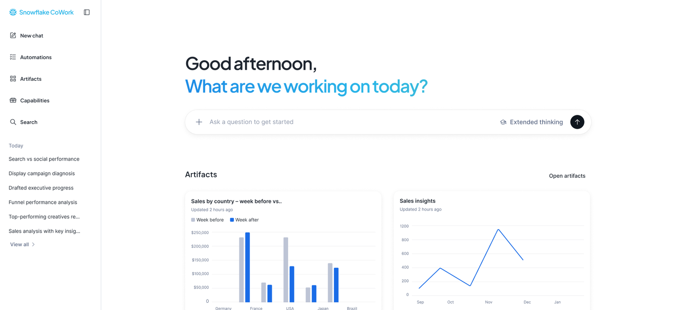</a> | `ai.snowflake.com → New chat → 数据/工具 → 报告、动作、Artifact/Automation`。图中对话、自动化、工件、能力、搜索和历史任务同屏，最接近“个人工作 Agent”。 | [界面来源](https://www.snowflake.com/en/product/snowflake-cowork/) · [官方 AI Pulse，Demo 从 17:48 开始](https://www.snowflake.com/en/ai-pulse/june-2026/)。不能由此证明 MCP 动作评测和默认角色没有残差。 |
| **Databricks · Genie One** | <a href="./vendor-entry-atlas.html#databricks">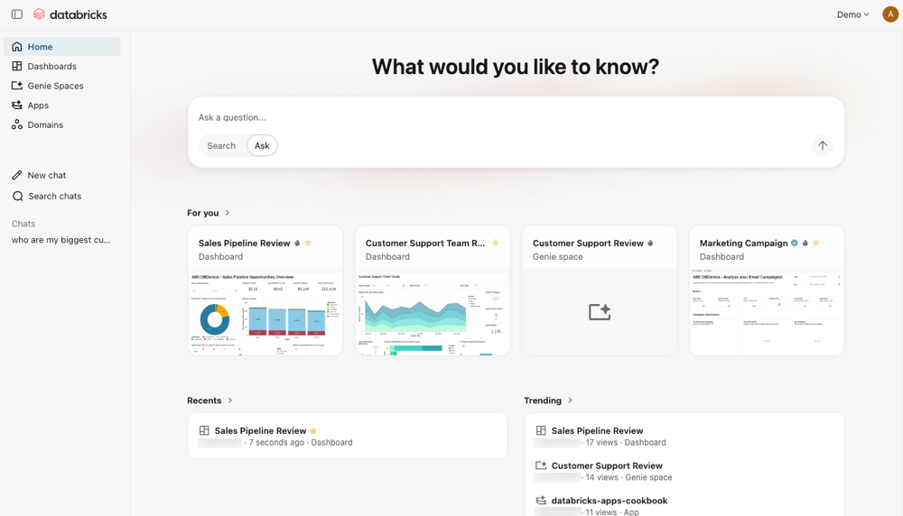</a> | `Genie One → Ask/Search → Dashboard/Genie/App → 答案、图表与资产`。它更像“受治理的数据消费首页”，统一性来自入口背后的 Unity Catalog 对象连续性。 | [界面来源](https://docs.databricks.com/aws/en/genie-one) · [官方端到端 Demo](https://www.youtube.com/watch?v=Tc3WqbV7fKA) · [交互式 Tour](https://www.databricks.com/resources/demos/tours/bi/databricks-aibi-genie)。复杂写动作与不同嵌入凭据仍需实测。 |
| **Google Cloud · BigQuery Conversational Analytics** | <a href="./vendor-entry-atlas.html#google"></a> | `BigQuery → Conversations/Agent Catalog → 数据 Agent → 多步推理与查询 → 回答/引用/API`。官方动图能直接观察多步分析与 Agent 目录，但上层入口仍分布在 BigQuery、Looker 与 Gemini Enterprise。 | [官方发布页与四段动态 UI](https://cloud.google.com/blog/products/data-analytics/introducing-conversational-analytics-in-bigquery)。未用第三方长视频补位；动图不证明跨产品语义和策略已统一。 |
| **AWS · Amazon Quick** | <a href="./vendor-entry-atlas.html#aws">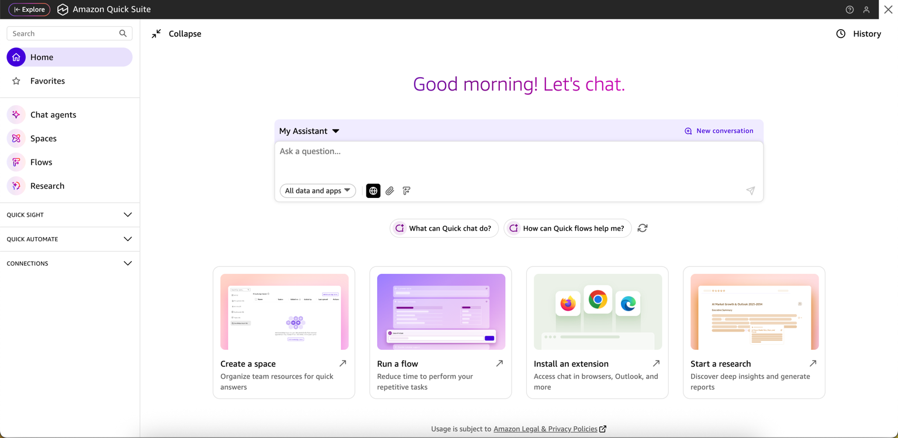</a> | `Quick Chat → Agent/Space → 数据、文档与 Apps → Research/Flow → consent 后动作`。Chat、Agents、Spaces、Flows、Research 首屏收敛，且官方明确称 Chat 为 primary interface。 | [发布时界面（图中旧称 Quick Suite）](https://aws.amazon.com/blogs/business-intelligence/reimagine-business-intelligence-amazon-quicksight-evolves-to-amazon-quick-suite/) · [官方产品视频](https://www.youtube.com/watch?v=duccb_K1seQ) · [当前机制文档](https://docs.aws.amazon.com/quick/latest/userguide/how-quicksuite-works.html)。新组合的长期成熟度仍需验证。 |
| **Microsoft · Fabric Data Agent** | <a href="./vendor-entry-atlas.html#microsoft">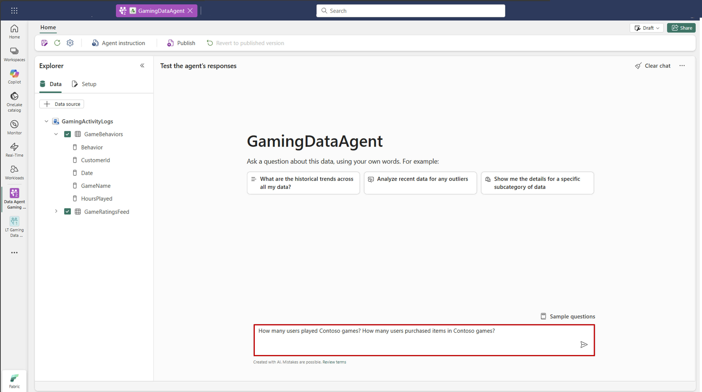</a> | `Fabric Workspace → 绑定数据与指令 → 测试/发布 → M365 Copilot/Agent Store → 只读回答`。图中是作者和测试面，不是最终业务首页；Microsoft 的入口优势主要来自 M365 分发。 | [界面来源](https://learn.microsoft.com/en-us/fabric/data-science/how-to-create-data-agent) · [官方 Demo](https://www.youtube.com/watch?v=5hPVjbV2bRU)。不能把清晰的作者 UI 误读成 Fabric 全产品统一消费入口。 |
| **阿里云 · Quick BI 智能小Q** | <a href="./vendor-entry-atlas.html#alibaba">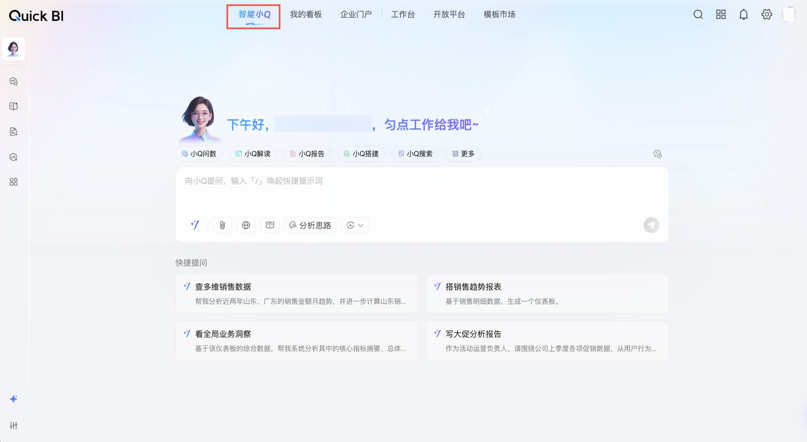</a> | `智能小Q → 选择模式/提问 → 数据集/看板 → 答案、报告或仪表板 → Skill/CLI/DMS`。问数、解读、报告、搭建和搜索共用一级入口，中文业务消费面完成度高。 | [界面来源](https://help.aliyun.com/zh/quick-bi/user-guide/smart-q-home-page) · [官方实操视频](https://help.aliyun.com/zh/quick-bi/videos/smartq)。Quick BI、DataWorks、DMS 是否共享同一 OBO 和 Trace 仍是 Unknown。 |
| **腾讯云 · DataBuddy** | <a href="./vendor-entry-atlas.html#tencent">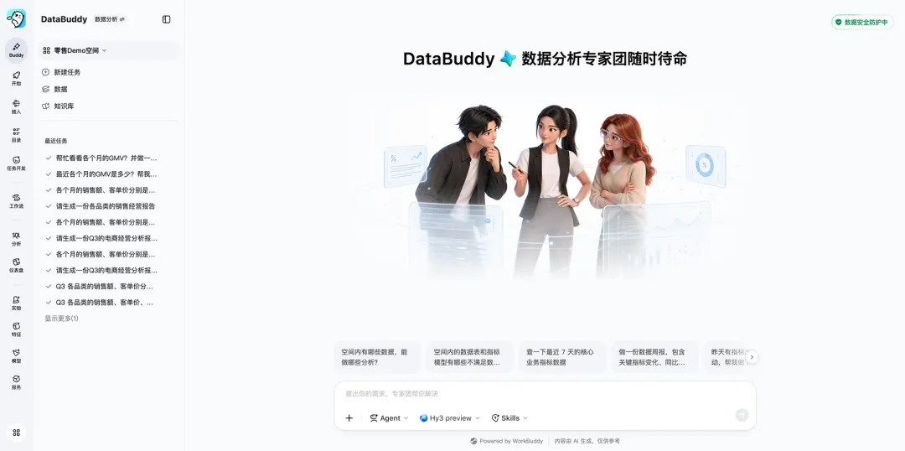</a> | `DataBuddy Workspace → 自然语言任务 → Agent + Skills → SQL/工程/治理/分析 → 报告或发布`。侧栏与输入框体现 Agent-native 数据工作台方向，比单独问数框更激进。 | [腾讯云大数据团队界面文章](https://cloud.tencent.com/developer/article/2672626) · [产品页](https://cloud.tencent.com/product/databuddy)。截至基准日未确认到与当前入口一一对应的官方专场视频；2026-08 新产品的规模与稳定性不确定度较大。 |
| **Oracle · Analytics AI Agent** | <a href="./vendor-entry-atlas.html#oracle">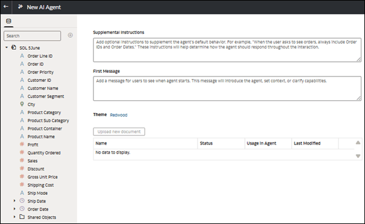</a> | `OAC 创建 Agent → 数据/指令/知识文档 → Workbook 或 standalone → 对话分析 → DB Tools/A2A`。静态图是作者配置面；入口不最统一，但数据库最终用户 OBO 是深层授权强项。 | [作者界面来源](https://docs.oracle.com/en/cloud/paas/analytics-cloud/acubi/create-oracle-analytics-ai-agent.html) · [官方消费者端 Demo](https://www.youtube.com/watch?v=FYg5mGs7-IE)。不能用首页分散否定数据库授权，也不能由 OBO 推断 OAC 全链路统一。 |
| **火山引擎 · Data Agent** | <a href="./vendor-entry-atlas.html#volcano">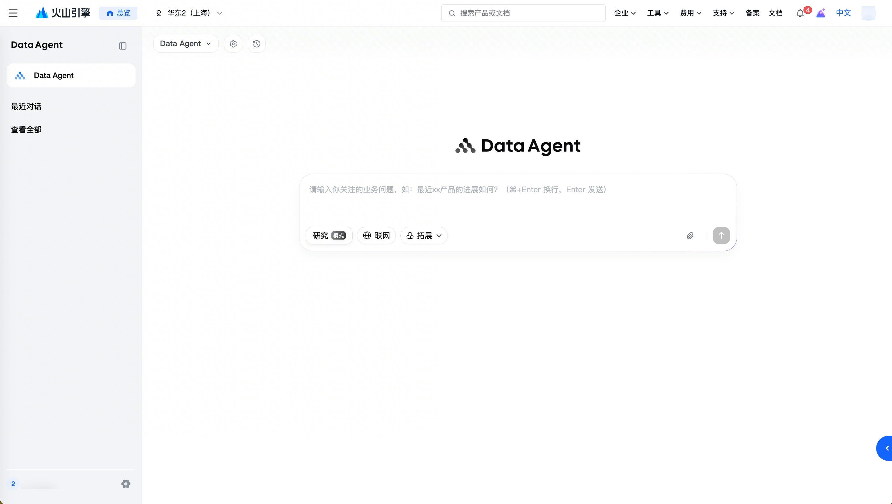</a> | `数据智能体项目 → Data Agent → 研究/联网/拓展/附件 → SQL/Python/知识 → 网页或文档报告`。分析与深度研究入口完整，但不等于已有企业工作 Agent 的安全动作控制面。 | [界面来源](https://www.volcengine.com/docs/85637/1783727?lang=zh) · [官方系列课程](https://developer.volcengine.com/videos/set/7552801541149687846)。OBO、逐工具策略和版本化动作评测证据较弱。 |
| **华为云 · DataArts Insight 智能分析助手** | <a href="./vendor-entry-atlas.html#huawei">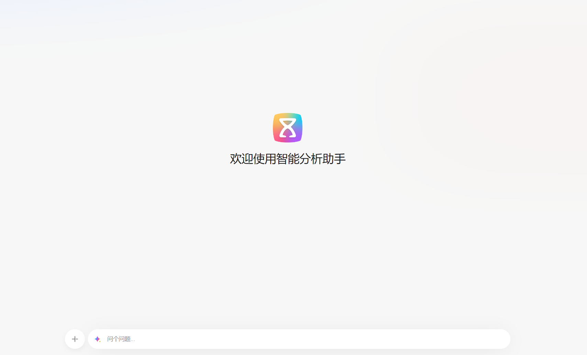</a> | `企业版/公测 → 项目与数据源 → 数据集与助手 → 问答 → 图表/见解`。真实入口已存在，但它仍是项目内 BI 旅程，前置步骤多，尚不是 DataArts、AgentArts 和数据库的统一壳层。 | [界面与快速入门](https://support.huaweicloud.com/qs-dataartsinsight/dataartsinsight_02_0007.html) · [官方 02:24 操作视频入口](https://support.huaweicloud.com/dataartsinsight_video/index.html)。跨产品身份、语义对象、策略、Trace 贯通为 Unknown。 |
| **百度智能云 · DataBuilder Data Agent** | <a href="./vendor-entry-atlas.html#baidu">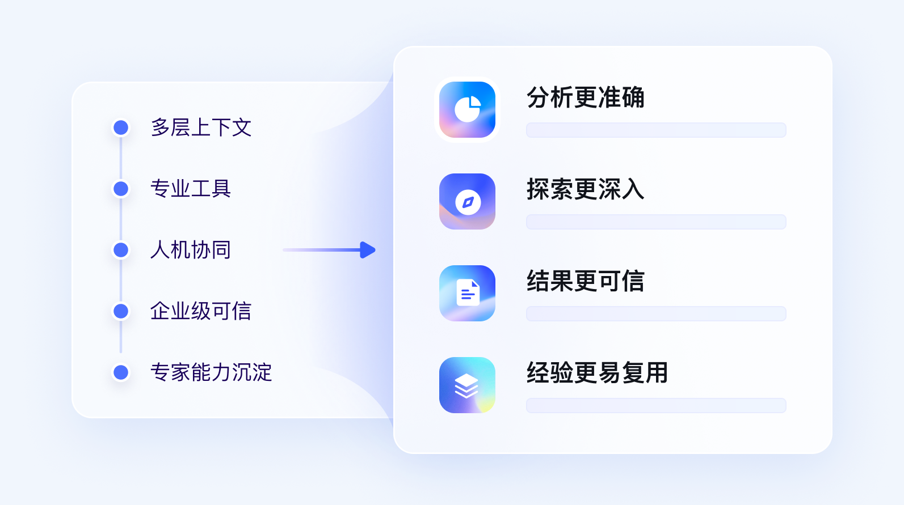</a> | `产品方向 → 真实入口 Unknown → 首次任务 Unknown → 授权/评测 Unknown`。图片表达多层上下文、工具、人机协同和可信结果，但它是概念图，不能与前 10 家真实 UI 等价比较。 | [官网概念图](https://cloud.baidu.com/product/databuilder) · [官方文档入口](https://cloud.baidu.com/doc/DataBuilder/s/tm99rrn2e)。截至基准日未确认到对应真实入口的官方演示视频，低分主要是证据惩罚。 |

从入口图可以作出的最重要判断不是“谁的聊天框最好看”，而是三种产品路线已经分化：Snowflake/AWS 更像跨系统工作 Agent，Databricks/Google/阿里/火山/华为更偏受治理的数据分析入口，Microsoft 依赖上层办公 Agent 分发，腾讯试图从第一天重构成 Agent-native 数据工作台，Oracle 则以数据库授权深度抵消入口分散。真正的胜负仍要回到后文的十维评分，尤其是语义、OBO、工具策略、评测、Trace 和安全动作闭环。

## 3B. 细粒度能力全集、数据源与接入方式、前置准备与责任边界

入口截图只能回答“用户从哪里进去、页面如何组织”。要解释同样一个聊天框为何答案准确性、时效、权限和落地成本不同，本轮进一步把公开产品能力同类项合并，形成 **8 个能力域、67 项细粒度能力、12 类数据源**。完整可筛选的 `67 × 11` 矩阵、数据源悬停说明和逐厂商责任卡见[厂商能力详册](./vendor-entry-atlas.html#capabilities)；主报告保留[八类能力覆盖、关键数据源和准确性保障/易用度摘要](./agent-entry-governance-visual-report.html#capability-gap)。

### 3B.1 “支持”不能再用一个勾表示

| 状态 | 含义 | 为什么必须分开 |
|---|---|---|
| `支持（A）` | 截至基准日，官方当前文档明确描述为可用 | 仍不是本研究账号实测，也不自动证明所有区域/Edition |
| `限用（L）` | 可以使用，但受 Preview/Beta/邀测/版本、数量、文件类型或其他关键条件限制 | 方向存在，但成熟度、可获得性或任务范围有限 |
| `组合（J）` | 需要接入、建模、联邦、相邻产品或外部编排后实现 | 组件存在不等于最终用户身份、语义和执行链路已端到端贯通 |
| `待证（U）` | 没有找到足够公开官方证据 | 不能解释为“确认不支持”，也不能按营销方向计为已实现 |
| `不支持（N）` | 官方明确列为当前范围外 | 例如 Fabric Data Agent 当前文档把 root-cause、causal inference、advanced analytics 列为范围外 |

这套状态也用于计算报告里的“公开证据覆盖度”：`支持（A）=1、限用（L）=0.65、组合（J）=0.4、待证/不支持（U/N）=0`。该指数只帮助快速扫描证据完整度和产品覆盖，**不是产品实测分，也不是准确率**；因此页面同时显示每个能力域的“待证”数量。字母只保留在底层数据中便于复核，页面矩阵使用前面的简短中文名。

### 3B.2 67 项细粒度能力如何去重

| 能力域 | 项数 | 能力项范围 | 判断重点 |
|---|---:|---|---|
| 交互入口与协作 `E` | 7 | 统一入口、Agent 路由、多轮、澄清、恢复、团队空间、第三方分发 | 是否只是产品内问答，还是可续接的任务入口 |
| 数据源与接入方式 `D` | 10 | 湖仓/数仓、关系库、跨云、文件、文档、SaaS、流、CDC、API、联合分析 | 数据是否可直接分析，还是要先复制、联邦、建模或建立知识库 |
| 业务语义与知识准备 `S` | 10 | 范围、表关联、指标、术语、值映射、可信查询、指令、RAG、自动上下文、版本 | 回答前由谁把业务口径变成权威对象 |
| 分析能力与结果交付 `A` | 10 | 查询、计划、图表、仪表板、深度研究、根因、预测、引用、报告、订阅 | 能否从一次回答走到可保存、复算和继续使用的结果 |
| 工具调用与任务自动化 `T` | 9 | API、嵌入、双向 MCP、CLI/CI、函数、写操作、工作流、多 Agent | 能力是否可供外部 Agent 调用且不绕过治理 |
| 身份、权限与审计 `G` | 8 | OBO、行列安全、工具权限、按用户 OAuth、服务身份、隔离、审计 | 最终用户权限是否真正到达数据和工具执行点 |
| 准确性验证与质量保障 `Q` | 8 | 查询验证、可信逻辑、结果一致性、多步评测、执行链路、失败样本、回归、成本 | 错误是否可检测、定位、回归并阻止退化发布 |
| 上线与运行管理 `O` | 5 | 状态/版本、配额、SLA、回滚、使用分析 | 演示能力能否成为长期可运营服务 |

### 3B.3 数据源必须同时说明“是什么”和“怎么接入”

“支持 Salesforce、PDF、PostgreSQL”可能有六种完全不同的产品含义：

1. `直用（D）`：Agent 可在当前产品内选用并执行分析；
2. `接入（P）`：需先复制、增量同步、联邦、建受治理表/数据集或知识库；
3. `限用（L）`：可以直接使用，但处于 Preview/Beta 或有明显类型、大小、数量、区域限制；
4. `工具（T）`：Agent 可以调用外部系统，但它不是可关联、可评测的分析数据源；
5. `待证（U）`：公开证据不足，仍需账号或更细文档确认；
6. `不支持（N）`：官方明确当前不支持。

把四者合并为“连接器数量”会产生三个误判：把接入准备时间当作零、把服务身份/工具 OAuth 当作底层查询 OBO、把外部动作可调用当作数据已经进入统一语义和回归体系。

在 12 类源上可观察到的主要差异是：

- **Snowflake / Databricks**：原生受治理数据最强；Snowflake 用 Analyst + Search 组合结构化/非结构化，Databricks 用 Unity Catalog + Genie Agent 组合。外部关系库、流和 SaaS 往往仍要经过平台对象、联邦或摄取。
- **Google**：BigQuery 内原生表、对象表、跨云 Catalog 和 AI 函数范围最广之一；数据库 Agent 与主动动作仍含 Preview 路径。
- **AWS**：Quick 的关系库、文件、SaaS、协作知识与 Space/KB 入口最宽，首次消费摩擦最低之一；但连接广度不等于 verified query/result-equivalence 保证同样深。
- **Microsoft**：Lakehouse/Warehouse/semantic model、SQL/Mirrored DB、Eventhouse/KQL 和 Microsoft Graph 形成特色组合；非结构化、Graph/Ontology 等仍有 Preview/源数量边界。
- **Oracle / 阿里 / 火山**：底层连接器广，但通常要先形成 OAC/Quick BI/DataWind 数据集。Oracle OAC Agent 当前一个 Agent 绑定一个 dataset；火山直连模式不能跨连接关联；阿里官方新手材料展示了默认字段/指标错误需要知识或计算字段修正。
- **腾讯**：官方发布声明的数据源与数据工程范围很宽，但产品极新，当前应把来源广度与生产成熟度分开评分。
- **华为**：Insight 当前官方源清单集中在 DWS、GaussDB、MySQL、PostgreSQL、Doris、ClickHouse、API、DLI、Hive；Studio 的实时/CDC 只是相邻能力，不能自动算成 Insight Agent 已端到端支持。
- **百度**：官网确认结构化/非结构化与本体方向，但细粒度 Agent 数据源清单公开证据不足，维持 Unknown。

### 3B.4 谁完成哪些工作，决定获得可信答案有多容易

统一任务流程为：

```text
接入 → 授权 → 业务语义 → 验证 → 发布 → 执行/交付 → 执行链路/反馈/回归
```

| 产品路线 | 平台自动完成 | 客户需要配置和维护 | 实际使用体验 |
|---|---|---|---|
| Snowflake | Agent 规划、Analyst/Search、工件、版本、Trace/Eval、MCP 运行 | semantic view、Search index、verified query、角色/Connector OAuth、动作回归 | 控制面强，但不是零配置；索引访问语义与底表权限还需单独治理 |
| Databricks | Agent/Chat 计划、多 SQL、UC 权限、报告/引用、Benchmark 运行 | 收窄 Genie Space、指标/Join/SQL 示例、trusted assets、外部源 OAuth、Benchmark 裁决 | 高质量准备可复用且可回归；Beta 外部源/Volume 仍增加边界 |
| Google | BigQuery 内多步分析、对象表/AI 函数、引用/API | Agent 数据域、Knowledge Catalog、verified queries、IAM/预算、跨产品语义 | BigQuery 内启动快；跨 Looker/DB/Gemini 的控制面仍分布 |
| AWS | Chat/Research/Flow/Automate/Space/Connector 的统一体验 | dataset/topic/KB、Agent persona、资源选择、OAuth/Consent、动作策略 | 用户最容易开始；保障答案质量所需的作者工作仍不能省略 |
| Microsoft | 源路由、NL2SQL/DAX/KQL、Entra 读取、M365 分发 | F2/P1/租户设置、最多 5 个源、Prep for AI/Verified Answers、两层发布验证 | 分发容易，构建/消费面分离；高级分析当前范围有限 |
| 阿里 | Smart Q 多 Agent、SQL/图表/报告、移动/订阅、Skill/CLI；DI Agent 对话创建单表/整库、离线/实时同步；Governance Agent 生成治理方案与 Diff | 选择源/目标、资源组、调度和表范围并确认发布；维护数据集字段/指标/术语/知识；跨 Quick BI/DataWorks/DMS 治理 | 中文入口和数据建设任务都较直接，但需要购买 Data Agent、Serverless 资源组、Region/Edition 和计算费用；跨产品身份/Trace 仍需验证 |
| 腾讯 | 声明覆盖接源、工程、治理、分析、工作流和监控 | 三种数据路径选型、Catalog/权限/脱敏、高风险确认、成熟度验证 | 表面首答路径短；新产品证据不确定度高 |
| Oracle | OAC RAG/问数/可视化与 DB 原生 Agent/Tools | 一个 dataset 的组织与索引、列/过滤器、关键事实复核、跨产品协同 | 授权深但准备步骤多，入口与生命周期分散 |
| 火山 | 多源、研究、SQL/Python/联网、报告、API/JWT | 项目/白名单/数据集/向量化、模型配置、跨连接 Join 与结果验证 | 分析深，但前置与模型运维负担较高 |
| 华为 | Insight 问数/图表/BadCase；相邻 AgentArts Trace/Eval/MCP | 公测/项目/源/数据集/助手；复杂指标预计算；多表预拼宽表；跨产品身份闭环 | 页面简单不等于首答容易，当前客户数据准备负担最高之一 |
| 百度 | 官网描述本体、逻辑、Action、治理方向 | 真实首次任务、连接、发布、授权、评测步骤均待补证 | 低分主要是证据折扣，不能断言产品实际弱 |

### 3B.5 如何评估准确性保障与易用度

本轮没有 11 家同题、同数据、同权限账号，因此不声称测得“真实准确率”。新增的两个分数分别是：

- **准确性保障能力**：业务语义 20% + 可信逻辑 15% + 查询与结果验证 20% + 评测与回归 20% + 执行链路与证据 15% + 权限正确性 10%；
- **获得可信答案的易用度**：许可与账号 15% + 数据接入 20% + 语义准备负担 25% + 作者测试 15% + 消费分发 15% + 失败修复 10%。

| 厂商 | 准确性保障能力 /10 | 获得可信答案的易用度 /10 | 不确定度与解释 |
|---|---:|---:|---|
| Snowflake | **9.3** | 7.4 | ±0.4 / ±0.6；保证面最完整，语义/Search/授权配置仍多 |
| Databricks | **9.2** | 7.7 | ±0.4 / ±0.6；UC + Benchmark 强，外部源/文档仍有 Beta |
| Google | 8.8 | **8.1** | ±0.5 / ±0.6；BigQuery 内置路径易用，多产品一致性仍需验证 |
| Microsoft | 8.2 | 7.4 | ±0.6 / ±0.7；verified answers/OBO 强，作者/消费两面与范围限制 |
| AWS | 7.8 | **8.7** | ±0.7 / ±0.5；入口与数据/应用覆盖最省摩擦，结果等价证据较弱 |
| 阿里云 | 7.7 | 7.4 | ±0.7 / ±0.8；业务入口完整，知识调优与跨产品接缝增加负担 |
| Oracle | 7.5 | 6.8 | ±0.7 / ±0.8；DB 授权深，one-dataset/index 与多产品入口增加工作 |
| 腾讯云 | 7.2 | 8.0 | ±1.0 / ±0.9；架构声明先进但产品极新，不可按成熟能力解读 |
| 火山引擎 | 7.0 | 6.5 | ±0.8 / ±0.9；研究/报告强，模型、向量化和连接准备更多 |
| 华为云 | 6.7 | 5.6 | ±0.8 / ±0.9；显性预计算/宽表建议和跨产品接缝拉低易用度 |
| 百度智能云 | 6.0 | 5.5 | ±1.4 / ±1.5；主要是公开证据不足，不是确认能力缺失 |

关键结论不是一个新排行榜，而是两条轴不能合并：AWS 可在“获得可信答案的易用度”领先，但公开可见的质量保障深度仍低于数据云双强；Snowflake/Databricks 的准备工作并不少，但这些准备更容易成为可复用、可版本化、可回归的工程资产；华为若只优化聊天页而不降低数据与业务语义的前置准备和跨产品接缝，用户体感不会发生同等幅度改善。

## 4. 公开证据评分方法：重点看治理、身份和生产闭环

### 4.1 权重

| 代码 | 维度 | 权重 | 满分要求 |
|---|---|---:|---|
| E | 统一入口与分发 | 12 | 一个可替换壳层能发现/路由领域 Agent，并覆盖 Web、移动、Office、嵌入和第三方 Agent |
| A | 任务深度与结果工件 | 12 | 从问答走到多步分析、图表、报告、Dashboard、计划、定时任务和动作，且工件可保存/授权 |
| S | 语义、上下文与数据治理 | 14 | Catalog、指标、Join、可信查询、文档、版本、血缘和行列治理共同服务所有入口 |
| I | 身份、授权与委托 | 14 | 人、服务、Agent 身份可区分；支持短期 OBO；底层数据源实施权限；撤销和审计一致 |
| T | API/CLI/MCP 与工具治理 | 10 | API 是权威契约，CLI/MCP 可发现；逐工具策略、schema、版本、allow/deny 和 trace 完整 |
| X | 安全动作与审批 | 10 | 草案、dry-run、风险分级、审批、幂等、执行、后置验证、补偿/回滚闭环 |
| Q | 正确性、评测、Trace 与版本 | 12 | SQL/结果等价、语义、权限负例、tool trajectory、动作后置条件、版本/回滚与线上回流 |
| O | 运营、审计、成本与可靠性 | 6 | SLA/配额、成本/任务、延迟、失败归因、审计查询、升级/灰度/回滚 |
| M | 当前成熟度 | 6 | GA/区域/Edition、连续发布、规模与客户证据，而非刚出现的 Preview |
| F | 跨系统、非结构化与生态 | 4 | 多数据源、文档、SaaS、数据库、Office/IDE/第三方 Agent，且身份治理不降级 |

总分公式为：

```text
总分 = Σ(单维 0~10 分 × 该维权重 ÷ 10)
```

### 4.2 评分纪律

1. 单个营销页最多证明“方向存在”，不能直接证明端到端生产可用。
2. Beta/Preview 可以获得能力分，但成熟度受限；planned/coming soon 只进入路线判断。
3. 多个不连通产品不能直接相加。若同一身份、对象、策略、trace 贯通为 Unknown，则在 `E/S/I/T/Q` 扣分。
4. 服务账号、共享凭据、Ticket、AK/SK 和最终用户 OBO 分开评分。
5. “有审批按钮”不等于安全动作闭环；必须继续看 dry-run、幂等、后置验证和回滚。
6. “有 Trace”不等于有回归保证；必须看 golden/benchmark、权限负例、版本联动和线上数据回流。

## 5. 先看梯队，再看公开证据分

| 梯队 | 厂商 | 当前公开证据说明 |
|---|---|---|
| 第一梯队 | Snowflake、Databricks | 都已形成较完整的受治理数据 Agent 产品链，但领先来源不同，0.7 分差没有实际排名意义 |
| 第二梯队 | Google、AWS、Microsoft | 分别依靠推理/API、工作入口/连接器、办公分发/身份建立优势 |
| 国内当前领先组合 | 阿里云 | 问数、对话接数/治理和数据库工具的公开组合较完整，跨产品连续性仍需验证 |
| 高动量、成熟度待证 | 腾讯云等近期发布产品 | 方向和架构积极，但发布时间短、账号与规模证据不足 |
| 华为云当前公开位置 | 组件具备，客户旅程接缝待补 | 关键 Unknown 是 DataArts、AgentArts 与数据库之间的身份、语义、任务和证据能否贯通 |

下面的精确分数是按第 4 节规则形成的研究草案，不是账号实测或采购结论。小于不确定度的差值不应被解释为明确名次。

<details>
<summary>展开完整分数、动量和不确定度</summary>

| 排名 | 厂商产品组合 | 当前能力 /100 | 证据不确定度 | 近 12–18 月动量 /10 | 与“Agent 主入口”方向吻合 /10 | 主要画像 |
|---:|---|---:|---:|---:|---:|---|
| 1 | Snowflake | **91.3** | ±3 | **10.0** | **10.0** | Agent 控制面与保证体系领先 |
| 2 | Databricks | **90.6** | ±3 | **9.8** | **10.0** | Catalog 中心的统一数据消费领先 |
| 3 | Google Cloud | **85.9** | ±4 | **9.8** | 9.5 | 推理、API、多模态与数据库广度领先 |
| 4 | AWS | **85.0** | ±4 | 9.3 | **10.0** | 对话主入口、连接器和分级自治领先 |
| 5 | Microsoft | **84.4** | ±4 | 9.0 | 9.0 | 办公分发、Entra/OBO 与合规领先 |
| 6 | 阿里云 | **81.8** | ±5 | 9.5 | 9.5 | 国内较完整的对话接数/治理 + BI Agent + Skill/CLI + DB 工单组合；新增证据未做全量重评分 |
| 7 | 腾讯云 | **79.6** | ±7 | **9.8** | **10.0** | 新架构方向激进、DB 动作安全强，成熟度待证 |
| 8 | Oracle | **79.0** | ±5 | 8.7 | 8.5 | DB 原生最终用户身份与深层数据安全领先 |
| 9 | 火山引擎 | **68.6** | ±6 | 7.8 | 8.0 | 聚焦分析/深度研究/嵌入，动作控制面较弱 |
| 10 | 华为云产品组合 | **67.6** | ±6 | 9.0 | 8.0 | AgentArts 组件强，跨 DataArts/数据库集成证据弱 |
| 11 | 百度智能云 | **62.9** | ±9 | 7.5 | 8.5 | 方向吻合，但公开可核验证据过少 |

另有一个不参加横向排名、只用于定位产品断点的诊断分：**DataArts 当前直接用户旅程 57.6±7**。把 AgentArts 与 DAS/DWS 的公开组件计入华为云组合后可到 67.6，但这 10 分不是已经实现的“集成红利”，而是组件存在带来的组合上限；跨产品身份和控制面仍然被扣分。

### 5.1 如何读这个排名

- Snowflake 与 Databricks 的 0.7 分差没有实质排名意义；二者属于共同第一梯队，领先来源不同。
- Google、AWS、Microsoft 处于 84–86 分的第二梯队，可能凭借分发、模型、身份或云生态迅速追平特定场景。
- 阿里当前公开组合更成熟；腾讯的方向更激进，但 2026-08 的发布过新，置信区间明显更宽。
- Oracle 总入口不强，却在“外部 Agent 以最终用户身份安全进入数据库”这一战略子问题上是一号参考对象。
- 华为不是“没有模块”，而是公开证据无法证明模块构成一个可购买、可运营、身份不断链的客户旅程。
- 百度的低分主要是证据惩罚；不能被解读为确认缺失。

</details>

## 6. 能力差距的深层拆解

### 6.1 入口之争：一个壳层、多个领域 Agent，而不是一个万能 Prompt

领先设计不是把所有指令交给一个巨大 Agent，而是统一入口负责身份、意图分类、上下文发现和路由，领域 Agent 负责分析、工程、治理、数据库运维或业务动作。Databricks 已公开提示 Agent 数量增加可能影响路由准确性，这说明“统一入口”本身也需要路由 benchmark、置信阈值和用户纠错，而不是只有一个首页。

| 层次 | 领先基线 | 常见伪完成 | 决胜验证 |
|---|---|---|---|
| 发现 | 用户不必知道产品名即可描述目标 | 首页放一个聊天框但仍要求先选数据产品/工作空间 | 用 20 个跨域任务测首跳路由、澄清次数和误路由率 |
| 连续性 | 对话可继续操作已生成的 Query、Dashboard、Report、Workflow | 每次问答只返回文本/图片，不能复用对象 | 工件是否有稳定 ID、Owner、ACL、版本和 provenance |
| 跨端 | Web、移动、Office、SaaS、IDE、第三方 Agent 共享任务状态 | 不同端只是各自调用同一模型 | 同一用户、同一会话/工件、同一权限负例是否一致 |
| 可替换性 | 厂商自有壳层和第三方 Agent 调用同一受治理工具 | 自有 UI 有特权，外部 API/MCP 是降级版或绕过审计 | UI/API/MCP 对相同输入返回同一授权决策和证据 ID |

竞争差异：Databricks 强在数据资产路由，AWS 强在工作应用与连接器，Microsoft 强在办公场景分发，Snowflake 强在从问答到 research/action，阿里与腾讯在中文业务/数据任务集成上推进快。华为当前问题不是缺一个聊天组件，而是缺少公开可证的跨 DataArts、AgentArts、数据库领域路由与任务连续性。

### 6.2 语义与治理：Catalog 不只是资产目录，而是 Agent 的事实边界

Agent 比传统 BI 更依赖语义层，因为它会自己选表、Join、指标、工具和时间范围。传统“用户点选已建好的报表”把很多歧义留给作者；Agent 会把这些歧义放大成自动错误。

领先控制面需要同时保存：

- 业务实体、指标、维度、Join、同义词、枚举、币种/时区/状态口径；
- 可信 SQL/参数化 query、适用条件和反例；
- 数据 Owner、质量、血缘、新鲜度、敏感级别与使用限制；
- 语义、Schema、prompt、工具、策略和 Agent 的独立版本及兼容关系；
- Dashboard、API、MCP、Agent 回答对同一对象的引用。

Databricks 的优势是 Unity Catalog、metric view、AI/BI/Genie/MCP 逐渐围绕一个数据对象面收敛；Snowflake 以 semantic/verified query、Agent object 与 evaluation 补强；Google 的强项分布在 BigQuery、Looker 和 Knowledge Catalog；AWS 在 2026-08 把多数据集 topic 宣布为人和 Agent 共用的语义模型；Microsoft 依赖 Fabric/OneLake/Purview。华为公开资料能证明 Studio/Insight/数据库/AgentArts 各自拥有重要对象，却没有证明一个业务指标 ID 和版本贯穿所有入口。

关键不是“有没有 Catalog”，而是以下四个问题能否同时回答“是”：

1. Agent 和 Dashboard 是否读取同一个已发布指标版本？
2. 外部 MCP 调用是否能引用同一个指标和权限决策 ID？
3. Schema/语义变化后，评测能否定位受影响 Agent 与工件？
4. 回答能否显示数据时间、口径、来源、执行 Query ID 和推断部分？

### 6.3 身份与授权：真正的分水岭是 OBO，而不是“支持 OAuth”

OAuth 只说明一种认证机制，不自动证明最终用户身份到达数据源。至少要区分：

| 身份模式 | 优点 | 主要风险 | 适用范围 |
|---|---|---|---|
| 最终用户 OBO/短期 token | 最小权限、责任清楚、RLS/CLS 可在底层生效 | 跨系统 consent、token exchange 和撤销复杂 | 交互式问数、外部 Agent、敏感数据查询的首选 |
| Agent/service identity | 适合定时任务和受控自治，可独立限权 | 需明确发起用户、委托范围和责任归属 | 后台任务、共享服务、已审批自动化 |
| publisher/shared credential | 部署简单、可形成固定数据产品 | 可能绕过最终用户权限或放大共享范围 | 公开/预聚合数据、严格限定的嵌入场景 |
| Ticket/JWT | 适合 iframe/短期嵌入 | 持票人访问边界、claim 映射和撤销传播必须验证 | 有受控后端签发的嵌入 |
| AK/SK/长期 API key | 兼容性强、搭建快 | 责任记在凭据所有者、泄漏半径大、难以逐用户撤销 | 仅限服务间最小权限；不应作为生产交互默认 |

Oracle 的公开链路最清晰：外部 MCP 用户以短期 OBO 身份进入数据库，再由数据库实施行、列、单元级安全。Microsoft 的 Entra/OBO/Purview 是跨办公与云数据的强组合。Databricks 的 UC 与托管 MCP OBO 很强，但 Dashboard viewer/publisher credentials、不同云和 Preview 状态要求逐入口验证。Snowflake 的 role/caller grant/agent identity 很强，但默认 role 语义是容易被忽视的边界。阿里 DMS 公开说明部分 RealLoginUserUid/AssumeUser 路径受限，而固定 AK 日志可能归属凭据所有者，这是很诚实也很关键的风险证据。

华为的 AgentArts gateway 已有 API Key、OAuth2、STS 和 JWT claim 等组件；DataArts Insight 有 Ticket 和数据集权限；DAS 样例可用 AK/SK。**Unknown 在于这些机制是否构成一条标准、短期、逐用户、可撤销并能落到 DataArts/数据库 RLS 的 OBO 链。** 这也是华为与领先者之间最大的单项加权差距。

### 6.4 CLI/MCP 与工具治理：协议标准化不等于安全标准化

MCP 解决工具描述、发现和调用互操作，但它不天然解决：

- 谁可以发现某个工具；
- 谁可以调用、以谁的身份调用；
- 输入参数是否越权或包含 prompt-injected 指令；
- 工具能否动态生成任意 SQL/代码；
- 返回值是否含敏感字段；
- 调用是否需要审批、配额和费用预算；
- 工具版本升级后，Agent 是否仍选择正确；
- 多个 MCP server 重名/冲突时如何路由；
- 第三方工具是否可信、能否出网和二次调用；
- 最终动作如何审计、验证、撤销或补偿。

因此成熟的工具对象至少要有：`tool_id`、owner、version、input/output schema、risk tier、read/write 分类、required scopes、data classification、network egress、rate/cost budget、approval policy、idempotency contract、postcondition、rollback/remedy、trace policy 和 deprecation policy。

领先差异：Databricks 把 MCP Service 做成 UC securable 并提供 allow/deny/审计；Snowflake 将 MCP、caller grants、Native Apps 与 agent object 生命周期结合；AWS 把 connector、READ/WRITE consent、sandbox 和策略测试结合；Oracle 用 DB role 和参数化工具降低风险；阿里 DMS 把 MCP 接入既有工单审批；腾讯 DatabaseClaw 显式分 L1-L4；AgentArts 的 gateway/API→MCP/认证/trace 已形成强底座，但公开资料尚不足以确认上述逐工具策略和 DataArts/数据库动作生命周期全部贯通。

### 6.5 安全动作：从“能调用工具”到“可托付结果”还隔着八个状态

```text
意图 → 动作草案 → 静态/权限校验 → dry-run/影响评估 → 风险分级
     → 人工或策略审批 → 幂等执行 → 后置条件验证 → 回滚/补偿或升级处理
```

评分不把“执行 SQL”“调用 API”视为完成。真正生产化需要：

- 只读调查与写动作权限物理分离；
- 计划中展示目标、差异、影响对象、成本、超时和可逆性；
- 对数据库动作使用 AST/allowlist、只读事务、`EXPLAIN` 预算、结果/扫描上限和取消；
- 高风险动作使用双人/多方审批或策略审批；
- 使用 idempotency key，防止 Agent 重试造成重复执行；
- 执行后读取权威状态验证，不以工具返回 `200 OK` 当成功；
- 不可回滚动作必须预先声明补偿和人工接管；
- 记录发起人、Agent、模型、prompt/plan、tool version、审批人和前后状态。

AWS 的分级自治、Snowflake 的 connector/sandbox/多方审批方向、腾讯 DatabaseClaw 的风险等级、阿里 DMS 工单与 Oracle 参数化 DB tools 各自提供重要参考。Databricks 在分析和治理上领先，但通用业务/数据库动作控制面仍是相对短板；华为有 AgentArts 工具轨迹评测和数据库 MCP 组件，却缺少公开证明的统一八状态动作对象。

### 6.6 正确性与保证：回答“像对的”远远不够

一个生产数据 Agent 至少需要六层 Oracle：

| 层 | 要验证什么 | 合格证据 |
|---|---|---|
| 路由 | 选了正确的领域 Agent/数据产品 | route benchmark、置信度、误路由/澄清率 |
| 语义 | 指标、Join、过滤、时间和业务规则正确 | golden/verified query、语义版本和业务 reviewer |
| 数据 | SQL 或其他计算与标准结果等价 | result equivalence、快照/水位、Query ID、data freshness |
| 权限 | 无权用户、越权参数、间接工具调用都被拒绝 | permission-negative suite、底层 RLS/CLS 证据、policy decision ID |
| 工具/动作 | 工具选择、参数、顺序和最终状态正确 | tool trajectory、模拟/dry-run、postcondition、rollback test |
| 运营 | 新模型、prompt、schema、策略和工具版本不造成回退 | version matrix、canary、online trace 回流、rollback |

Snowflake 目前公开证据最完整：Agent versions/aliases/rollback、Agent evaluation、Analyst verified-query/result evaluation 和全 trace；但其 Agent evaluation 当前不实际调用 MCP 工具，是明确残差。Databricks 有 benchmark、SQL/结果等价和 Agent-mode judge，且 Agent Framework/MLflow 提供 trace/eval；部分 detail 仅保留一周、benchmark 数量有限。AgentArts 的多轮评测集、工具轨迹、trace 回流、版本和评测对比非常有竞争力；关键缺口是将它从通用 Agent 评估贯通到 DataArts 的 SQL/指标结果等价、权限负例和数据库动作后置条件。

### 6.7 可视化会升级成“证据工件”，不是更漂亮的聊天气泡

结果形态的演进可概括为：

```text
文本答案 → 图表 → 可追问分析 → 带引用的报告 → 可保存 Dashboard/文档
        → 定时任务/活动记录 → 可审批动作 → 可嵌入应用或第三方 Agent 的受治理工件
```

一个可信结果工件应携带：数据来源、数据时点、指标/语义版本、过滤范围、生成 SQL/Query ID、事实与推断分界、置信/限制、Owner、ACL、生命周期和下一步动作。Google 强在多步/多模态与 cited analysis，Databricks 强在 Dashboard/Query/metric/Genie 资产连续性，Snowflake 强在 research/action/trace，Microsoft 强在 M365 中的分发，AWS 强在活动/任务/连接器。未来“能画图”不会形成明显壁垒，“工件能否继承治理并继续执行”才会。

## 7. 各家路线与演进速度：看已经交付的轨迹，不替厂商编路线图

### 7.1 速度评分口径

“动量”不是功能总量，也不是官方承诺数量，综合四个信号：

- 过去约 12–18 个月是否连续发布，而非一次性品牌重启；
- Preview/Beta 是否转成 GA，并补齐 API、权限、监控和限制文档；
- 新能力是否跨越入口、上下文、策略、执行、保证多个平面；
- 是否出现稳定对象模型、版本与兼容路径，而不是频繁改名。

腾讯和华为的 2026 新发布非常密集，所以动量高；但其“持续交付”和“规模成熟”证据少于 Snowflake、Databricks、Google，因此当前能力分与置信度不会随发布数量等比例上升。

### 7.2 国际厂商

| 厂商 | 已交付/已公开的轨迹（官方声明） | 后续主要发力点（推断） | 动量判断 | 最可能卡住的位置 |
|---|---|---|---:|---|
| Databricks | Genie One、全屏 Genie 路由、external sources Beta、Genie Agent API Beta、UC securable MCP、托管 MCP OBO Preview、Dashboard Agent、Lakebase AI troubleshooting | 把 Genie One 从“入口汇总”推进成跨分析、工程、应用和数据库的统一任务壳层；MCP/AI Gateway/UC 成为外部 Agent 的策略面；评测扩展到更多工件和动作 | 9.8 | 多云/嵌入身份一致性；Preview 转 GA；复杂动作的审批、验证与回滚 |
| Snowflake | Intelligence GA、Cowork、agent versions/evals/traces、managed MCP、Native Apps Agents/MCP GA、service-agent identity、connectors/actions | 将“数据问答”升级为个人工作 Agent；补齐 Agent Identity、移动端、sandbox、MCP action 与多方审批；把评测从 query 延伸到真实外部工具 | **10.0** | 默认 role/身份语义；外部工具评测目前不实际调用 MCP；动作供应链安全 |
| Google | Conversational Analytics API v1/BigQuery GA、verified query/citation、Gemini Enterprise 数据 Agent 聚合、DB agents/MCP/ADK | 以 Gemini Enterprise 统一分发 BigQuery/Looker/数据库 Agent；扩大非结构化/多模态、API 和 proactive workflow；把 Agent Analytics 变成开发生态 | 9.8 | Looker/BigQuery/Knowledge Catalog/数据库之间的统一语义和策略；主动动作成熟度 |
| AWS | Quick Suite chat-primary 产品面、MCP/connector、2026-06 autonomous agents、identity propagation/activity feed、2026-08 multi-dataset semantic GA | 从一次性问答转为持续工作 Agent；扩大连接器、计划任务和策略限定自治；把 AgentCore policy/sandbox 能力下沉到统一体验 | 9.3 | 数据语义与正确性回归深度；新产品的稳定对象模型、成本与规模证据 |
| Microsoft | Fabric data agent GA、M365 Copilot Agent Store Preview、Foundry OBO、Fabric MCP Preview、Purview audit Preview、Git/CLI/ALM | 利用 M365 成为默认入口；以 Entra agent identity、Purview 和 Copilot Studio workflow/MCP 打通从只读分析到受控动作 | 9.0 | Fabric data agent 当前只读且有显著数据/语言/结果限制；多 orchestrator 下答案一致性 |
| Oracle | Database Tools MCP、短期 OBO 到 DB、行列单元安全、OAC Agents、Select AI Agents、A2A | 继续把数据库能力转为可供外部 Agent 使用的安全工具；可能逐步收敛 OAC、Select AI 与 Database Tools 的用户旅程 | 8.7 | “收敛入口”只有推断证据；统一评测、版本、路由和跨产品 trace 不足 |

上述 Databricks 路线推断由 [Genie One](https://docs.databricks.com/aws/en/genie-one)、[Genie chat](https://docs.databricks.com/aws/en/workspace/genie-chat)、[MCP Service](https://docs.databricks.com/aws/en/agents/mcp/mcp-services) 和 [2026 产品发布说明](https://docs.databricks.com/aws/en/release-notes/product/) 共同支持。Snowflake 的保证体系由 [Agent versioning](https://docs.snowflake.com/en/user-guide/snowflake-cortex/cortex-agents-versioning)、[Agent evaluations](https://docs.snowflake.com/en/user-guide/snowflake-cortex/cortex-agents-evaluations) 和 [Agent monitoring](https://docs.snowflake.com/en/user-guide/snowflake-cortex/cortex-agents-monitor) 直接证明。Google 的 API 已 GA，但官方同时明确 v1 不返回 chart，这正说明不同入口仍未完全同构：[Conversational Analytics API release notes](https://docs.cloud.google.com/gemini/data-agents/conversational-analytics-api/release-notes)。

### 7.3 国内厂商

| 厂商 | 已交付/已公开的轨迹（官方声明） | 后续主要发力点（推断） | 动量判断 | 最可能卡住的位置 |
|---|---|---|---:|---|
| 阿里云 | Smart Q 多 Agent 入口；Quick BI v6.2 Skill/CLI；DMS MCP、细粒度权限和变更工单；DataWorks DI Agent 对话创建/管理单表/整库、离线/实时同步；Governance Agent 扫描、生成方案/Diff、确认和复检 | 把 BI Agent、数据接入/治理 Agent 和数据库 MCP 组合成一个阿里云数据任务入口；统一用户委托、语义对象和任务 trace | 9.5 | Data Agent 购买、Serverless 资源组、Region/Edition/费用有边界；三条产品线的身份连续性、策略和评测闭环公开证据不足 |
| 腾讯云 | 2026-08 DataBuddy Agent Native/“对话即交付”；工程/治理/分析 Agent；DatabaseClaw L1-L4、独立只读 AI role、Skill；Agent 平台审批中心 | 快速把 DataBuddy 变成数据全生命周期统一入口，以 DatabaseClaw 提供高风险 DB 动作底座，再连接外部 Agent | 9.8（发布爆发） | 产品过新；GA/区域/Edition、客户规模、评测回归、SLA 和跨产品身份尚未形成长期证据 |
| 华为云 | Insight 助手公测/API/嵌入；AgentArts gateway、MCP、trace/eval/版本回流；DAS/DWS MCP 与 Agent 实践 | 最大概率的发力不是再造聊天框，而是把 DataArts 语义治理、AgentArts Runtime/Gateway/Eval 与数据库原生工具贯通 | 9.0（发布爆发） | 产品边界与责任分散；OBO、共享资源 ID、统一策略/trace/action lifecycle 未公开证明 |
| 火山引擎 | DataWind 对话、深度研究、权限、API/JWT 嵌入、审计/反馈 | 深化分析 Agent 和嵌入，补工具/动作与 Agent 评测生命周期；是否与相邻 MCP 平台合流为 Unknown | 7.8 | 工具治理、安全动作、版本回归和数据库原生路径证据不足 |
| 百度智能云 | “胜算”提出本体、逻辑、动作、治理的一体化方向 | 若方向落地，需补统一入口、API/MCP、OBO、评测和成熟度材料 | 7.5（低置信） | 公开技术/接口/状态证据密度不足，难以判断真实速度 |

[Quick BI v6.2](https://help.aliyun.com/zh/quick-bi/product-overview/quick-bi-v6-2-release-notes) 同时出现外部 Skill 和 CLI；[DataWorks DI Agent](https://help.aliyun.com/zh/dataworks/user-guide/introduction-to-data-integration-and-ai-native-capabilities) 已把整库/单表、离线/实时同步直接做成自然语言任务；[DataWorks Governance Agent](https://help.aliyun.com/zh/dataworks/user-guide/data-governance-agent) 则补上扫描、治理方案/Diff、确认和复检；[DMS MCP](https://help.aliyun.com/zh/dms/use-cases/deploy-dms-mcp) 又把数据库查询、变更工单、审批与日志纳入可调用链。四者共同说明国内竞争基线已经跨过“只做 NL2SQL”。腾讯 [DataBuddy 产品概述](https://cloud.tencent.com/document/product/1835/135576) 与 [DatabaseClaw 安全设计](https://cloud.tencent.com/document/product/1813/130681) 的方向最激进，但发布日期距离基准日极近，因此只能给高动量、宽置信区间，不能给高成熟度。

## 8. Databricks：为什么它最接近你的判断，又为什么还不能被当成终局模板

### 8.1 已经形成的优势闭环

Databricks 当前最强的不是聊天样式，而是五件事逐渐围绕同一数据平台收敛：

1. `Genie One / Genie chat`：把业务用户问题、Dashboard、Query、Metric View、Agent、外部文档和任务路由到一个消费入口。
2. `Unity Catalog`：作为表、函数、模型、工具/MCP 等对象的治理边界，并把消费权限延伸到 Agent 工具。
3. `AI/BI + metric views + trusted assets`：减少自然语言直接猜 Schema/Join/指标的空间。
4. `Agent Framework + MLflow + benchmark`：把 Agent 运行、trace、SQL/结果等价和回归逐步产品化。
5. `API/MCP/外部客户端`：使 Databricks 自有入口不是唯一消费端，Claude、Cursor 等外部 Agent 也可进入同一数据能力面。

这套结构直接支持“用户以后先说任务，而不是先找产品菜单”的判断。它也说明真正难复制的是 Catalog、语义、权限和运行证据，而不是 Genie 的前端。

### 8.2 不能忽略的限制

| 限制 | 为什么重要 | 对华为的启示 |
|---|---|---|
| Agent mode/API、MCP Service、managed MCP、external sources 等多项处于 Beta/Preview 或逐云差异 | 市场方向已经确定，但生产基线尚未完全固化 | 不必等竞品全部 GA 才行动，但不能把 Preview 宣称当验收标准 |
| Dashboard 可有 viewer/publisher credentials，外部源又采用每用户 OAuth | “Databricks 有统一身份”不能笼统成立，必须逐入口画 token/permission flow | 华为也应逐入口验证，而不是只问“是否支持 IAM/OAuth” |
| Agent/数据源增多会降低路由和上下文准确性；存在数据集/benchmark/保留期等限制 | 单入口会创造新的路由、上下文和运营难题 | 路由本身要成为可评测、可回滚的版本化对象 |
| UI 与 API 字段/图表/体验并不完全同构 | 外部 Agent 可能得到降级能力或不同证据 | 先定义 canonical task/artifact/trace schema，再适配 UI/MCP |
| 通用安全动作闭环弱于分析与 Catalog | 从“问数据”到“改业务/改数据库”风险骤升 | 数据库动作不能直接复用通用 NL2SQL；需数据库原生风险控制 |
| 跨云、区域、Edition、配额和成本仍需账号验证 | 公开产品组合不等于目标客户可买、可开、可规模运行 | 采购和产品决策必须经过区域/Edition/价格 Gate |

### 8.3 最值得预判的竞争压力

- Snowflake 会从 `版本 + Eval + Trace + Action` 侧攻击 Databricks 的 Agent 生产保证。
- Microsoft/AWS 会从用户已经工作的 Office/应用/连接器入口绕过数据平台原生入口。
- Google 会从模型推理、非结构化、API 与数据库 Agent 广度攻击复杂任务体验。
- Oracle 会把最终用户身份直接下沉到数据库，树立敏感数据 Agent 的安全标杆。
- 国内厂商会利用中文业务语义、本地合规、私有化、数据库和既有云产品协同缩短入口差距。

所以 Databricks 的长期防线不是“Genie 首发优势”，而是能否让每个入口和工具持续落在 Unity Catalog/语义/评测/AI Gateway 共同控制下，并把分析优势扩展到安全动作。

## 9. 华为云：真正差距在接缝，不在组件数量

### 9.1 当前公开组件各自最适合承担什么

| 组件域 | 已有强项（官方声明） | 最合适的长期责任（建议） | 不应独自承担 |
|---|---|---|---|
| DataArts / Insight | 数据治理、分析、数据集权限、问数、嵌入/API、业务数据资产 | 业务语义、指标、Catalog/血缘/质量、分析工件和数据消费规则 | 通用 Agent Runtime、跨云工具网关、数据库高风险动作 |
| AgentArts | Agent 构建、模型/工具、API→MCP gateway、认证/凭据、Trace、评测集、线上回流 | Agent Runtime、router/supervisor、tool registry/gateway、通用 trace/eval、模型与成本治理 | 重新发明 DataArts 语义和 DB 内部权限/事务/负载语义 |
| 数据库产品（DAS/RDS/DWS/GaussDB 等） | 权威 Schema/Role/RLS、执行计划、负载、诊断、变更、数据库 MCP/实践 | 参数化 DB tools、只读路由、预算/取消、风险分级、动作验证/回滚、数据库证据 | 重建通用 BI、企业 Catalog、通用 Agent 平台 |
| 统一产品壳层 | 当前公开证据不足 | 一个客户可识别的 Data Intelligence Agent 入口、任务/工件/审批中心、第三方 Agent 入口 | 成为另一个拥有独立身份、语义和私有 API 的孤岛 |

这不是在预设组织归属，而是在按不可替代的权威数据与责任分工。**谁拥有聊天前端不是最关键决策；谁拥有统一资源 ID、最终用户委托、策略决策、trace 和动作状态机，才决定平台是否真的统一。**

### 9.2 相对 Databricks 的 23.0 分差从哪里来

| 差距维度 | 单维差（10 分制） | 对总分的贡献 | 证据解释 |
|---|---:|---:|---|
| 最终用户身份与委托 I | 3.5 | **4.9** | AgentArts 有认证/凭据组件，Insight 有 Ticket/数据集权限，DAS 样例有 AK/SK；尚无统一短期 OBO 到 DataArts/DB 权限的公开证据 |
| 统一入口 E | 3.5 | **4.2** | 有多个助手/Agent 入口，未证明一个入口可稳定路由 DataArts、AgentArts 和 DB 任务并保持状态 |
| 语义与治理 S | 2.5 | **3.5** | DataArts 具治理资产，但同一指标/语义对象贯穿 Insight、外部 Agent、DB tools Unknown |
| 工具面 T | 2.5 | **2.5** | AgentArts/DAS/DWS 有 MCP，但逐工具统一策略、资源 ID 与底层 API 一致性未闭环 |
| 任务/工件 A | 2.0 | **2.4** | 问数、Agent、DB 分散；报告、Dashboard、计划、动作与活动记录缺统一生命周期 |
| 安全动作 X | 1.5 | 1.5 | 有 DB 操作样例和通用工具能力，缺统一草案→审批→幂等→后置验证→回滚证据 |
| 正确性/评测 Q | 1.0 | 1.2 | AgentArts 评测很强，所以差距相对小；但 DataArts SQL/指标/权限/DB 动作尚未共用 |
| 运营 O | 2.0 | 1.2 | 跨产品任务成本、SLA、失败归因和 trace 关联 Unknown |
| 成熟度 M | 2.0 | 1.2 | Insight 助手公测，多个能力较新；没有账号级规模证据 |
| 跨系统 F | 1.0 | 0.4 | 组件覆盖广，但身份不断链的联邦使用未证明 |
| **合计** |  | **23.0** | 67.6 对 90.6 |

前五项占总差距的 76% 左右。也就是说，优先再做一个更漂亮的聊天页、再接一个模型或再做一个 NL2SQL Demo，不会显著缩小真实差距；最有效投资是入口、身份、语义、工具策略和工件生命周期的贯通。

### 9.3 推荐的产品形态：一个壳层、三类领域权威、一个共同控制面

`建议`：采用联合产品/联合控制面的形态，而不是数据库部门重建通用数据智能平台，也不是简单把数据库工具挂到当前某个聊天框。

```text
统一 Data Intelligence Agent 壳层
  ├─ DataArts 领域 Agent：分析 / 指标 / 数据开发 / 治理
  ├─ Database 领域 Agent：诊断 / 计划 / 只读调查 / 受控动作
  ├─ Business 领域 Agent：第三方 SaaS / 工作流 / 文档
  └─ AgentArts 公共 Runtime：路由 / 模型 / Gateway / Trace / Eval

共同控制面
  ├─ Canonical resource + semantic IDs
  ├─ Human / service / agent identity + OBO
  ├─ Policy decision + tool registry
  ├─ Task / artifact / approval / action state machine
  └─ Trace / evaluation / audit / cost
```

产品组织可以有多个实现选项，但必须经过 Gate 决定：

| 选项 | 优势 | 根本风险 | 何时才可选 |
|---|---|---|---|
| DataArts 拥有统一前门 | 靠近数据资产、语义、治理和 BI 客户 | 通用 Agent runtime、数据库动作和外部工具可能被做成附属功能 | 证明 DataArts 可承载跨产品身份、工具对象、任务/工件和第三方 Agent SLA |
| AgentArts 拥有中立前门 | 靠近企业 Agent 分发、模型、Gateway、Trace/Eval | 可能重新发明数据语义，或把 DataArts/DB 降成无状态工具 | 证明它能引用而非复制 DataArts/DB 权威对象，并执行底层权限 |
| 数据库部门新建完整产品 | 数据库上下文、权限、负载和动作责任最清楚 | 重复建设 BI/Catalog/语义/Agent 平台，入口碎片化更严重 | 仅当 DataArts/AgentArts 的接口、SLA 或身份 Gate 被证伪，且差距无法通过共同底座补齐 |
| 联合控制面 + 可替换壳层 | 复用三方不可替代能力，兼容自有/第三方入口 | 需要强契约、共同 roadmap 和跨组织产品 Owner | **当前证据下的首选假设**；必须以端到端 Gate 而非组织承诺验收 |

## 10. 建议路线：先建立可证明的信任链，再追求自治

下面是能力依赖顺序，不是假定团队规模后的交付日期。每一阶段以前一阶段的生产 Oracle 为准，不能仅凭 Demo 晋级。

### H0：统一契约与身份（必须先做）

目标：证明一个用户、一个资源和一个任务在 DataArts、AgentArts、数据库之间不断链。

- 定义 canonical `user/agent/service identity`、`resource_id`、`semantic_id/version`、`tool_id/version`、`task_id`、`artifact_id`、`policy_decision_id`、`trace_id`。
- API 成为权威对象契约；CLI/MCP 都只是同一 API/策略面的适配。
- 建立短期 OBO/token exchange；交互默认最终用户身份，后台任务使用独立 agent identity 和显式 delegation grant。
- 工具默认不可发现/不可调用；按工具、数据分类、动作类型、网络和预算授权。
- 明确 UI、API、CLI、MCP、iframe/第三方 Agent 的同一错误语义和审计关联。

`Gate H0`：同一权限正例/负例在五种入口得到一致的底层授权决策；撤销在定义的时限内传播；审计可由一个 `trace_id` 关联到用户、Agent、工具、SQL/动作和结果。未通过时不得宣布“统一入口”。

### H1：可信只读数据任务

目标：先把高价值、低动作风险的分析做深，而不是追求“什么都能聊”。

- 选择经营分析、售后联查或财务证据中的一个窄场景。
- 同一业务语义对象服务 Dashboard、问数、API/MCP 和第三方 Agent。
- 回答返回事实/推断分界、指标版本、数据时点、SQL/Query ID、引用和限制。
- 形成路由、语义、SQL/结果等价、数据新鲜度、权限负例和成本/延迟 benchmark。
- 结果生成可保存、可授权、可复算的 Chart/Report/Dashboard/Document，而非聊天附件。
- 对无法回答、权限不足、口径冲突、数据延迟、成本超限给出显式失败状态。

`Gate H1`：权限负例必须全部拒绝；已定义 benchmark 不得有未裁决的高风险错误；同一任务从 UI/API/MCP 返回等价结果与同一 provenance；线上 bad case 可回流并绑定版本。

### H2：外部 Agent 与受控数据库/业务动作

目标：让第三方 Agent 使用同一能力，并把写动作纳入确定性状态机。

- 发布 UC-like securable（不要求照搬命名）的 Agent/tool registry；逐工具 scope、allow/deny、risk tier、schema 与版本。
- 外部 Agent 只获得短期、目的限定、可撤销的 delegation；禁止默认长期 AK/SK。
- 数据库提供只读副本路由、AST/方言校验、`EXPLAIN` 预算、超时/取消、扫描/结果上限、事务边界和负载保护。
- 写动作执行草案、diff、dry-run、风险分级、审批、幂等、后置条件和补偿/回滚。
- Eval 覆盖真实/模拟工具 trajectory、越权工具选择、prompt injection、重试、部分成功和审批超时。

`Gate H2`：任何动作都不能以模型自报成功作为通过；必须读取权威后置状态。不可回滚动作必须有明确补偿或人工接管，未定义则禁止发布。

### H3：策略限定的主动与自治任务

目标：在已有证据链上支持定时、事件触发和有限自治。

- 将“建议下一步”升级为可预览的计划和可暂停活动记录。
- 自治权限按目标、工具集合、数据范围、预算、时间窗口和风险上限发放。
- 使用 canary、policy simulation/log-only、异常停止、全局 kill switch 和回滚。
- 对跨 Agent 委托记录完整 delegation chain，禁止权限在多 Agent 链中扩张。
- 用成本/成功任务、误动作/总动作、人工接管、恢复时间和业务结果衡量，而不是对话数。

`Gate H3`：只有 H0–H2 在目标场景连续满足安全、正确性和恢复 Oracle，才允许从“逐步批准”升级到“目标范围自治”。

### 10.1 产品 KPI 应如何改变

| 不够好的指标 | 应替换/补充为 |
|---|---|
| DAU、对话数 | 完成且被验证的业务任务数、重复使用率、从意图到可用结果的时间 |
| 模型回答准确率 | route success、semantic correctness、result equivalence、权限负例通过率、证据覆盖率 |
| 工具调用成功率 | 端到端后置条件达成率、幂等重试正确率、回滚/补偿成功率、未验证终态数 |
| 连接器数量 | 以最终用户身份安全调用的连接器比例、统一策略/trace 覆盖率 |
| 生成图表数量 | 被保存、分享、复算、订阅或继续行动的受治理工件数 |
| Token/请求成本 | 每个成功且验证通过的任务成本、失败浪费、缓存/复用收益 |
| 用户点赞 | 已裁决 bad case、回归阻断率、版本升级后的质量变化 |

## 11. 用真实任务检验“一个入口”是否只是表面统一

| 任务 | 对话入口要做什么 | 共享治理/授权必须做什么 | 工具/动作必须做什么 | 通过证据 |
|---|---|---|---|---|
| 经营利润下滑归因 | 澄清区域/周期/口径，多步下钻并形成图表/报告 | 使用已发布收入、成本、毛利指标；执行用户行列权限 | 调用 metric/query 工具，保存报告并可订阅 | 指标/SQL/结果等价、数据时点、引用、报告 ACL |
| 订单-退款-工单联查 | 跨数据库/湖仓/文档路由，区分事实与建议 | 客户 PII、租户和客服角色权限不断链 | 查询多源，起草而非直接执行退款/回访动作 | 每个来源与权限决策、动作审批、执行后订单状态 |
| 财务对账与合规证据 | 输出可审计差异清单和解释 | 锁定会计期间、币种、规则版本和数据快照 | 只读调查；修正动作进入双人审批 | 可复算快照、规则版本、审批链、差异关闭证据 |
| 数据库故障与业务影响 | 关联指标、日志、会话、SQL、发布和业务告警 | DBA/业务用户看到不同敏感范围 | 先诊断；`EXPLAIN`/kill/变更按风险分级，验证恢复 | 计划、前后指标、受影响会话、审批、后置验证/回滚 |
| 第三方 SaaS/Agent 嵌入 | 外部入口调用同一分析/动作能力并返回工件 | 短期 OBO、tenant isolation、RLS/CLS、用途/预算策略 | MCP/API 逐工具授权，不泄漏内部 schema/凭据 | UI/API/MCP 权限负例一致、trace 贯通、撤销生效 |

如果任何任务要求用户在多个控制台重新选择项目、复制凭据、重建指标或丢失 `trace_id`，则“一个入口”尚未形成；前端路由只能掩盖产品割裂，不能消除它。

## 12. 对原判断的反方压力测试

为避免把趋势写成必然，以下反证成立时应下调结论：

1. **专业创作不会全部对话化。** 复杂语义建模、政策配置、大规模差异审阅和流水线调试在结构化 UI/代码中更高效；对话只会成为入口和协作者。
2. **第三方 Agent 可能拥有入口，云厂商只拥有工具。** 如果用户主要停留在 M365、Claude、IDE 或企业自建 Agent，原生 Genie-like 页面可能只是一个参考客户端。因而工具/策略面比独占 UI 更具防御力。
3. **自然语言入口容易商品化。** 模型和聊天壳层可替换，真正难迁移的是受治理的业务语义、权限映射、评测资产、动作策略和运营历史。
4. **治理不是万能解。** Catalog 很完整但业务指标错误、数据延迟、工具选错或动作无后置验证，仍会生产错误结果。
5. **MCP 扩大而非自动减少攻击面。** 工具投毒、描述注入、越权参数、响应数据外泄、跨 server 间接调用都需要协议之外的策略。
6. **用户未必愿意把高风险任务交给 Agent。** 信任需要可解释计划、可预测失败、审批、可恢复性和清晰责任，不靠模型能力单独建立。
7. **统一入口可能成为单点复杂度。** Agent/数据源越多，路由、上下文和权限组合爆炸；必须允许领域入口直达和人工纠错。

这些反方并不推翻“对话成为主入口”，而是把终态限定为“主入口 + 结构化工件/工作台 + 可替换外部入口 + 统一控制面”。

## 13. 当前 Unknown 与必须执行的验证 Gate

### 13.1 仍不能从公开资料确认

- 华为云内部是否已有未公开的统一资源/语义 ID、OBO、Agent identity、tool policy 和 trace schema；
- DataArts Insight、Studio、AgentArts、DAS/DWS 在同一区域/Edition 是否可以形成无需复制凭据的真实旅程；
- Insight Ticket 的用户映射、撤销、RLS/CLS 与审计归属；
- AgentArts gateway 的 OAuth2/STS 是否可标准化下传最终用户到 DataArts/数据库，而非仅代表资源拥有者；
- DataArts 指标/语义资产是否可被 AgentArts/MCP 原生引用并保持版本；
- 通用 AgentArts Eval 能否关联 SQL result equivalence、数据快照、权限负例和数据库动作后置条件；
- 各产品 GA/公测、区域、Edition、价格、配额、SLA 和升级兼容的真实组合；
- 腾讯/百度等近期产品在真实客户、规模、失败恢复和商业交付上的成熟度。

### 13.2 建议的六个验证 Gate

| Gate | 只读/合成验证 | 通过标准 | 会改变什么决策 |
|---|---|---|---|
| G1 入口与对象 | 用同一合成数据完成问数→报告→外部 API/MCP | 资源/语义/工件 ID 和版本不丢失，不重复建模 | 是否已有可演进产品骨架 |
| G2 身份与权限 | 三个用户、两角色、行列负例、撤销和嵌入 | UI/API/MCP/iframe/第三方 Agent 均由底层拒绝越权，审计归属最终用户/明确委托 | 是否可直接复用现有身份面 |
| G3 语义与正确性 | 指标、Join、同义词、时间、歧义和 Schema 变化集 | Dashboard/Agent/API 结果等价，变化触发影响分析和回归 | DataArts 语义是否可成为共同真相源 |
| G4 工具与动作 | 只读、低风险写、高风险写、重试、超时、部分成功 | 风险分级、审批、幂等、后置验证、补偿/回滚全部可追踪 | DB/AgentArts 哪些能力必须补建 |
| G5 运营与评测 | 模型/prompt/tool/schema/policy 版本变更 | 可回放、比较、阻断回退、回滚；trace 与成本可关联 | 是否达到生产运营而非 Demo |
| G6 商业可用 | 目标区域/Edition/价格/配额/SLA/支持矩阵 | 一个可采购组合覆盖目标旅程，无隐藏公测/跨区/增购断点 | 新建、迭代、联合或集成的商业选择 |

在 G1–G6 完成前，不能把“公开未证明的贯通”写成华为没有能力，也不能把“组件存在”写成已完成端到端产品。

## 14. 最终判断与决策含义

### 14.1 对趋势判断的最终裁决

你的判断在战略方向上是正确的，而且 2026 年的厂商发布已提供强交叉证据：

- 自然语言 Agent 会成为大多数数据任务的**主意图入口**；
- 图表会升级为带来源、权限和生命周期的**可操作结果工件**；
- 自有对话页与第三方 Agent 会共同存在，入口本身不会被一家永久垄断；
- CLI/MCP 会成为关键的 Agent/自动化工具面，但 API/对象/策略/执行引擎才是权威底座；
- 数据治理与授权是入场券，真正的领先是把语义、身份、工具、动作、评测和运营组成一条可证明的信任链。

### 14.2 对华为云最重要的取舍

最高优先级不是追赶 Genie One 的页面，而是让任何自有或第三方 Agent 都能在一个控制面下做到：

1. 发现同一个已治理的数据/语义/工具对象；
2. 以最终用户或明确 Agent delegation 身份执行；
3. 由 DataArts 与数据库底层真正实施权限，而不是由 prompt 自律；
4. 返回可保存、可复算、可授权的结果工件和证据；
5. 对高风险动作执行可验证、可恢复的状态机；
6. 用同一 trace/evaluation/version 体系持续运营。

基于当前公开证据，最合理的产品假设是 **联合控制面 + 一个统一但可替换的入口 + DataArts/AgentArts/数据库三个领域权威**。这不是最终组织结论；它必须由 G1–G6 证明。若现有产品无法通过身份、对象和动作 Gate，才有充分证据决定哪些控制面必须新建；在此之前重建通用 BI、Catalog 或 Agent Runtime 的重复建设风险高于收益。

### 14.3 一句话竞争判断

> **Databricks 和 Snowflake 当前领先的不是“更会聊天”，而是更接近把数据、语义、身份、工具和 Agent 保证体系变成同一个产品闭环；华为追赶最快的路径不是堆更多助手，而是把已经存在的 DataArts、AgentArts 和数据库能力通过同一身份、对象、策略、任务和证据链真正连起来。**
