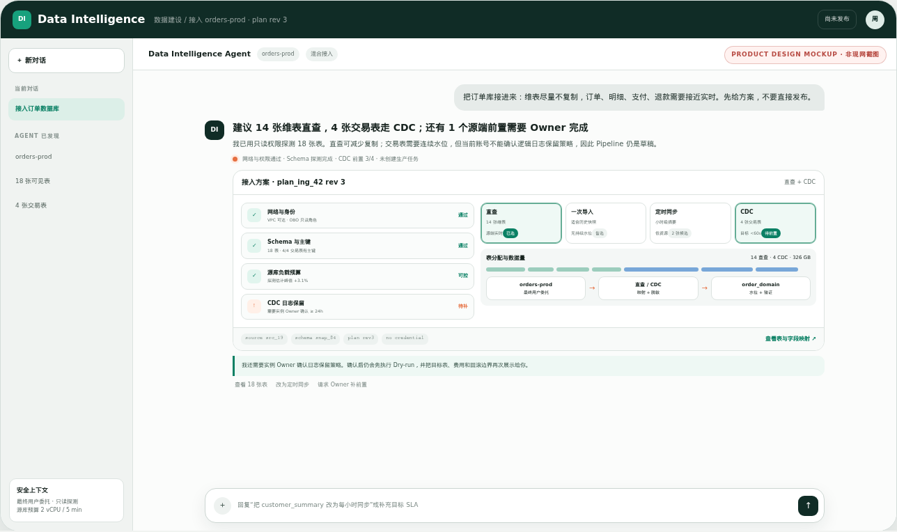
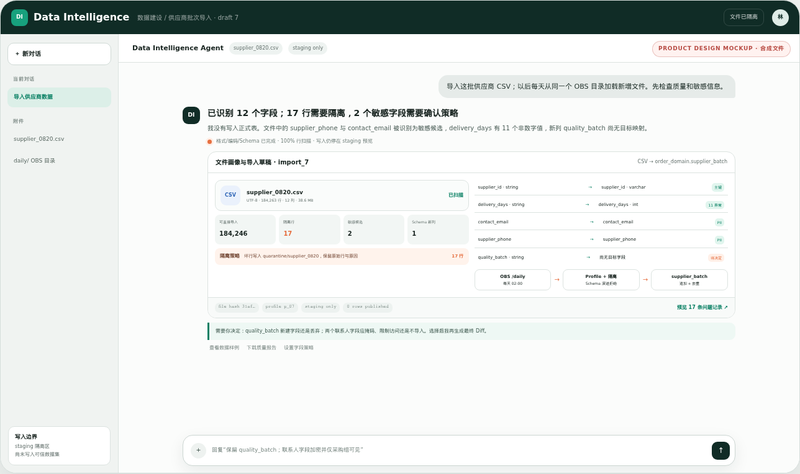
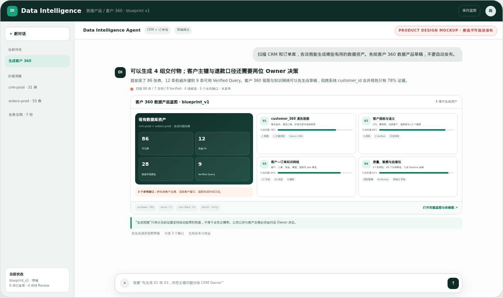
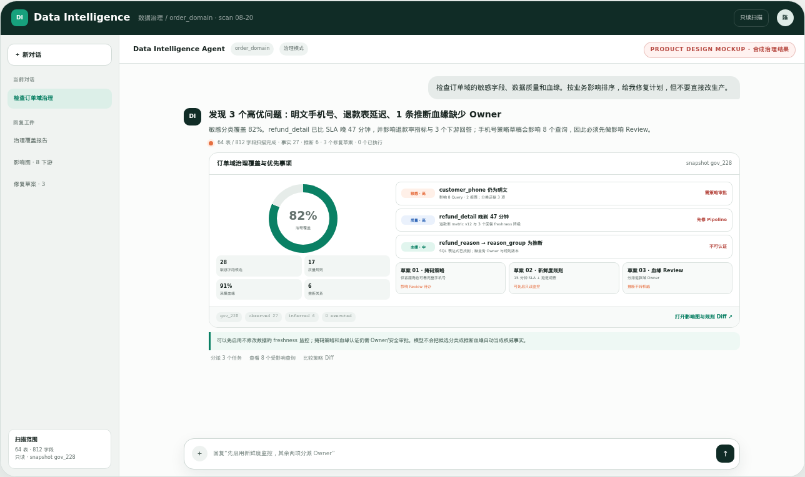
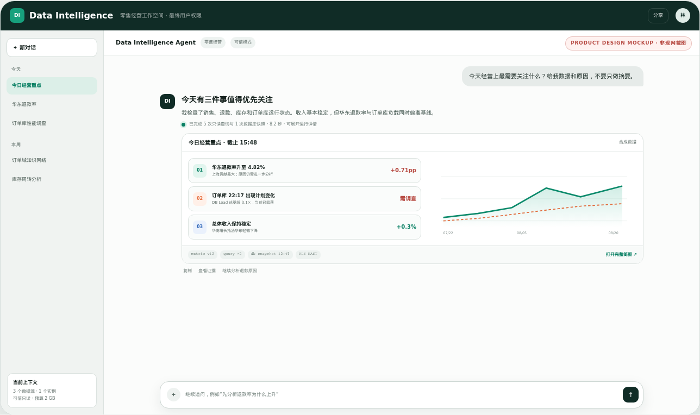
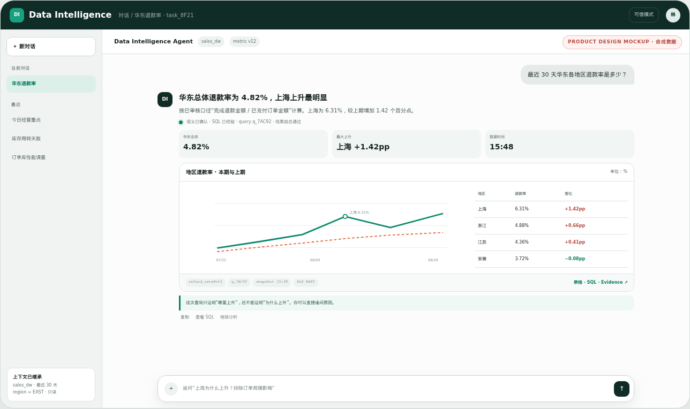
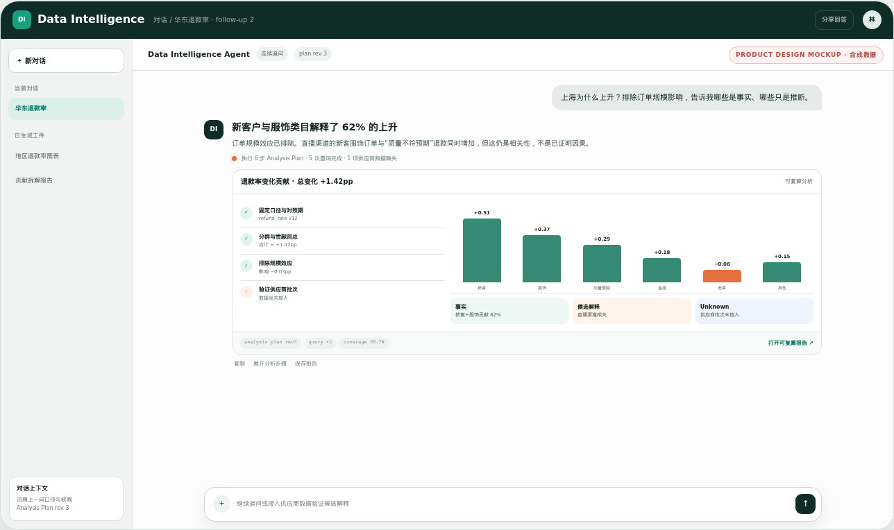
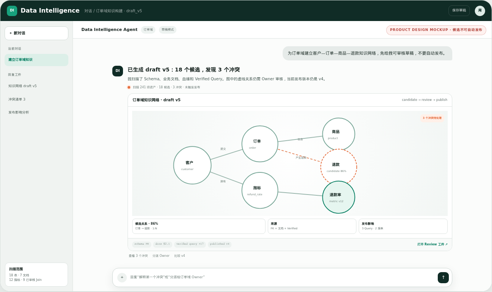
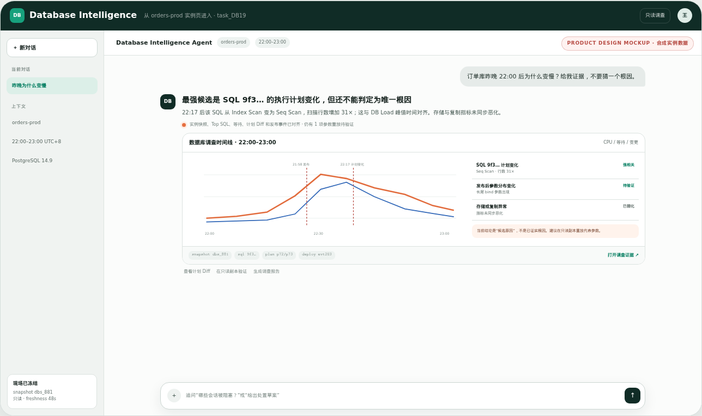
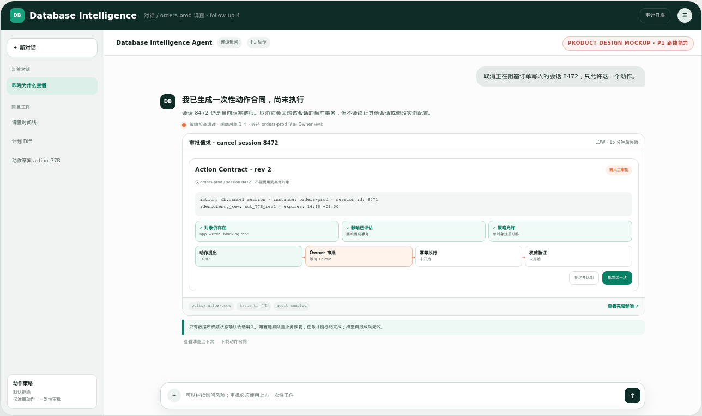

# 华为云 Data Intelligence：能力目标驱动的 Harness-first 领先产品落地方案

- 方案基准日：2026-08-20
- 方案性质：基于公开资料与独立竞品探索形成的产品设计建议，不代表华为云已立项或承诺
- 事实边界：未进行华为云内部接口、账号、区域、容量、成本与团队资源验证
- 工作名：`Data Intelligence Agent`；CLI 示例统一使用占位命令 `di`
- 核心目标：**让用户或外部 Agent 用一句话完成接入数据、生成数据产品、管理数据、查数、分析、建知识、查数据库和受控行动；优先跑通“接入—资产化—使用—治理”的完整数据生命周期，而不是只做运维咨询。**
- 实现原则：先锁定客户可感知的能力组合和优先级，再选择两种组织/架构承载；Harness、Goal Contract、CLI/MCP、权限和证据是执行内核，不替代产品能力定义。

> 信息标签：`官方`表示官方资料可直接证明；`推断`表示由多个事实推导；`建议`表示目标设计；`待证`表示必须通过内部接口或真实运行验证。本文不把“能启动 CLI”写成“可生产交付”，也不把公开资料缺失写成产品缺失。

---

## 0. 一页决策

### 0.1 先定产品能力目标，再选方案和架构

产品首先要回答：**用户到底可以用一句话做成哪些事情，哪几件先做。**首期不是泛化的“Agent 完成任务”，而是集中做成四条主线：数据接入与资产化、智能问数与基础分析、数据知识构建、数据库洞察。

| 时间 | 对外能力目标 | 集中范围 |
|---|---|---|
| 0–3 月 | 一句话接入/导入数据、生成资产草稿、问数据、做基础分析、查数据库 | 一个数据库、一个文件源、一个数据域、四条完整能力主线 |
| 3–6 月 | 智能治理、知识生命周期、外部 Agent 调用、极少安全行动 | 版本/影响/漂移、质量/分类、CLI/MCP/API 同能力 |
| 6–18 月 | 主动智能、跨域知识和更多可验证行动 | 主动调查、订阅、行业知识包、平台级 SLO |

本文因此按以下顺序组织：

1. **产品能力目标**：功能叫什么、用户一句话能做成什么、优先做哪几项、短中长期扩到哪里；
2. **两种方案**：比较产品边界、Owner、依赖和路线，再分别展开两套完整架构；
3. **共同与专属模块**：明确必须同源的内核，以及因方案不同才存在的模块；
4. **技术细节**：最后下钻 Harness、Session/Event、ECS、CLI/MCP、语义、NL2SQL、数据库调查和评测。

两种方案共享同一能力命名和调用协议，但首要能力不同：方案一以多源接入、数据产品、问数分析和治理为中心；方案二以一个数据库的接入/资产化、数据库洞察和数据库上的问数为中心。两者的人机入口都是统一对话 Agent，接入方案、Pipeline、治理报告、表图与专业工件在回复中生成；CLI/MCP/API 面向 Harness 和外部 Agent。两者共享 Harness Adapter、Session/Event、`di` CLI/MCP、Artifact/Evidence 与安全评测。

### 0.2 当前决策建议

| 决策项 | 方案一：华为云竞争力优先 | 方案二：数据库部门绿地突围 |
|---|---|---|
| 产品内核 | 同一套 Goal/Task、Harness Adapter、Session/Event、Artifact/Evidence、CLI/MCP 契约 | 同一套，不另造第二种架构 |
| 组织方式 | 各部门交付版本化能力包，共同发布一个产品 | 数据库部门先拥有端到端最小闭环，其他部门以后通过适配器接入 |
| 首期依赖 | 只有签署接口、SLO、版本和权限契约的共享能力才能成为硬依赖 | 除 ECS、模型端点和数据库只读接口外，其他华为云服务均为可选增强 |
| 入口 | 公司级统一对话 Agent，可嵌入 DataArts/数据库；外部 Agent 走 CLI/MCP/API | 新独立对话 Agent + 数据库实例页嵌入对话；外部 Agent 走 CLI/MCP/API |
| 速度优势 | 能复用成熟语义、BI、IAM 和数据库能力时更快达到高上限 | 一台 ECS 即可起步，不等待跨部门平台排期 |
| 最大风险 | 组织依赖拖慢产品；组件都存在但端到端仍断裂 | 数据库部门不自觉扩成通用数据平台，或长期维护开源分叉 |

`建议`：技术工作先按方案二的低依赖方式启动，不等待组织讨论；同时给方案一 2–4 周书面 Gate。若公司级 Owner、共同 OKR、能力包契约和发布权成立，同一代码升格为方案一；不成立则由数据库部门继续拥有闭环。

### 0.3 首期明确做与不做

| 首期必须做 | 首期明确不做 |
|---|---|
| 一台 ECS 上可重复部署的完整纵向样例 | 自研通用 Agent Loop 或照搬 LangChain/LangGraph 工作流作为核心 |
| 一主一备 Harness；同一 Adapter 契约 | 同时把六个 Harness 集成到生产 |
| 数据接入/资产化、智能问数/分析、数据知识、数据库洞察四条主线 | CCE/Kubernetes、Kafka、Temporal、通用 Debezium 平台、复杂微服务 |
| 首月 35–40 个高价值 CLI/MCP 原子能力，完整合同保留近 90 项 | 重建完整 BI、Catalog、数据开发和通用 Agent 平台 |
| Git 管理的语义包、Skills、Verified Queries、评测集 | 把 Prompt、聊天历史或 GUI 当成唯一知识和状态 |
| Runner 隔离、短期授权、查询预算、取消与审计 | 因“首期无 HA”而延期安全、权限和证据链 |

---

## 1. 产品能力目标：先回答产品让用户“一句话做成什么”

### 1.1 产品总定位与推荐命名

产品目标不是管理 Agent 的一次执行，而是形成一组客户可理解、可购买、可持续使用的数据智能能力：

> **让业务用户、数据人员、DBA 或外部 Agent 用自然语言完成接入数据、生成数据产品、管理与使用数据、查数据库和受控行动，并得到可复核的结果。**

建议采用“一套产品、多个能力模式”的命名，不为每个场景再造一个 Agent：

| 层级 | 推荐名称 | 面向客户的含义 |
|---|---|---|
| 公司级产品/统一入口 | **Data Intelligence｜数据智能** | 面向业务数据、数据平台和数据库的统一自然语言工作入口 |
| 方案一产品承载 | **DataArts Intelligence** | DataArts 内的智能问数、分析、知识、治理和数据库能力包 |
| 方案二产品承载 | **Database Intelligence｜数据库智能** | 数据库部门独立交付的问数、查库、诊断和数据库知识产品 |
| 一级能力模式 | **数据接入与准备、智能问数、智能分析、数据知识构建、数据库洞察、智能治理、安全行动、主动智能** | Agent 根据用户目标自动选择能力；用户不需要先选 Harness、模型或内部 Agent |

中文对话示例可以直接使用动词：**接数据、导数据、生成数据产品、管数据、问数据、做分析、建知识、查数据库、执行动作**。这些不是首页按钮，而是同一输入框能够理解的客户任务。CLI、MCP、REST 和嵌入 SDK 是能力调用面，不应被包装成独立的客户价值目标。

### 1.2 产品能力全集与优先级

| 编号 | 正式功能名 | 用户会怎么说 | 产品必须完成什么 | 主要交付物 | 优先级 |
|---|---|---|---|---|---|
| C0 | **数据接入与准备** | “把订单库接进来；14 张表直查、4 张交易表实时同步，再导入这批供应商文件。” | 在直查、一次导入、定时同步和 CDC 间给出可解释选择；完成连接/权限/网络检查、Schema 探测与映射、样例/质量预检、发布和数据到达验证 | 接入方案、数据源卡、Schema 映射、Pipeline 草稿、质量/敏感预检、freshness/水位证据 | **P0 核心 1** |
| C1 | **智能问数** | “最近 30 天华东各地区退款率是多少？” | 发现数据、理解口径、必要时澄清、生成和执行安全 SQL、多轮追问 | 表、图、SQL、参数、口径、query_id、证据 | **P0 核心 2** |
| C2 | **智能分析** | “哪些地区显著上升？为什么？与上月相比影响多大？” | 完成趋势、对比、分群、异常、贡献和假设验证，区分事实与推断 | 分析画布、关键发现、证据、可复算报告 | **P0 核心 3** |
| C3 | **数据知识构建** | “扫描订单库，生成客户 360 数据产品和客户—订单—退款知识网络草稿。” | 从 Schema、样例、文档与血缘生成清洗表/视图、指标语义、实体关系、Join、同义词、质量规则和 Verified Query 候选 | 数据产品蓝图、可视知识网络、候选语义包、冲突/缺口、Review 任务 | **P0 核心 4：先生成草稿** |
| C4 | **数据库洞察** | “订单库昨晚为什么变慢？哪些 SQL 和变更影响最大？” | 查询实例状态、容量、Top SQL、锁、等待、计划、指标和变更，形成证据调查 | 数据库体检/调查报告、证据时间线、候选原因与建议 | **P0 核心 5：方案二首要差异** |
| C5 | **智能治理** | “扫描订单域的敏感字段、质量和血缘，给我修复计划。” | P0 先做资产发现、质量/敏感分类、血缘候选和可审核治理计划；P1 扩到跨源影响、Owner、策略、生命周期和受控修复 | 资产清单、治理任务、影响图、质量结果、待审批变更 | **P0 最小闭环 / P1 完整治理** |
| C6 | **安全行动** | “取消这条异常查询，并确认业务恢复。” | 生成动作方案，经过策略和人工审批后幂等执行，并从权威系统验证结果 | 审批、执行、后置验证、补偿/回滚证据 | P1 极少动作；P2 扩展 |
| C7 | **主动智能** | “每天监控退款率，异常时自动分析并通知我。” | 由指标、质量或数据库事件触发调查，生成解释、订阅和下一步建议 | 主动洞察、告警调查包、周期报告、动作草案 | P2 |

“知识图谱”在这里不是让模型随意画一张图。产品要构建的是**可治理的数据知识网络**：节点包括业务实体、数据对象、指标、维度、规则、Owner 和 Verified Query；边包括业务关系、Join、血缘、派生和影响。所有推断关系必须带来源、置信度和 Review 状态。

#### 建议优先级评分

下表是**投资优先级设计分，不是华为云现状能力分**。按客户价值/频次 25%、华为权威能力与差异化 20%、对后续能力的飞轮价值 20%、首期可交付性 15%、安全可控性 10%、多入口复用 10% 评分；内部客户基线、接口和团队容量验证后必须重算。

| 能力 | 方案一优先分 | 方案二优先分 | 排序解释 |
|---|---:|---:|---|
| C0 数据接入与准备 | **94** | **91** | 已成为客户可独立感知的 Agent 任务；决定首次价值、数据新鲜度和后续所有能力上限 |
| C1 智能问数 | **91** | **86** | 高频入口、客户容易理解、能直接验证知识/权限/SQL 全链 |
| C2 智能分析 | **88** | 73 | 公司级产品价值高；DB 方案首期只做趋势/对比/贡献 |
| C3 数据知识构建 | **92** | **82** | 从已有库生成数据产品与知识，降低准备成本并形成准确率飞轮 |
| C4 数据库洞察 | 84 | **95** | 数据库权威上下文最强差异化；方案二第一优先 |
| C5 智能治理 | **87** | 68 | 资产发现、质量/敏感/血缘最小闭环前移；全平台治理仍分阶段 |
| C6 安全行动 | 61 | 64 | 价值高但事故半径大，必须等待只读能力、审批与后置验证成熟 |
| C7 主动智能 | 68 | 70 | 长期粘性强，但依赖稳定知识、事件、评测和动作边界 |

据此，方案一首期资源顺序为 **C0 → C3 → C1 → C2 → C5 最小闭环 → C4**；方案二为 **C4 → C0 → C1 → C3 → C2 → C5 最小闭环**。这不是平均铺开：首个纵向样例把“接订单库 → 生成资产草稿 → 问数 → 查库”串成一条故事，完整跨源治理和高风险动作仍后置。

### 1.3 真正应该集中投资的四条主线

#### 主线 A：数据接入 + 资产化

这是把已有数据库和新增文件变成可用数据资产的第一条客户旅程，而不是后台配置工作：

> 一句话描述来源与用途 → Agent 比较直查、一次导入、定时同步和 CDC → 检查网络/权限/源端前提 → 探测 Schema、字段和样例 → 预览映射、质量和敏感风险 → 确认后发布 → 验证数据到达与水位 → 生成可用资产候选。

首期不追求连接器数量。一个数据库引擎和 CSV/Parquet 必须把以上闭环做完整，并让用户知道哪些步骤由产品自动完成、哪些必须由数据 Owner 决策。只显示“连接成功”不算完成。

#### 主线 B：智能问数 + 基础智能分析

这是最容易被业务用户理解、使用频率最高、也最能验证统一入口价值的能力。首期必须形成：

> 一句话提问 → 找到正确数据与口径 → 安全查询 → 生成表图 → 做趋势/对比/贡献分析 → 给出 SQL、口径和证据。

“生成了一条可执行 SQL”不算完成；能够回答追问、解释口径、识别歧义并交付可复核分析，才是产品能力。

#### 主线 C：数据知识构建

这是把存量数据库从“能连”提升为“能被业务正确使用”的能力。首期不先建设庞大的知识图谱平台，而是实现：

> 一句话选择数据域 → 自动扫描 Schema/样例/文档/血缘 → 生成清洗表或视图建议、指标/维度/Join、实体关系、同义词、质量规则和 Verified Query 草稿 → Owner 可视化 Review → 发布后直接服务问数与分析。

首期目标是“生成高质量可审核的数据产品与知识草稿”，不是“模型自动发布全部资产”。3–6 个月再补版本、影响、漂移、冲突合并、API/共享/RAG 等交付形态。

#### 主线 D：数据库洞察

这是数据库部门最不可替代、也最能与通用 BI/问数产品拉开差异的能力。首期集中完成：

> 一句话查实例信息 → 一句话查运行状态 → 一句话调查慢 SQL/锁/等待/计划变化 → 生成证据时间线和处置建议。

业务数据分析和数据库运行分析使用同一入口、身份和工件，但底层证据必须来自数据库权威接口。

资产发现、质量预检、敏感扫描和生成资产的最小血缘属于主线 A/C 的 P0 闭环；跨域策略、生命周期和大规模自动修复属于 C5 P1。这样既不把治理推迟到最后，也不在首月重建完整治理平台。

### 1.4 九条“一句话”产品旅程

| 产品旅程 | 用户输入示例 | 能力组合 | 用户最后得到什么 | 产品验收重点 |
|---|---|---|---|---|
| **一句话接入数据库** | “连接订单库；维表直查，交易表每天同步，订单明细做 CDC。” | C0 + C5 最小预检 | 接入方式比较、前置条件、表清单/映射、Pipeline 草稿、成本/新鲜度与发布确认 | 不盲目复制；权限/网络/CDC 前提明确；数据到达可验证 |
| **一句话导入新数据** | “导入这批供应商 CSV，以后每天从 OBS 同目录增量加载。” | C0 + C5 最小预检 | Schema 推断、字段映射、质量/敏感预检、隔离行、目标表和调度草稿 | Schema 演进不静默丢列；坏数据不污染可信表 |
| **一句话生成数据产品** | “扫描 CRM 和订单库，生成客户 360 数据产品草稿。” | C0 + C3 + C5 | 清洗表/视图、指标语义、实体关系、质量规则、血缘和缺口清单 | 自动生成只到草稿；每项资产有来源、Owner 和验收标准 |
| **一句话管理数据** | “检查订单域敏感字段、质量和血缘，给我修复计划。” | C5 + C3 | 资产清单、敏感分类、质量结果、血缘/影响、待审批治理任务 | 推断血缘有标签；修复前看 Diff/影响并审批 |
| **一句话问数据** | “上季度各产品线收入和毛利率是多少？” | C0 + C1 | 表图、口径、SQL、数据时间和证据 | 结果等价、权限正确、口径可解释 |
| **一句话做分析** | “收入下降主要来自哪些客户和产品？排除汇率影响。” | C1 + C2 + C3 | 多步分析、贡献拆解、假设与反证、报告 | 分析步骤可复算，事实与推断分离 |
| **一句话建知识** | “为订单域建立客户、订单、商品、退款的知识网络。” | C0 + C3 + C5 最小 Review | 实体关系图、指标/Join/规则候选、冲突和缺口 | 来源可追溯，推断不自动发布 |
| **一句话查数据库** | “这个实例容量、复制延迟和最近变更怎么样？” | C0 + C4 | 实例状态卡、趋势、异常和相关证据 | 时间窗、实例身份和数据新鲜度准确 |
| **一句话调查故障** | “昨晚 22 点后订单库为何变慢？” | C4 + C2 | SQL/锁/等待/计划/变更时间线、候选原因和下一步 | 相关性不冒充根因，证据缺口明确 |

九条旅程都留在同一个对话 Agent 中；“接入数据”和“管理数据”不是再造两个工作台。专业向导、Pipeline 图、质量报告和审批只作为当前回复的可展开工件。

### 1.5 分阶段能力目标

| 阶段 | 对外可宣传的产品能力 | 必须做成的范围 | 暂不承诺 |
|---|---|---|---|
| **0–2 周：纵向验证** | 一句话接入数据库、导入文件、问数据、查数据库 | 一个数据库、一个数据域、CSV/Parquet；直查或快照导入；Schema/质量/敏感预检；问数表图/SQL/证据；一条慢 SQL 调查；数据产品草稿 | 任意连接器、通用 CDC、复杂知识图谱、自动动作、生产 SLA |
| **1 个月：首个可用版本** | 接入与准备 + 智能问数 + 基础分析 + 数据库洞察 | 一个引擎和文件源的接入闭环；5–10 指标、10 Verified Query、20 问数 Gold；8–10 个数据库诊断能力；趋势/对比/贡献分析 | 预测、复杂归因、跨库 Join、高风险动作；方案二不承诺通用 CDC |
| **2–3 个月：Private Beta** | 增加“一句话生成数据产品/建知识/管数据” | 一个业务域可生成、Review、发布清洗表/语义/关系/质量/Verified 草稿；方案一扩多源/CDC，方案二补一个引擎 CDC；3–5 个伙伴连续使用四条主线 | 全企业知识图谱、全自动发布、完整跨域治理 |
| **3–6 个月：形成飞轮** | 完整智能治理 + 外部 Agent 接入 + 极少安全行动 | 知识版本/影响/漂移，质量/分类/血缘任务，CLI/MCP/API 同能力，取消 Query/Session 等低风险动作 | 跨域自主行动、无人审批生产变更 |
| **6–18 个月：平台壁垒** | 主动智能 + 跨域数据知识 + 更多受控行动 | 跨源分析、主动调查、行业知识包、订阅、可验证动作和真实 SLO 触发的 HA | 不经安全和客户价值 Gate 的“大而全 Agent 平台” |

这里的阶段不是组件开发顺序，而是**客户能够说出哪句话、产品能够完整做成哪件事**。

### 1.6 两种方案对能力目标的不同排序

| 产品能力 | 方案一：公司竞争力优先 | 方案二：数据库绿地突围 |
|---|---|---|
| C0 数据接入与准备 | **首要能力**：统一 DataArts 多源、批量/实时/CDC、Catalog 与权限，用对话生成和管理接入任务 | **首要能力之一**：一个 DB 主引擎 + CSV/Parquet；直查/快照导入先闭环，CDC 后加 |
| C1 智能问数 | **首要能力**：多源业务问数与统一 BI Artifact | **首要能力之一**：直接查询数据库业务数据 |
| C2 智能分析 | **首要能力**：趋势、对比、贡献、异常逐步扩展到复杂分析 | 首期只做服务于问数和 DB 调查的基础分析 |
| C3 数据知识构建 | **核心壁垒**：DataArts 承载企业级语义/知识生命周期 | 首期 Git/轻服务承载 DB 域知识草稿，保留 DataArts Adapter |
| C4 数据库洞察 | 数据库团队以版本化能力包进入统一产品 | **第一差异化能力**：查库、诊断、证据和低风险处置 |
| C5 智能治理 | P0 接入时完成发现/质量/敏感/血缘预检；3–6 月扩到跨域策略和生命周期 | P0 只做 DB 资产、质量/敏感/血缘草稿；不复制企业治理平台 |
| C6 安全行动 | 长期扩展到跨域审批与动作 | 先做取消 Query/Session，再逐个增加可验证 DB 动作 |
| C7 主动智能 | 跨数据与数据库事件的公司级长期能力 | 聚焦数据库异常、容量和慢 SQL 的主动调查 |

因此两种方案并非只在组织上不同：

- **方案一的产品中心是“多源接入与资产化 + 问数分析 + 知识治理”，数据库洞察是强能力包；**
- **方案二的产品中心是“一个数据库的接入/资产化 + 数据库洞察 + 数据库上的问数”，轻量知识治理用于提高准确率并保留升格路径。**

### 1.7 能力依赖关系与产品边界

> 数据接入与准备 → 资产发现/最小治理 → 数据产品与知识草稿 → 智能问数/分析 → 持续治理/安全行动。数据库洞察从数据库权威上下文切入，同时为接入水位、问数、分析和知识网络补充实例证据；主动智能建立在所有能力的事件、评测和安全闭环之上。

- Harness、Goal Contract、Session、Event、Artifact、权限和评测是**执行内核**，不是对外产品目标；
- CLI/MCP/API 是**统一调用面**，不是一项孤立能力；
- 语义、知识图谱和 Verified Query 首期允许自动生成候选，但可信模式只能使用已审核资产；
- 图表和聊天是结果展示，不是独立竞争力；
- 每个技术模块必须明确支撑 C0–C7 中的哪项能力，否则不进入路线图。

#### 产品能力到功能模块/原子域的映射

| 产品能力 | 主要功能模块 | 主要 `di` 原子域 | 不应该另建什么 |
|---|---|---|---|
| C0 数据接入与准备 | Source Onboarding、Path Advisor、Schema/Profile、Mapping、Pipeline Draft/Preview/Publish、Freshness/Watermark Verify | 身份、数据源、接入、目录、质量 | 另一个只负责聊天的“接数 Agent”；为每种源自建一套 UI |
| C1 智能问数 | 数据发现、语义解析、Verified、NL2SQL、SQL Guard、表图证据 | 身份、目录、语义、SQL、工件 | 与 C2 分开的 SQL/权限/Artifact 栈 |
| C2 智能分析 | Analysis Plan、趋势/比较/分群/贡献、假设验证、报告画布 | SQL、结果 Profile/Compare、质量、工件 | 只读结果后再交给无证据的通用总结 Agent |
| C3 数据知识构建 | Asset Inventory、Clean/View Draft、Metric/Graph/Verified Draft、Validate、Review、Publish、Diff/Impact/Rollback | 目录、接入、知识、语义、质量、保证 | 只存在 Prompt 中、不可版本化的“Agent 记忆” |
| C4 数据库洞察 | 实例状态、体检、Top SQL、锁/等待、计划/指标/变更时间线 | 诊断、SQL、保证、工件 | 让 DataArts 或 Harness 用通用 SQL 猜实例事实 |
| C5 智能治理 | 资产发现、分类分级、质量、血缘、影响、策略、Owner Workflow、Schema 漂移 | 目录、接入、知识、质量、保证 | 首期重建完整治理平台；让模型无 Review 修改生产资产 |
| C6 安全行动 | Action Plan、策略、审批、执行、后置验证、补偿 | 动作、诊断写操作、保证 | Harness 直连权威系统执行自由写操作 |
| C7 主动智能 | 订阅、触发器、异常调查、周期报告、动作草案 | 质量、诊断、工件、动作、保证 | 在 C1–C6 不稳定前建设复杂自主多 Agent |

### 1.8 明确不优先建设的产品能力

- 首期不建设通用 Agent Builder、Agent 市场或复杂多 Agent 编排；
- 不把“任意自然语言都能生成 SQL”作为卖点，优先把签署场景做准；
- 不承诺模型自动发布企业知识图谱，先做好候选、证据、Review 和回滚；
- 不首期复制完整 BI、数据开发、Catalog 或治理平台；
- 不在只读问数、分析和调查没有稳定前开放高风险数据库动作；
- 不用聊天 UI、模型数量、Tool 数或知识节点数量代替客户能力完成度。

### 1.9 执行保障（折叠）：不是产品能力目标

下面保留 Goal Contract、完成判据和状态机作为执行内核设计，避免 Agent 把“输出了一段话”误报为能力已完成；它们不再作为产品能力或投资主线。

<details>
<summary>展开执行合同与完成判据</summary>

每次调用 C0–C7 能力时，产品内部仍需固定以下执行合同；这些字段不作为首页功能名称：

| 执行字段 | 作用 |
|---|---|
| actor / context | 固定最终用户、租户、数据源、实例、时间和用途 |
| objective / deliverables | 固定本次调用要交付的表、图、报告、知识草稿或动作结果 |
| success criteria | 绑定该能力的结果、证据和安全验收规则 |
| constraints | 固定只读/动作模式、权限、预算、时限和 freshness |
| evidence / stop conditions | 规定必须返回的来源，以及何时以 partial/blocked 停止 |

状态统一为 draft → clarifying → accepted → planning → executing → validating → completed / partially_completed / blocked / cancelled / failed。只有对应能力的 Completion Oracle 通过，才能标记 completed。

例如：智能问数检查结果等价、语义、权限和证据；数据知识构建检查来源、冲突、置信度和 Review 状态；数据库洞察检查实例身份、时间线、反证与证据缺口；安全行动检查审批、幂等和权威后置状态。
</details>

---

## 2. 两种方案总览与选择

### 2.1 决策对比

| 维度 | 方案一：华为云竞争力优先 | 方案二：数据库部门绿地突围 |
|---|---|---|
| 能力中心 | C1 智能问数、C2 智能分析、C3 知识构建、C5 智能治理；C4 DB 洞察作为强能力包 | C4 数据库洞察 + 数据库上的 C1 问数；C3 DB 域知识草稿提高准确率 |
| 产品边界 | 问数、分析、知识、治理、数据库洞察 + 多入口嵌入 | 数据库数据问数、基础分析、知识草稿、查库/诊断与证据报告 |
| 目标用户 | 数据消费者、分析师、数据工程师、DBA、应用 Agent | DBA、开发者、数据库运维和使用数据库数据的业务人员 |
| 产品入口 | 人：公司级统一对话，可嵌入 DataArts/DB；Agent：CLI/MCP/API | 人：独立对话 + DB 实例页嵌入；Agent：CLI/MCP/API |
| 唯一 Owner | 公司级 Data Intelligence 总 Owner | 数据库部门产品 Owner |
| 逻辑架构 | 统一对话入口 + 控制面 + 可替换 Harness + 多部门能力包 | 对话 Web + 模块化单体 + 隔离 Runner + DB 权威 Tool Gateway |
| 硬依赖 | IAM、DataArts、数据库、Agent/AI 平台中通过契约 Gate 的能力 | ECS、模型端点、一个数据库只读接口；其他均为可选 Adapter |
| 首期部署 | 先用纵向样例验证，正式产品逐步承载到共享云服务并按 SLO 建 HA | 单 ECS Docker Compose；无 HA/生产 SLA，但安全、取消和证据完整 |
| Harness/模型 | 同一 Bake-off，一主一备；平台团队可承载但不能锁定 | 同一 Bake-off，一主一备；本地 Adapter 直接控制版本与回滚 |
| 语义与 BI | DataArts 成为权威承载者，前提是稳定 ID、版本、ACL、事件和作者 API 通过 Gate | Git YAML/JSON + Verified Query 起步；以后通过 DataArts Adapter 替换或增强 |
| 数据库能力 | 数据库部门交付版本化 SQL/诊断能力包 | 数据库部门直接拥有方言、SQL、安全、计划、锁、会话、指标和变更证据 |
| 身份授权 | IAM 最终用户委托贯穿多服务；跨产品 OBO 是成立条件 | 首期做最小 IAM→DB 主体映射和短期凭据代理，不自建长期用户密码 |
| 通用数据/BI 上限 | **最高** | 中；接入 DataArts 能力包后提高 |
| 数据库深度与可控性 | 高，但取决于公司 Backlog 中数据库优先级 | **最高** |
| 首个纵向样例速度 | 可在 2 周完成，但不能等待全部组织条件 | **最直接** |
| 主要成本 | 跨部门契约、协调和统一发布成本 | 小队全栈建设、轻量重复和开源升级维护成本 |
| 最大风险 | 名义协作、实际多套入口和状态；每个部门都完成但任务仍失败 | 范围膨胀成通用数据平台，或临时实现长期固化 |
| 退出/升级路径 | Gate 不成立立即降为方案二，不停止技术样例 | 公司级条件成熟后把本地模块替换为能力包，平滑升格方案一 |
| 适合条件 | 有强 Sponsor、总 Owner、共同 OKR、稳定接口和一个发布列车 | 组织授权不足，但数据库团队拥有端到端小队、预算和发布权 |

### 2.2 决策树

```text
能否在 2–4 周内签署总 Owner + 共同 OKR + 能力包契约？
  ├─ 能：方案一；同时用单 ECS 纵向样例验证，不等待“大平台”
  └─ 不能：方案二；数据库部门拥有产品闭环，保留所有适配器

无论哪条路线：
  先跑通“接订单库/导文件 → 生成资产草稿 → 问数据 → 查数据库”的统一纵向故事 → Harness Bake-off → 做深能力 → 再扩规模
```

`当前建议`：技术工作立即按方案二的低依赖单 ECS 方式启动；组织上给方案一 2–4 周 Gate。若公司级条件成立，同一代码与能力包平滑升格为方案一，不推倒重来。

### 2.3 统一对话 Agent 与十种回答画册

产品不是一系列 Dashboard、按钮或能力工作台。人只面对一个类似 ChatGPT / Genie 的对话 Agent；用户描述目标后，Agent 自动路由接入、导入、资产生成、治理、问数、分析、知识、数据库或动作能力，并把接入方案、Pipeline、质量报告、资产蓝图、图表、知识图、诊断时间线和审批卡直接嵌入回复。来源、配置 Diff、query_id、权限和运行步骤是该回复的可展开附件。完整可浏览原型见 [`huawei-product-ui-prototypes.html`](./huawei-product-ui-prototypes.html)；以下均为**产品设计示意**，不是华为云现网截图、已发布能力或交付承诺，画面使用合成数据。

| 对话回答 | 用户问题 | Agent 回复中的结构化工件 | 可信边界 |
|---|---|---|---|
| 接入现有数据库 | 连接订单库；维表直查、交易表同步 | 路径比较 + 表清单/映射 + 前置检查 + Pipeline 草稿 + 发布确认 | 连接器与权限以目标 Region 实测为准；CDC 前提不满足时不伪装可用 |
| 导入新数据 | 导入供应商 CSV，以后每天增量加载 | Schema/Profile + 映射 + 敏感/质量预检 + 隔离行 + 目标表/调度草稿 | 新列、坏行和截断显式展示；用户确认目标和保留策略后才写入 |
| 从现有库生成数据产品 | 扫描 CRM/订单库，生成客户 360 草稿 | 资产蓝图 + 清洗表/视图 + 指标/实体/Join + 质量/血缘 + 缺口/Owner | 自动结果均为候选；没有业务口径和 Owner 的资产不能标记可信 |
| 数据治理 | 检查订单域敏感字段、质量和血缘 | 覆盖度 + 发现清单 + 质量规则 + 血缘/影响 + 待审批修复 Diff | 推断血缘/分类与权威事实分开；修复动作默认不执行 |
| 综合经营 | 今天经营上最需要关注什么 | 文字结论 + 重点事项 + 趋势图 + 来源附件 | 多域串联仍是只读；原因不足时引导追问 |
| 智能问数 | 最近 30 天华东各地区退款率是多少 | 文字结论 + 指标卡 + 趋势图 + 明细表 | 口径、SQL、query_id、数据时间和 RLS 可展开 |
| 智能分析 | 上海为什么上升，排除规模影响 | 分析结论 + 贡献图 + 事实/推断/Unknown | 相关性不冒充因果，缺失数据明确展示 |
| 知识构建 | 建立订单域知识网络并先给草稿 | 生成说明 + 知识图 + 冲突/来源/Review | 候选关系不自动发布，Owner 审核后才生效 |
| 数据库调查 | 订单库昨晚为什么变慢 | 候选结论 + 诊断时间线 + 假设/反证 | 相关性不冒充唯一根因，P0 全只读 |
| 安全行动 | 只取消阻塞会话 8472 | 风险说明 + 一次性动作合同 + 审批卡 | P1；未审批不执行，权威后置验证才算完成 |

[](./huawei-product-ui-prototypes.html#connect)

[](./huawei-product-ui-prototypes.html#import)

[](./huawei-product-ui-prototypes.html#derive)

[](./huawei-product-ui-prototypes.html#govern)

[](./huawei-product-ui-prototypes.html#brief)

[](./huawei-product-ui-prototypes.html#ask)

[](./huawei-product-ui-prototypes.html#analyze)

[](./huawei-product-ui-prototypes.html#knowledge)

[](./huawei-product-ui-prototypes.html#database)

[](./huawei-product-ui-prototypes.html#action)

### 2.4 数据建设与管理补全：竞品事实、产品全集与责任边界

#### 2.4.1 为什么必须前移

- **`官方声明` 阿里云 DataWorks**：DI Agent 已把单表/整库、离线/实时同步做成自然语言任务，能探测 Schema、生成字段映射与调度、展示表清单和配置摘要，用户确认后发布；同一文档还描述了文件/多模态 ETL、Embedding 和对已接数据源的 ChatDB 管理。它证明“对话接数”已经是直接竞争基线，而不只是未来构想。[DI Agent](https://help.aliyun.com/zh/dataworks/user-guide/introduction-to-data-integration-and-ai-native-capabilities)
- **`官方声明` Databricks**：Lakeflow Connect 覆盖托管数据库/SaaS/文件/流接入，外部数据库还可在 Unity Catalog 下联邦只读；Auto Loader 提供文件 Schema 推断、演进和异常字段保留；Unity Catalog 提供发现、自动血缘、质量监控和敏感分类。[Lakeflow Connect](https://docs.databricks.com/aws/en/ingestion/lakeflow-connect/) · [Lakehouse Federation](https://docs.databricks.com/gcp/en/query-federation) · [Auto Loader Schema](https://docs.databricks.com/aws/en/ingestion/cloud-object-storage/auto-loader/schema) · [Data discovery](https://docs.databricks.com/aws/en/data-governance/unity-catalog/data-discovery)
- **`推断`**：阿里当前更清楚地展示“对话直接创建/管理接入任务”；Databricks 的平台治理、零复制/复制路径和 Schema 演进更系统，但官方材料仍把部分接入配置放在向导/API/Genie Code，而不是证明 Genie One 已独立承担所有数据工程操作。
- **`建议`**：华为不应只追平其中一个入口。领先目标是同一对话完成“选路径 → 接入 → 资产化 → 使用 → 治理 → 追踪”，且每一步继承最终用户身份、可预览、可停止、可回滚并有权威证据。

#### 2.4.2 去重后的数据建设与管理功能全集

| 产品任务 | Agent 必须能做 | 回复内工件 | 阶段 |
|---|---|---|---|
| **接入已有数据库** | 发现可用连接或引导新建；测试网络/身份/权限；探测数据库、表、主键、变更能力和数据量；比较直查/快照/定时/CDC；生成表选择、字段映射、目标命名与资源计划 | 路径比较卡、前置检查、表清单、Schema Diff、Pipeline 草稿、成本/新鲜度估计 | P0 一个引擎闭环；P1 多源/CDC |
| **导入新文件/对象** | 上传或绑定 OBS/S3/目录；识别 CSV/JSON/Parquet/Excel 等格式；推断 Schema/编码/分区；检测坏行、新列、PII 和重复；选择隔离/补列/拒绝策略；发布一次或周期任务 | 文件画像、字段映射、质量/敏感报告、隔离区预览、目标表和调度草稿 | P0 CSV/Parquet；P1 多格式/目录增量 |
| **连续同步与演进** | 支持全量、增量、全量+增量、CDC；记录 snapshot/watermark；处理 Schema 演进、断点续传、重复和延迟；提供暂停/恢复/重跑与数据到达验证 | Pipeline 状态、水位、延迟、Schema 变更、重复/坏数告警、验证结果 | 方案一 P0/P1；方案二 P1 |
| **资产发现与理解** | 生成库表清单、Schema/Profile、主外键与候选关系、字段业务说明、热度/新鲜度、Owner 候选和可用范围；搜索、预览、请求访问 | 资产地图、表/字段卡、关系图、权限缺口、Unknown | P0 |
| **从现有库生成数据产品** | 生成清洗层表/视图、客户 360/订单域等主题资产、指标/维度/Join、知识网络、Verified Query、质量规则、敏感策略、血缘、API/共享/RAG 索引候选 | 数据产品蓝图、生成清单、来源与置信度、依赖/成本、缺口、Owner Review | P0 草稿；P1 发布/服务化 |
| **质量与敏感治理** | 推荐并运行完整性、唯一性、范围、及时性和业务规则；分类敏感字段；建议掩码/访问策略；发现异常后生成修复计划 | 覆盖度、问题样例、规则结果、分类标签、策略 Diff、待审批任务 | P0 发现/草稿；P1 自动化闭环 |
| **血缘、影响与生命周期** | 区分自动采集和推断血缘；展示上下游、Owner、口径版本；评估 Schema/指标变更影响；管理认证/废弃、保留和删除 | 血缘/影响图、版本 Diff、受影响任务与用户、生命周期任务 | P1 |
| **运行与运营** | 查看状态、吞吐、延迟、费用、失败原因；自然语言暂停/恢复/重跑；周期巡检；从 BadCase 修复映射/规则 | 运行时间线、SLA/费用、诊断报告、动作合同、后置验证 | P0 状态/停止；P1 主动巡检 |

#### 2.4.3 接入方式不是一个开关：Agent 必须解释选择

| 路径 | 适合场景 | 产品自动完成 | 用户仍需决定 | P0 边界 |
|---|---|---|---|---|
| **直查/联邦** | 数据不能复制、低频探索、先验证价值 | 连接测试、能力/代价探测、谓词下推建议、只读保护 | 允许访问的库表、源库负载预算、数据用途 | 方案一/二均可先做一个 DB；不宣称所有源适合生产高并发 |
| **一次导入** | 文件或数据库快照、离线分析 | Schema/Profile、映射、目标表、坏数隔离、导入和行数/校验和验证 | 目标位置、覆盖/追加、保留与敏感策略 | 两方案 P0；方案二首发主复制方式 |
| **定时同步** | 分钟/小时/天级新鲜度 | 增量字段候选、调度、断点、水位和延迟监控 | 频率、窗口、费用和目标 SLA | 方案一首月；方案二 P1 |
| **CDC** | 交易表低延迟连续复制 | 检查主键/日志/版本、全量起点、位点、Schema 演进和恢复计划 | 源端开关与授权、容忍延迟、重复语义、故障切换 | 不作为通用首月承诺；逐引擎 Capability Manifest 开放 |

#### 2.4.4 “从已有数据库能生成什么”必须直接回答

| 可生成对象 | 自动化程度 | 必须补的人工语境 | 发布条件 |
|---|---|---|---|
| 库表资产清单、Schema/Profile、索引/约束与热度 | 高 | 数据用途和扫描范围 | 只读扫描完成，样例受权限/脱敏约束 |
| 表/字段业务说明、领域归类、Owner 候选 | 中 | 组织术语、职责和业务文档 | Owner Review；模型推断显式标记 |
| 主外键/Join/实体关系与知识网络 | 中 | 缺失外键、业务基数和例外规则 | 数据样例验证 + Owner Review |
| 清洗表/视图、主题宽表、客户 360 等数据产品蓝图 | 中 | 目标用户、SLA、粒度、保留和成本 | Pipeline Dry-run、质量 Gate、回滚计划 |
| 指标、维度、同义词、Verified Query | 中 | 权威口径、时间/币种/过滤和适用范围 | Gold/结果等价评测 + 语义 Owner Review |
| 质量规则、敏感分类、掩码/访问策略 | 中高 | 法务/合规等级、误报处置、例外 | 样例确认、影响分析、策略审批 |
| 血缘与影响 | 采集血缘高；推断血缘中低 | 外部系统关系、手工流程 | 来源类型可见；推断不能冒充权威血缘 |
| API、共享数据集、特征/向量/RAG 索引候选 | 中 | 消费合同、更新频率、ACL、模型用途 | 数据产品 Owner + 安全/成本 Gate |

#### 2.4.5 厂商做什么、用户必须做什么

| 环节 | 产品/厂商负责 | 用户/数据 Owner 负责 | 不允许的捷径 |
|---|---|---|---|
| 身份与网络 | 引导、最小权限模板、连通/撤权/过期验证、凭据托管 | 提供或批准最终用户/服务身份、VPC/白名单、用途 | 把长期数据库密码交给 Harness |
| 路径选择 | 给出直查/导入/定时/CDC 的成本、时效、负载、风险比较 | 确认数据驻留、SLA、源库负载预算和费用 | Agent 只因“实时”二字自动开启 CDC |
| Schema/映射 | 自动探测、候选映射、类型兼容、目标命名、Dry-run | 确认主键、业务含义、字段删留和冲突 | 静默截断、强转类型或丢弃新列 |
| 数据质量/敏感 | 画像、规则/分类候选、问题样例、隔离建议 | 确认阈值、敏感等级、误报和豁免 | LLM 自行把生产数据标为“可信” |
| 发布与运行 | 生成版本化 Pipeline，执行、监控、暂停、恢复、验证与审计 | 批准写入、调度、费用和生产窗口 | 只有模型一句“成功”，没有目标端行数/水位验证 |
| 资产/知识发布 | 生成可审核草稿、来源、置信度、影响和回滚 | 业务口径、Owner、认证/废弃裁决 | 自动发布指标、血缘推断或访问策略 |

#### 2.4.6 两种方案的具体承载

| 模块 | 方案一：华为云竞争力优先 | 方案二：数据库绿地突围 | 固定合同 |
|---|---|---|---|
| Connection Registry | 复用 DataArts 数据源/IAM 对象，统一映射到 product source ID | 新建轻注册表；P0 仅一个 RDS/PostgreSQL 类引擎和 CSV/Parquet，凭据进 Credential Broker | source_id、subject、purpose、capability、expiry、network status |
| Ingestion Planner | 新建对话规划与比较层；调用 DataArts 批/实时/CDC 能力包 | 新建 `ingest-lite`；直查用只读驱动，快照/文件用数据库原生导出与 Arrow/Parquet，预留 `IngestionBackend` | plan revision、mode、tables、mapping、SLA、budget、prerequisites |
| Pipeline Executor | DataArts/DRS/流处理作为权威执行器，产品只持 task/pipeline ID | 同一 ECS Worker 首期做一次导入和受控定时任务；不首期引入 Kafka/Flink/Debezium，单引擎 CDC 过 Gate 后再接 | publish/stop/resume/status/watermark/verify/error |
| Asset & Catalog | DataArts Catalog/数据地图为权威对象，补 Agent 草稿/Review | PostgreSQL 元数据 + Git YAML/JSON + OBS/本地加密工件；保留 DataArts Adapter | asset ID/version/owner/source/ACL/status/evidence |
| Quality/Classification/Lineage | 复用 DataArts 权威能力并补自然语言任务、覆盖度和 Review | P0 做 profile、规则候选、敏感候选和生成 Pipeline 血缘；不复制全域策略平台 | observed/inferred、rule version、sample、impact、review state |
| Data Product Builder | 统一生成表/视图、指标语义、知识、Verified、API/共享候选 | 先生成 DB 域清洗视图、指标/关系/Verified 草稿；P1 扩服务形态 | product draft、deliverables、dependencies、SLA、owner、release Gate |

**方案一的领先点**：多源接入和治理广度更快形成，对话层负责把分散能力变成一个连续任务。**方案二的领先点**：把一个数据库的“直查/导入—资产化—问数—诊断”做得最深、最快部署；不能用“未来可接 DataArts”掩盖首期连接器和跨域治理范围有限。

---

## 3. 方案一：华为云竞争力优先

### 3.1 产品边界

方案一建设公司级 `DataArts Intelligence`：人从统一对话 Agent 直接描述目标，产品自动路由接入、资产生成、问数、分析、知识、数据库、治理或动作能力；同一对话也可嵌入 DataArts 和数据库控制台。外部 Agent 通过 CLI/MCP/API 调用相同能力。所有入口恢复同一 Goal/Task/Session，不分别创建彼此割裂的“接数 Agent”“DataArts Agent”“DB Agent”和“治理 Agent”。

它的产品中心是 C0 数据接入与准备、C1/C2 问数分析、C3 数据知识构建和 C5 智能治理；C4 数据库洞察由数据库团队作为强能力包交付。各领域继续保留权威对象与操作面，但不得再拥有彼此不兼容的 source/pipeline/asset、知识、会话、权限、工具和证据协议。

### 3.2 方案一完整架构

```text
┌────────────────────────────────────────────────────────────────────┐
│ 公司级统一入口面                                                   │
│ 人：对话 Agent Web | DataArts/DB 控制台嵌入对话 | IM 对话         │
│ Agent：di CLI | MCP | REST API                                   │
└───────────────────────────────┬────────────────────────────────────┘
                                │ 自然语言目标/上下文；能力自动路由
┌───────────────────────────────▼────────────────────────────────────┐
│ 公司级产品能力层                                                   │
│ C0 接入 | C1 问数 | C2 分析 | C3 知识 | C4 DB洞察 | C5治理 | C6/C7│
└───────────────────────────────┬────────────────────────────────────┘
                                │ capability / user / tenant / context
┌───────────────────────────────▼────────────────────────────────────┐
│ 公司级产品控制面                                                   │
│ Goal/Task | Session | Event | Artifact | Approval | IAM/OBO/Audit│
└───────────────────────────────┬────────────────────────────────────┘
                                │ Harness Protocol v1
┌───────────────────────────────▼────────────────────────────────────┐
│ 可替换执行面                                                       │
│ Harness Adapter → 主/备 Harness → 隔离 Runner → Skills            │
└───────────────────────────────┬────────────────────────────────────┘
                                │ short-lived task token
┌───────────────────────────────▼────────────────────────────────────┐
│ 统一 Tool Gateway / di CLI/MCP / Policy / Budget / Credential     │
└──────────────┬─────────────────┬──────────────────┬────────────────┘
               │                 │                  │
      ┌────────▼────────┐ ┌──────▼──────┐ ┌────────▼──────────────┐
      │ DataArts 能力包 │ │ 数据库能力包 │ │ IAM/模型/外部能力包   │
      │ 源/目录/语义/BI │ │ SQL/诊断/动作 │ │ 身份/模型/业务动作     │
      └────────┬────────┘ └──────┬──────┘ └────────┬──────────────┘
               └─────────────────┴──────────────────┘
                                 │
                    统一 Evidence / Trace / Eval / Audit
```

架构关键点：产品控制面只有一套；部门通过版本化能力包接入，不让入口直接调用部门私有 Agent；Harness 可以替换，但 user、resource、semantic、query、artifact、approval 和 trace 的统一 ID 不随之变化。

### 3.3 方案一模块承载与选型

| 模块 | 首选承载/选型 | 建设方式 | 成为硬依赖的 Gate | 禁止复制 |
|---|---|---|---|---|
| 公司级入口与嵌入 SDK | 总 Owner 下的产品团队新建统一壳层；复用 DataArts Insight 表图组件 | 新建壳层，复用渲染 | 同一 Task 可在统一页、DataArts 和 DB 控制台恢复 | 各部门第二套聊天会话 |
| Goal/Task/Session/Event/Artifact | 产品团队维护统一协议、Goal 状态机与服务 | 共同新建 | Goal 确认、Oracle、部分完成、续流、取消、ACL、恢复和审计契约通过 | Harness 私有 Session 直接暴露给页面 |
| Harness Adapter/Runner | 六候选 Bake-off 后一主一备；隔离 Runner | 集成现成 Harness，自建 Adapter | 契约、权限、取消、版本固定和 Gold 回归通过 | 自研通用 Agent Loop |
| Tool Gateway 与 `di` CLI/MCP | 产品团队拥有合同；领域团队交付能力包实现 | 共同新建协议，复用领域 API | Schema、错误、SLO、权限、预算、审计齐全 | 每部门私有 MCP 语义和错误码 |
| 接入规划与 Pipeline | DataArts 数据集成/DRS/流处理为权威执行器；产品团队新建 Path Advisor 与对话任务层 | 复用执行面，补统一计划/预览/发布/水位验证 | source/pipeline 稳定 ID；批/实时/CDC 能力、停止/恢复、错误和目标端验证通过 | 产品团队重建通用连接器/调度平台 |
| 资产/数据知识/语义/Verified | DataArts 作为权威承载者 | 复用并补数据产品/知识生成与 Review 能力 | 资产/实体/关系/指标稳定 ID、来源、版本、ACL、作者 API、影响与回滚通过 | 产品团队复制完整 Catalog/知识平台 |
| 质量/敏感/血缘 | DataArts 权威能力 + 统一治理任务工件 | 复用扫描/规则/策略，补 P0 预检与自然语言计划 | observed/inferred 来源、规则版本、问题样例、影响和审批通过 | 让模型直接改生产规则或访问策略 |
| SQL/数据库调查 | 数据库部门能力包 | 复用 DAS/RDS/DWS API 并补齐缺口 | 最终用户权限、方言、负载、取消、证据和正负例通过 | DataArts 或 Harness 自行直连数据库 |
| IAM/OBO/Credential Broker | IAM/安全团队 | 优先复用，必要时补薄代理 | 委托、短期凭据、撤权、过期和 DB 审计主体通过 | 产品保存长期数据库账号 |
| Model Gateway/Trace/Eval | AgentArts/公共 AI 团队通过 Gate 后承载；否则轻量兼容实现 | 竞标承载、保持 Adapter | API、SLO、成本、取消、Trace、升级/回滚通过 | 领域 Gold 判分逻辑上收为通用指标 |
| 表图报告与分享 | DataArts Insight/产品体验团队 | 复用受控 Artifact schema | ACL、版本、导出/分享、撤销和水印通过 | 执行模型生成的任意 HTML/JS |
| 运行与数据持久化 | 正式阶段优先 CCE/RDS/OBS 等共享服务；纵向样例可单 ECS | 分阶段演进 | SLO、容量、容灾和成本触发，不预先平台化 | 为组织完整而提前拆复杂微服务 |

如果 AgentArts 的 Runtime/Gateway/Eval 能在两周内通过相应 Gate，可承载对应模块；否则首发使用轻量实现并保留 Adapter。**它是竞标承载者，不是启动前置依赖。**

### 3.4 目标组织形态

```text
公司级 Sponsor
       │
Data Intelligence 总 Owner（产品、预算、版本唯一 DRI）
       │
┌──────┼──────────┬──────────┬──────────┬──────────┐
体验/入口  Session/Harness  DataArts包  数据库包   IAM/安全
       └──────────── 同一契约 / 同一 Gold Tasks ───────────┘
```

不是建立长期联席委员会，而是把各部门变成同一个产品的“能力包供应方”。

### 3.5 公司级共同 OKR

| Objective | 公司共同 KR（建议值，先测基线） | 各部门如何贡献 |
|---|---|---|
| 做成 C0 接入与资产化 | 一个 DB + 文件源从自然语言到首个可用资产；直查/导入/定时/CDC 选择可解释；源/目标行数、水位和 Schema 验证完整 | DataArts 提供权威执行/Catalog/治理，DB 提供源端能力，产品交连续对话旅程 |
| 做成 C1/C2 智能问数分析 | 20 个问数 Gold 达签署阈值；趋势/对比/贡献步骤可复算；权限负例全部阻断 | DataArts 提供知识/语义与渲染，DB 提供安全执行，产品交完整旅程 |
| 做成 C3 数据知识构建 | 一个域可从 Schema/样例/文档生成数据产品与知识草稿；来源/冲突/Review/发布/回滚完整 | DataArts 负责权威资产/知识生命周期，产品/Harness 负责低门槛生成与 Review 体验 |
| 做成 C4 数据库洞察 | 查实例、查状态和故障调查覆盖 8–10 个核心能力，证据时间线完整 | 数据库团队对实例证据、方言、计划、锁、等待和变更深度负责 |
| 首次价值更快 | 从连接数据到首个探索答案 ≤30 分钟；从空白域到首版知识草稿 ≤60 分钟（均待实测） | DataArts 降低接入/知识准备；入口和 Harness 降低操作成本 |
| 信任链不断裂 | 核心任务 user/resource/semantic/query/artifact/trace 关联率 100% | IAM、DataArts、DB、Agent 平台共同过契约测试 |
| 可持续演进 | 主备 Harness 每日兼容；任何版本升级 Gold 回归无 MATERIAL 退化 | 产品团队维护 Adapter；领域团队维护能力包 |
| 证明商业价值 | 5–10 个设计伙伴；至少 3 个持续 4 周使用真实任务 | 产品与销售按任务结果而非 Demo 次数验收 |

### 3.6 部门 KR，避免“各自都完成”

| 团队 | 建议 KR | 不接受的 KR |
|---|---|---|
| 产品/体验 | 接入资产化、问数分析、知识构建、数据库洞察四条主线全链可用；用户能理解证据和失败 | 页面数、聊天入口数 |
| DataArts | 接入 Pipeline、资产、语义/Verified 版本化；变更事件和 ACL 一致；低准备时间 | 新增指标数、连接器数而无成功旅程 |
| 数据库 | 目标引擎 P0 Tool 通过正/负/负载用例；取消与审计成功 | MCP 数量、诊断项数量 |
| Agent/AI 平台 | 一主一备兼容、Trace 覆盖、模型路由与成本可控 | Agent 数、模型数 |
| IAM/安全 | 最终用户/明确服务主体传递、撤权及时、零凭据泄漏 | 只完成方案评审 |

### 3.7 公司级仓库与发布合同

```text
data-intelligence/
├─ contracts/            Harness、Tool、Artifact、Error schema
├─ gateway/              Session、Runner、Tool Gateway
├─ adapters/             harness/dataarts/database/iam/model
├─ packs/
│  ├─ dataarts/          语义/目录/BI 能力包
│  ├─ rds-postgresql/    引擎能力包
│  └─ gaussdb/           引擎能力包
├─ product/              Web 与嵌入组件
└─ evals/                公司共同 Gold Tasks
```

每个能力包必须声明：版本、Owner、支持区域/引擎、权限模型、SLO、配额、错误、弃用期、回滚版本、正/负例。缺少任一项只能标 `实验`，不能成为共同 GA 依赖。

### 3.8 方案一成立的五个 Gate

1. 唯一总 Owner 对范围、预算、优先级和发布有最终裁决权；
2. DataArts、数据库、Agent/IAM 各签一个可执行能力包契约；
3. 用一个真实身份跑通 UI → Harness → Tool → Authority → Audit；
4. 共同 Gold Task 失败不能以“我的组件成功”关闭；
5. 至少一个发布周期使用共同 Backlog、共同 Scoreboard 和共同 Release Train。

任一 Gate 不能在 2–4 周内落实，立即切换方案二，避免名义联合。

---

## 4. 方案二：数据库部门绿地突围

### 4.1 产品定位

`Database Intelligence｜数据库智能`（工作名）是数据库部门拥有的 Conversation-first 数据与数据库 Agent 产品：

- 首发做深 C4 数据库洞察，同时把同一数据库的 C0 直查/快照导入、C1 智能问数、C2 基础分析、C3 数据产品/知识草稿和 C5 最小治理串成一条闭环；
- 以 Harness + DB Skills + `di` CLI/MCP 为核心；
- 新 Web 是统一对话壳，只渲染 Message、Harness Event 与回复内 Artifact；
- DataArts、AgentArts、DAS 等只通过可替换 Adapter 接入，不等待其成为硬依赖；
- 不重建完整 DataArts Studio、BI、Catalog 或通用 Agent Builder；P0 只把一个引擎和 CSV/Parquet 做完整，明确展示范围而不冒充“80+ 连接器”。

### 4.2 方案二完整架构

```text
┌──────────────────────────────────────────────────────────────┐
│ 统一入口面                                                   │
│ 人：对话 Agent Web | DB 实例页嵌入对话                     │
│ Agent：di CLI | MCP | REST API                             │
└───────────────────────────┬──────────────────────────────────┘
                            │ 自然语言目标/DB 上下文；能力自动路由
┌───────────────────────────▼──────────────────────────────────┐
│ DB 产品能力层                                                │
│ C4 DB洞察 | C0 DB/文件接入 | C1/2 问数分析 | C3/5 资产治理  │
└───────────────────────────┬──────────────────────────────────┘
                            │ capability / IAM user / db context
┌───────────────────────────▼──────────────────────────────────┐
│ 单 ECS：模块化单体控制面                                    │
│ edge | Goal/Session API | Event | Artifact | Approval | Audit│
├───────────────────────────┬──────────────────────────────────┤
│ runner-manager/launcher   │ tool-gateway / credential       │
│      │                    │ policy / budget / cancel        │
│  隔离 agent-runner-*      │                                  │
│  Harness + Skills         │                                  │
└──────────────┬────────────┴────────────────┬─────────────────┘
               │ Harness Protocol / task token│
       ┌───────▼────────┐          ┌─────────▼────────────────┐
       │ PostgreSQL     │          │ DB/接入权威能力           │
       │ Session/Event  │          │ IAM/Schema/SQL/Import    │
       │ Asset/Eval meta│          │ Plan/Lock/Wait/Metric    │
       └───────┬────────┘          │ Change/Cancel/Audit      │
               │                   └─────────┬────────────────┘
       ┌───────▼────────┐                    │
       │ Artifact/Files │          可选 DataArts / AgentArts Adapter
       │ Parquet/OBS    │
       └────────────────┘
```

一台 ECS 是首期部署边界，不是长期逻辑边界：Session、Harness Adapter、Tool、Artifact、Credential 和 Eval 仍有独立接口；以后可逐个迁到 CCE/RDS/OBS/共享平台，而不改变页面、Skill 和 `di` Tool 合同。

### 4.3 首期模块与具体选型

| 模块 | 首期选择 | 自建/复用 | 为什么 | 后续替换路径 |
|---|---|---|---|---|
| 对话入口 | React 或 Vue 对话 SPA + Session API；沿用团队成熟栈二选一 | 新建对话壳 | 人只面对统一 Agent；回复按受控 schema 渲染图、表、知识图、时间线和审批卡 | 可嵌入公司入口或 DB 实例页，消息/工件协议不变 |
| Harness | 六候选 Smoke；前三 Bake-off；第 7 天一主一备 | 集成 | 现成 Loop、Session、工具与多轮能力，避免自研 | Adapter 后替换，不改 GUI/Tool |
| Goal/Session/Event/Artifact | 数据库部门模块化单体 | 新建 | 保证目标、完成 Oracle、会话恢复、取消、证据和 ACL 不受 Harness 私有实现控制 | 按 SLO 拆分服务 |
| Runner | Docker 隔离容器 + narrow launcher | 新建控制层，复用容器运行时 | Pi 等候选没有完整产品安全边界，不能让 Runner 直连权威系统 | 迁 CCE Job/受管 Sandbox |
| Tool Gateway | `di` CLI/MCP 共用实现 + Policy/Credential/Budget/Audit | 新建控制层，复用 DB API | 数据库权限、SQL、安全和证据是不可外包边界 | 将通用部分接入公司 Gateway |
| `ingest-lite` / Connection Registry | 一个 DB 只读驱动 + 原生快照导出；CSV/Parquet 用 Arrow/Parquet 处理；OBS/加密卷承载文件；`IngestionBackend` 适配器 | 新建轻量控制层，复用 DB/OBS 能力 | 两周跑通直查与一次导入；Schema/坏数/敏感预检、停止和目标端验证完整 | 接入 DataArts 批/实时执行面；单引擎 CDC 过 Gate 后增加 |
| 状态 | PostgreSQL | 复用成熟数据库 | 单机足够；schema 从第一天含 tenant、revision、trace | 迁 RDS/高可用 PostgreSQL |
| 工件 | 加密本地卷；具备条件优先 OBS 对象引用 | 复用 | 快速落地，同时避免把大结果塞进会话表 | 迁 OBS，不改 Artifact ID |
| 图表 | ECharts 或 Vega-Lite 受控 spec；按团队现有资产二选一 | 复用 | 不执行模型生成的任意 JS | 可替换 DataArts Insight Renderer |
| DB 域资产/知识/语义 | Schema/样例/文档扫描 + Profile/质量/敏感候选 + Git YAML/JSON + Review + Verified Query | 新建轻量资产包 | 支持一句话生成清洗视图、指标/关系/规则可审核草稿，不先建企业知识平台 | 接入 DataArts 稳定 Catalog/知识/治理对象 API |
| 模型 | 华为云允许的模型端点，经薄 model-proxy | 复用模型，自建薄代理 | Harness 不持有密钥，不把模型绑定进产品协议 | 接入公司 Model Gateway |
| Trace/Eval | Event/Evidence 自有表 + OpenTelemetry 兼容导出；Gold Oracle 自有 | 新建领域判分，复用标准导出 | 通用 Trace 不能替代 SQL 结果、安全和负载 Oracle | AgentArts 通过 Gate 后承载通用部分 |

这里的“二选一”不是同时维护两套：React/Vue、ECharts/Vega-Lite 均由现有团队栈和供应链 Gate 一次性决定；架构只固定输入/输出协议。

### 4.4 数据库部门必须自己掌握

- Harness/Tool/Artifact 契约与 Adapter；
- 数据库身份映射、凭据代理、Role/RLS 和撤权；
- 方言、AST、只读、EXPLAIN、预算、执行、取消；
- 实例/Schema/会话/锁/计划/指标/变更证据模型；
- 领域 Skills、Gold Tasks、结果等价和负载/权限评测；
- 工件证据、动作审批与后置验证。

### 4.5 可以内嵌或以后替换

- Harness 本身；
- 前端组件、图表、SQL Parser、Telemetry SDK；
- 模型 Gateway、通用 Trace/Eval；
- DataArts 的 Catalog/语义/BI 适配；
- IM Channel；Hermes 等候选的现成 Gateway 只能作为 Channel Adapter，不让其成为数据权限真相。

### 4.6 明确的范围封顶

首期只支持：

1. 一个主引擎（建议 RDS for PostgreSQL 或内部证据最完整的引擎，需 Gate）；
2. 一个文件入口：手工上传或 OBS 目录中的 CSV/Parquet；
3. 一条完整纵向故事：直查/快照导入 → Schema/质量/敏感预检 → DB 域数据产品/知识草稿 → 问数/分析 → DB 调查；
4. 探索/可信两种只读模式；一次导入是受控写任务，必须预览并验证；
5. 两周约 18–20 个、首月 35–40 个 P0 原子能力；
6. Web + API/MCP；IM 仅在真实客户需要时接；
7. 5–10 个设计伙伴以内的 Private Beta。

首期不接：通用连接器平台、跨源复杂 ETL、任意 SaaS/流接入、通用 CDC、完整 BI、通用 Agent 市场、多云、跨 Region HA、自动高风险写动作、全引擎覆盖。

### 4.7 最小团队形态

下列为 `建议容量包`，实际人数是内部 `待证`：

| 工作流 | 建议容量 | 主要交付 |
|---|---:|---|
| 产品/UX | 1–2 | Gold Journey、统一对话壳、回复工件、设计伙伴 |
| Session/Harness | 2 | Gateway、Adapter、Runner、Event |
| DB Tool/Security | 2–3 | CLI/MCP、权限、SQL、诊断、取消 |
| Web/Artifact | 1–2 | 页面、表图报告、ACL |
| Eval/SRE/Security | 1–2（可共享） | Gold、负例、部署、恢复、供应链 |

若没有至少一条端到端全栈小队，方案二也会变成多个“组件兼职”，速度优势不成立。

### 4.8 数据库部门 OKR

| Objective | 建议 KR |
|---|---|
| 两周证明可运行内核 | 新 ECS 从镜像到样例任务 ≤30 分钟；约 18–20 个 P0 Tool；DB 直查和 CSV/Parquet 一次导入可完成；停止/取消与目标端验证可复核 |
| 一月证明问数/分析/DB 洞察可用 | 20 个问数 Gold；基础分析可复算；8–10 个 DB 诊断能力；所有权限负例阻断 |
| 三月证明资产飞轮与客户价值 | 一个 DB 域数据产品/知识草稿可生成/Review/发布；单引擎定时同步或 CDC 过 Gate；3–5 个伙伴持续使用四条主线；人工时间下降 |
| 保留替换能力 | 主备 Harness 契约通过率 100%；切换不修改 GUI/Tool；版本升级可一键回退 |

所有数值是立项目标，需用真实基线重估。

---

## 5. 两种方案共同实现的模块与选型

> 本章先明确无论选择哪种组织路线都不能分叉的产品内核；详细协议、工具与任务流程在后续章节展开。

### 5.1 选型状态

- `固定`：两种方案都必须采用的产品协议或安全边界，不再重复评选；
- `评选`：已有明确候选与同题 Oracle，必须在限定时间内选出一个主选；
- `适配`：公司服务通过 Gate 就复用，未通过时使用轻量实现，但接口不变。

### 5.2 共同模块全集

| 共同模块 | 状态与首期选型 | 为什么两种方案都需要 | 方案一承载 | 方案二承载 | 不变合同 |
|---|---|---|---|---|---|
| Capability Catalog | `固定`：C0–C7 ID、名称、版本、输入输出、前置条件和可用范围 | 两种方案必须使用同一客户能力语言，不能把同名能力做成不同产品 | 公司产品 Owner；各域交能力包 | DB Owner 先开放 C0–C5 的窄范围子集 | capability id/version/scope/input/output/availability |
| 执行合同 | `固定`：Goal Contract + Completion Oracle + 终态规则 | 保证每次 C0–C7 调用有明确交付和权威终态，不能以 Harness 退出当完成 | 公司产品 Owner + 领域 Oracle | DB 产品 Owner + DB Oracle | capability/goal/deliverable/criteria/evidence/terminal state |
| Task/Session API | `固定`：REST/JSON 发命令，SSE 续流事件；PostgreSQL 记录状态 | 多入口必须恢复同一目标，不能把聊天记录当状态机 | 公司级产品控制面 | 模块化单体 `session-api` | goal/task/session/turn/revision/idempotency |
| Harness Adapter | `评选`：六候选 Smoke、前三 Bake-off、一主一备 | 不自研 Loop，同时避免产品锁死在一个 CLI | 产品团队/AgentArts 竞标承载 | DB 产品团队直接维护 | Harness Protocol v1 |
| 隔离 Runner | `固定`：首期 Docker 非 root、只读根盘、限额；不挂长期凭据 | 任意 Harness 都可能调用文件、进程和网络，不能等生产期再隔离 | 平台 Runner 或 CCE Sandbox | 单 ECS per-session container | image digest/task token/quota/cancel |
| Skills 资产包 | `固定`：Git 版本化 `SKILL.md`，只描述流程，不复制 Tool schema | 让任务流程可审阅、回归和跨 Harness 使用 | 公司 `packs/skills` | DB 产品 `product-pack/skills` | skill id/version/compatible tools |
| `di` CLI/MCP | `固定`：一套实现同时暴露 CLI 与 MCP | CLI 适合 Harness/调试，MCP 适合外部 Agent；行为必须一致 | 各部门能力包实现、共同合同 | DB 团队实现 P0 子集 | JSON schema/error/idempotency/audit |
| Tool Gateway | `固定`：确定性 Policy、Credential、Budget、Audit；生产 Runner 不开放任意 Shell | Agent 只能提出工具意图，最终授权和执行必须在权威边界 | 公司共同控制面 | DB 模块化单体 | user/resource/purpose/risk/tool decision |
| 身份与短期凭据 | `适配`：IAM 主体 → 短期 task token → 权威系统凭据 | 凭据不能进入 Prompt、聊天历史或 Runner 文件 | IAM/OBO/Credential Broker | 最小 IAM→DB 映射与本地 Broker | subject/delegation/expiry/revocation |
| Capability Manifest | `固定`：按 Region、引擎、版本返回支持能力与限制 | Agent 不能靠 Prompt 猜某环境是否支持工具 | 各能力包签名发布 | 每个 DB 引擎 Adapter 发布 | capability/version/limit/SLO |
| Connection Registry | `固定`：连接引用、主体、用途、能力、网络状态和有效期；不保存到 Prompt | 接入、问数、治理和 DB 调查必须指向同一 source 身份 | DataArts/IAM 对象映射 | 轻量 PostgreSQL Registry + Credential Broker | source id/subject/purpose/capability/expiry |
| Ingestion Planner/Executor | `适配`：统一直查/一次/定时/CDC 计划、预览、发布、停止、水位和目标验证合同 | 用户不应跨产品理解不同接入模式；Agent 不能把“连接成功”误报为数据可用 | DataArts/DRS/流处理执行，产品承载规划 | `ingest-lite` 一次导入；P1 单引擎增量/CDC | plan/pipeline id/revision/mode/mapping/status/watermark/verify |
| Asset/Profile/Governance | `适配`：资产清单、Profile、敏感/质量/血缘候选与 Review；P0 区分 observed/inferred | 从已有库生成数据产品和可信问数都依赖这层 | DataArts Catalog/治理权威对象 | DB 域轻量资产包 + Git Review | asset id/version/owner/source/quality/classification/lineage |
| 数据知识接口 | `适配`：扫描、草稿、校验、Review、发布合同；首期可由 Git 承载 | C3 是问数/分析准确率和低准备体验的共同底座 | DataArts 企业知识/语义对象 | DB 域 Git Knowledge Pack | entity/relation/metric/source/confidence/review/version |
| SQL 安全执行 | `固定`：参数化、引擎权威解析/EXPLAIN、只读事务、预算、query_id、取消 | NL2SQL 正确不等于可以安全执行 | 数据库能力包 | DB Tool Gateway | normalized SQL/policy/estimate/cancel |
| Artifact/Evidence | `固定`：元数据入 PostgreSQL，大对象使用加密对象引用 | 页面、分享、审计和外部 Agent 都要复核同一结果 | 公司 Artifact 服务/Insight Renderer | 本地加密卷或 OBS Adapter | artifact id/hash/ACL/source/version |
| Trace/Eval | `适配`：统一 Event/Evidence，OpenTelemetry 兼容导出；领域 Gold Oracle 自有 | 通用 Trace 不能替代结果等价、权限和数据库负载判定 | AgentArts 通过 Gate 后承载通用部分 | 本地 Event/Eval runner | trace id + oracle result + version set |
| 模型代理 | `适配`：薄 model-proxy，密钥不进入 Harness；记录模型版本、Token 与时延 | 模型必须可换、可计量、可按 Region/合规路由 | 公司 Model Gateway | 单机 model-proxy | model ref/policy/usage/error |
| 对话 UI Renderer | `固定`：消费受控 Message/Event/Artifact/Approval schema | 两种方案承载位置不同，但必须共享一个对话形态，不能分别理解 Harness 私有 stdout | 统一对话入口与嵌入 SDK | 新 DB 对话 Web | message/plan/tool/artifact/evidence/approval |
| Gold/Eval Runner | `固定`：固定数据快照、语义、Skill、Tool 与模型版本重放 | Harness、模型或能力包升级必须有共同裁决 | 公司共同 Scoreboard | DB 产品 CI/离线 runner | task/oracle/failure owner/regression |

### 5.3 共同模块的代码边界

```text
core-contracts/        # Capability/Goal/Session/Event/Artifact/Tool/Error schema
harness-adapters/      # 一主一备 Adapter；无领域权限逻辑
runner/                # 隔离、配额、生命周期
tool-gateway/          # Policy/Credential/Budget/Audit
di-tools/              # CLI/MCP 共用实现与能力包 SDK
data-knowledge/        # Scan/Draft/Validate/Review/Publish/Diff/Impact
product-packs/         # Skills/Knowledge/Semantic/Verified/Gold/Policy
eval-runner/           # 结果、安全、权限、成本和恢复 Oracle
ui-renderer/           # 受控事件与工件组件
```

方案一和方案二可以位于不同仓库或发布列车，但以上 schema 必须同源、版本兼容并由同一契约测试裁决。若未来从方案二升格方案一，迁移的是模块承载位置，不是重新定义协议。

---

## 6. 两种方案各自专属的模块与选型

> 本章只列由组织边界和产品范围造成的差异模块；不能把共同模块复制成两套。

### 6.1 方案一专属模块

| 专属模块 | 具体选型 | 为什么只属于方案一 | 首期 Gate/P0 |
|---|---|---|---|
| 公司级统一产品壳层 | 新建统一 Task/Artifact 壳层，提供 DataArts/DB 嵌入 SDK；复用现有表图组件 | 需要跨产品恢复同一任务与工件 | 三个入口使用同一 session_id，状态与权限一致 |
| 能力包注册与合规 | Git/制品库发布签名 Pack Manifest；自动校验版本、SLO、权限和弃用期 | 多部门协作必须把“口头可用”变成机器合同 | DataArts、DB、IAM/Agent 各交付一个通过契约测试的包 |
| Canonical Resource ID | 建立 source/pipeline/asset/dataset/entity/relation/metric/db/query/artifact 的跨域映射服务 | 多权威系统必须关联同一资源而不复制对象 | 四条首期能力旅程 100% 可回溯到权威 ID |
| 跨服务 IAM/OBO | IAM 委托 + Credential Broker + 撤权事件 | 公司级任务跨 DataArts、DB 和其他服务，不能退化为共享服务账号 | 允许/拒绝/撤权/过期四组测试全部通过 |
| 共同 Release Train | 一个 Backlog、Scoreboard、版本列车和发布裁决者 | 多部门独立发布会让端到端任务持续漂移 | 连续一个发布周期执行，不接受组件自报完成 |
| 多领域 Artifact/分享 | DataArts Insight 或统一 Renderer 承载跨源表图报告、ACL、分享和撤销 | 方案一服务通用分析与多团队协作 | 表/图/SQL/证据使用同一 Artifact ID 与 ACL |
| 平台级运行面 | 在真实 SLO 触发后采用 CCE/RDS/OBS、队列和多 AZ | 公司级 GA 才需要平台级容量与 HA | 先测容量与故障基线，不因组织形态预建微服务 |

### 6.2 方案二专属模块

| 专属模块 | 具体选型 | 为什么只属于方案二 | 首期 Gate/P0 |
|---|---|---|---|
| DB Intelligence 对话入口 | 对话 SPA + Session API + DB 实例页嵌入对话 | 不背负既有产品导航；人只面对统一 Agent，可由一个小队快速迭代 | 新 ECS 30 分钟内可起服务并完成样例对话 |
| 单 ECS 安装/升级器 | Docker Compose、固定镜像 digest、配置模板、备份/恢复/回退脚本 | 方案二用低依赖部署换速度 | 干净 ECS 安装、升级失败回滚、会话恢复均演练 |
| DB Context Onboarding | 实例选择、IAM→DB Role 映射、只读用途、预算和连通测试向导 | 公司统一入口可能复用 DataArts 项目；绿地产品必须自己闭合首次连接 | 只读连接、无权、撤权和凭据过期路径清楚 |
| Engine Capability Manifest | 每引擎发布 Schema/SQL/EXPLAIN/Cancel/Diagnostics 能力与限制 | 数据库新品直接面对多版本/多 Region 差异 | 首发只签一个主引擎，未声明能力不展示 |
| DB Evidence Collector | 统一采集计划、Top SQL、会话、锁、等待、指标和变更 ID，并校准时区/采样窗 | 这是数据库产品形成差异的领域资产 | 调查工件能区分事实、相关性、推断和证据缺口 |
| DB 域知识构建 | Schema/文档扫描、知识草稿、Git YAML/JSON、关系图、Review 和 Verified SQL | 不等待 DataArts 作者 API，也不建设完整企业知识平台 | 1 个领域可生成实体/指标/关系草稿；5–10 指标、10 Verified |
| 本地运维页 | Runner、队列、Token/查询预算、版本、Trace、BadCase 和恢复状态 | 单 ECS 无平台团队兜底，必须让小队看见运行状态 | 取消、磁盘水位、失败归因和版本回滚可操作 |
| 公司能力 Adapter 空位 | `dataarts/agentarts/iam/model` Adapter 接口和契约测试，默认非硬依赖 | 保留升格方案一的路径而不提前耦合 | 使用 stub/轻量实现也能跑；正式服务通过 Gate 后替换 |

### 6.3 明确不属于“专属模块”的内容

能力命名、执行合同、数据知识对象、Harness、Session/Event、Runner、`di` CLI/MCP、Tool Gateway、Artifact/Evidence、Skill、Gold/Eval 都是共同内核。方案一可能由共享部门承载，方案二可能由数据库团队暂时承载，但不能因此形成两套对象、错误码或前端协议。

---

## 7. 方案依据：现成 Harness 已经足够，差异在嵌入与控制

### 7.1 六个候选的官方证据

| 候选 | 官方资料已经证明 | 关键约束 | 对本产品的角色 |
|---|---|---|---|
| OpenCode | `opencode serve` 提供无头 HTTP Server、OpenAPI 3.1、Session/Message/Event/Permission/Abort API；官方 JS/TS SDK 可启动 Server 或连接已有 Server；MIT | 暴露到非本机时仅有的基础认证不足以替代产品级 IAM；实际稳定性与升级兼容需压测 | `建议`作为首个主选候选，最适合统一对话壳 + Server 适配 |
| Pi | `pi --mode rpc` 通过 stdin/stdout 使用 JSONL 命令与事件；支持 prompt、steer、abort、session、扩展和直接 `AgentSession` SDK；MIT | 官方明确说明没有内建文件、进程、网络与凭据权限系统，必须容器化并在 Tool Gateway 再授权 | `建议`作为最小、可控的备选候选和协议基线 |
| DeepSeek Harness | 官方仓库提供 Web、headless profile、Python SDK、持久 SessionEvent、Tool Pipeline、Sandbox/Approval 插件缝；MIT | 官方标为 Developer Preview，并明确会发生破坏兼容的变化 | `建议`进入战略孵化，不直接成为首期唯一生产内核 |
| Hermes Agent | 同一 Agent Core 可由 ACP、TUI Gateway JSON-RPC、HTTP+SSE 驱动；覆盖 Session、Cancel、Approval、Skills、MCP、IM Gateway 和 headless server；MIT | 功能面很宽，默认记忆、自学习、渠道和插件面需要裁剪；供应链与策略面比极简 Harness 更大 | `建议`参加同题评测；若 IM/多渠道是首发关键，其优先级上升 |
| Codex | App Server 提供 thread/turn、流事件、审批、interrupt、Skills；`codex exec --json` 输出 JSONL 并支持 resume；App Server 实现公开 | 服务、模型、区域、企业授权、数据处理和可再分发边界需单独闭合；不能把个人订阅凭据用于产品 | `建议`作为协议与质量标杆；只有合规/商业 Gate 通过才成为可选 Adapter |
| Claude Code / Agent SDK | CLI 支持 print、stream-json、resume、MCP 与权限；Agent SDK 提供同一 Agent Loop、Session、Hooks、Skills、MCP、审批和部署指导 | 官方要求面向第三方产品使用 API key 与商业条款，不能转用用户个人 Claude.ai 登录或额度 | `建议`作为质量标杆和受许可的可选 Adapter，不是需要“采购的云 Agent 产品” |

官方来源见文末。以上只证明接口形态，不证明其在华为云目标任务上的正确率、时延、并发、故障恢复和商业可用性。

### 7.2 文档适配初筛分，不是最终选型分

下表按本产品的**工程适配性**打分，满分 100。它不包含真实 NL2SQL/诊断质量，不能代替 Bake-off。

| 候选 | 嵌入协议 20 | 控制/许可 20 | Skills/Tools 15 | 审批安全 15 | 单机部署 15 | 成熟/运维 15 | 初筛总分 | 当前判断 |
|---|---:|---:|---:|---:|---:|---:|---:|---|
| OpenCode | 19 | 20 | 14 | 12 | 14 | 12 | **91** | 暂列主选候选 |
| Hermes | 19 | 20 | 15 | 12 | 11 | 11 | **88** | 多渠道强，需裁剪 |
| Codex | 20 | 10 | 15 | 15 | 13 | 15 | **88** | 协议标杆，商业/区域 Gate |
| Pi | 18 | 20 | 14 | 6 | 15 | 11 | **84** | 极简备选，平台补安全 |
| Claude Agent SDK | 18 | 7 | 15 | 15 | 13 | 15 | **83** | 质量标杆，商业条款 Gate |
| DeepSeek Harness | 17 | 20 | 14 | 12 | 12 | 5 | **80** | 架构潜力高，Preview 风险 |

评分解释：

- `控制/许可`看能否自托管、替换模型、审计依赖和合法嵌入，不代表软件质量；
- `审批安全`只看官方可见机制。Pi 分低并不意味着不能安全使用，而是安全责任将更多落到本产品；
- `成熟/运维`对官方 Preview 与大范围快速变化扣分；
- 任何候选如果出现越权、凭据泄漏、取消无效或无法固定版本，直接淘汰，不以总分补偿。

### 7.3 选型不是“谁功能多”，而是同题淘汰

`建议`采用三段式选型：

1. **48 小时 Smoke**：六个候选各跑 3 个只读任务，验证安装、结构化事件、Session、MCP/CLI、取消、错误码和许可证；无法无头运行或无法锁版本直接退出。
2. **5 天 Bake-off**：进入下一轮的 3 个候选，在同一 ECS、同一模型、同一 Skills、同一 `di` 工具和同一数据快照上各跑 20 个 Gold Tasks × 3 次。
3. **第 7 天决策**：只保留一主一备。主选用于产品，备选每天跑兼容测试；其余只保留文档级 Adapter 设计，不进入发布物。

商业 Harness 无法使用同一模型时，必须拆成两条榜：

- `Harness 工程榜`：开源候选使用同一模型，比较 Harness 本身；
- `原生组合榜`：每个候选使用推荐模型，比较用户最终效果与成本。

不能把两条榜混成一个“准确率”。

---

## 8. 一个产品内核：Harness 可替换，能力和证据归华为云

### 8.1 逻辑架构

```text
┌──────────────────────────────────────────────────────────────────┐
│ 人：统一对话 Agent Web | DB 实例页嵌入对话 | IM 对话             │
│ Agent：di CLI | MCP | REST API                                   │
└──────────────────────────────┬───────────────────────────────────┘
                               │ 自然语言目标/上下文；能力自动路由
┌──────────────────────────────▼───────────────────────────────────┐
│ Capability Catalog / Router                                      │
│ C0 接入 · C1 问数 · C2 分析 · C3 知识 · C4 DB洞察 · C5–C7      │
└──────────────────────────────┬───────────────────────────────────┘
                               │ capability / user / tenant / context
┌──────────────────────────────▼───────────────────────────────────┐
│ Session Gateway                                                   │
│ AuthN/Z · Session State · Event Stream · Approval · Artifact ACL │
└──────────────────────────────┬───────────────────────────────────┘
                               │ Harness Protocol v1
┌──────────────────────────────▼───────────────────────────────────┐
│ Harness Adapter                                                   │
│ opencode | pi | dsh | hermes | codex | claude                    │
└──────────────────────────────┬───────────────────────────────────┘
                               │ prompt + skills + tool policy
┌──────────────────────────────▼───────────────────────────────────┐
│ 每会话隔离 Runner：一主 Harness；任意 Bash/文件能力默认关闭或限域 │
└──────────────────────────────┬───────────────────────────────────┘
                               │ short-lived task token
┌──────────────────────────────▼───────────────────────────────────┐
│ 华为云 Tool Gateway                                               │
│ di CLI / MCP · Policy · Credential Broker · Budget · Audit       │
└───────────────┬────────────────┬────────────────┬────────────────┘
                │                │                │
        DataArts/Insight       DB/DAS/RDS       IAM/Model/Other
        语义与分析权威         数据库权威        身份与外部权威
```

### 8.2 组件边界

| 组件 | 必须拥有 | 明确不拥有 |
|---|---|---|
| 薄入口 | 会话、进度、审批、表/图/报告/证据展示 | Agent 计划、SQL 拼接、权限真相 |
| Capability Catalog/Router | C0–C7 稳定 ID、版本、适用对象、输入输出、前置条件和方案可用范围 | Harness 选择、权限裁决或领域执行逻辑 |
| Session Gateway | 统一身份、会话状态、Event、Artifact、审批和取消 | 业务语义、数据库密码、厂商私有事件长期落库 |
| Harness Adapter | 把统一协议映射到候选 Harness；处理进程生命周期和事件归一化 | 数据权限决策、SQL 安全决策 |
| Harness | 理解目标、规划、选择 Skill/Tool、有限重试、生成解释 | 决定数据库权限、绕过策略、直接持有长期凭据 |
| Skills | 领域流程、选择工具的策略、停止条件、输出要求 | 重复定义每个 API 参数；Skills 不是第二套 API 目录 |
| `di` CLI/MCP | 确定性数据访问、语义解析、SQL 校验/执行、诊断、工件、审计 | 自由推理和开放式任务规划 |
| Tool Gateway | 身份映射、短期令牌、风险策略、预算、调用审计 | 把共享高权账号交给 Runner |
| Authority | 数据、知识/语义、指标、Role/RLS、实例状态、模型的真实状态 | 让聊天文本变成权威状态 |

### 8.3 从第一天就固定的三种模式

| 模式 | 数据准备 | 允许输出 | 产品标识 |
|---|---|---|---|
| 探索 | 只有只读连接、Schema 和统计信息 | 候选 SQL、探索性答案、未知项 | `探索`：不可作为正式指标口径 |
| 可信 | 语义包、指标、Join、Verified Query 已通过 Review | 可复算答案、表/图/报告、完整证据 | `可信`：绑定语义版本和数据快照 |
| 动作 | 可信模式 + 动作策略 + 审批人 + 后置验证 | 动作草案；经审批后执行与验证 | `动作`：首期默认关闭 |

这同时解决“是否必须预置”的矛盾：首问不强迫客户先建完整数据集，但没有经过治理的结果必须显式降级为探索结果。

---

## 9. Harness Protocol v1：把 GUI 与具体 Agent 解耦

本章只定义 C0–C7 每次调用的执行保障，不定义产品能力优先级。每个 task 首先引用稳定的 capability_id/version，再用 Goal Contract 固定本次具体交付。

### 9.1 九个最小命令

| 方法 | 输入要点 | 输出/行为 |
|---|---|---|
| `create_task` | capability_id/version、Goal Contract draft、tenant、user、context、harness、skill/tool policy | 返回 capability/goal/task/session ID；状态为 draft/clarifying |
| `submit_input` | task_id、message/clarification answer、goal_patch、idempotency_key | 补齐或修改 Goal；已接受 Goal 修改时产生新 revision |
| `accept_goal` | goal_id、expected_revision、accepted criteria/constraints | 冻结本轮交付物、完成条件、预算与 Evidence 要求后开始规划 |
| `resume_task` | task_id、expected_revision | 恢复 Goal、计划、Harness 会话和未完成状态；拒绝静默漂移 |
| `stream_event` | task_id、cursor | 从游标继续 SSE/WebSocket 事件，允许断线重连 |
| `approve_tool` | request_id、decision、scope、reason | 只允许对当前请求/会话的显式授权 |
| `cancel_task` | task_id、reason、expected_revision | 中断 Harness、在途工具和数据库 Query，进入 cancelling/cancelled |
| `export_artifact` | artifact_id、format | 导出有 ACL、版本与 hash 的工件 |
| `close_task` | task_id、retention_policy | 关闭 Runner，保留 Goal、Oracle、事件和工件 |

### 9.2 统一事件，不让前端理解六套私有协议

```json
{
  "spec_version": "harness.events/v1",
  "event_id": "evt_01...",
  "capability_id": "c2.smart_analysis",
  "capability_version": "1.0",
  "goal_id": "goal_01...",
  "goal_revision": 3,
  "task_id": "task_01...",
  "session_id": "ses_01...",
  "seq": 42,
  "time": "2026-08-20T10:00:00+08:00",
  "type": "tool_call",
  "source": {"harness": "opencode", "version": "pinned-digest"},
  "payload": {},
  "trace_id": "tr_01..."
}
```

首期支持十一类稳定事件：

| 事件 | GUI 如何呈现 | 是否持久化 |
|---|---|---|
| `message` | Agent/用户消息 | 是，按保留策略 |
| `goal` | 目标、交付物、约束、缺失项、revision 和接受状态 | 是，完整版本 |
| `plan` | 当前步骤、完成/待办 | 是 |
| `tool_call` | 工具、去敏参数、风险、状态 | 是 |
| `tool_result` | 摘要、证据引用、错误码 | 是 |
| `artifact` | 表、图、SQL、报告、诊断包 | 只存引用与元数据；内容进工件存储 |
| `approval_required` | 风险、影响范围、允许选项 | 是 |
| `validation` | Completion Oracle、通过/失败项和证据缺口 | 是 |
| `status` | queued/running/waiting/cancelling | 是 |
| `error` | 可操作错误与重试建议 | 是 |
| `completed` | goal revision、交付物、Oracle、usage、证据完整度 | 是 |

### 9.3 状态机与硬约束

```text
draft → clarifying → accepted → planning → executing → validating
                                                   │        │
                                                   │        ├→ completed
                                                   │        ├→ partially_completed
                                                   │        └→ blocked
                                                   ├→ waiting_approval → executing
                                                   ├→ cancelling → cancelled
                                                   └→ failed
```

- 每个状态变更使用 revision；旧 revision 的审批、消息和取消请求拒绝执行；
- `cancel_task` 不仅结束模型流，还要把 query_id 传给数据库取消接口；
- Adapter 不认识的私有事件保存为 `vendor_event` 调试附件，不能直接成为 GUI 逻辑；
- `completed` 必须引用已接受的 goal revision，并附 Completion Oracle 结果；不允许 Harness 进程退出即假定成功；
- 主、备 Harness 每晚跑同一份契约测试，任何事件协议漂移先阻断升级。

### 9.4 Artifact / Evidence 协议

```json
{
  "artifact_id": "art_01...",
  "capability_id": "c2.smart_analysis",
  "goal_id": "goal_01...",
  "goal_revision": 3,
  "task_id": "task_01...",
  "type": "chart",
  "title": "近 30 天退款率",
  "content_ref": "obs://.../artifact.json",
  "content_sha256": "...",
  "acl_ref": "policy://tenant/workspace/resource",
  "completion_oracle_ref": "eval://goal_01/rev_3",
  "created_by": {"user_id": "u...", "session_id": "ses..."},
  "evidence": [
    {"kind": "query", "query_id": "q...", "sql_hash": "..."},
    {"kind": "semantic", "version": "git:4f2..."},
    {"kind": "source", "resource_id": "db...", "freshness": "..."}
  ]
}
```

只有带 ACL、内容 hash、证据引用和来源版本的输出才称为 Artifact；聊天里的 Markdown 表格只是一种展示。

---

## 10. 方案二首期部署细节：一台 ECS，但逻辑边界完整

> 本章是方案二的首期物理部署展开。方案一可复用它做纵向样例，但正式承载位置由第 3.3 节的公司级模块 Gate 决定，不能把“单 ECS”误读为方案一最终架构。

### 10.1 Docker Compose 拓扑

```text
ECS（建议起始规格仅作容量测试基线，不是承诺）
│
├─ edge              Nginx/Caddy：TLS、静态资源、反向代理
├─ web               薄前端
├─ session-api       Auth、Session、Event、Artifact、Approval API
├─ runner-manager    只允许启动签名镜像与固定资源参数
├─ runner-launcher   窄接口代理；不把 Docker Socket 暴露给 session-api
├─ agent-runner-*    每个活跃会话一个隔离容器；主 Harness + Skills
├─ tool-gateway      di CLI/MCP、策略、短期凭据、预算、审计
├─ postgres          会话、事件、策略引用、工件元数据、评测结果
├─ artifact-store    首期加密本地卷；有条件即切 OBS
└─ model-proxy       可选：统一模型端点、配额、脱敏日志与成本统计
```

### 10.2 为什么不是“Runner 直接连数据库”

```text
错误路径：Runner + DB 密码 → 任意 shell / Prompt / Trace 都可能读取凭据

目标路径：Runner → 短期 task token → Tool Gateway
                                   → 以最终用户/受限服务主体换取连接
                                   → 执行固定 di 原子能力
                                   → 返回去敏结果与 evidence_id
```

Runner 从不获得长期数据库密码。即使 Harness 被提示注入诱导，也只能请求 Tool Gateway 公开的动作；Gateway 再按主体、资源、用途和预算判断。

### 10.3 单机也不能省略的安全基线

| 层 | 首期硬要求 |
|---|---|
| 容器 | 非 root、只读根文件系统、临时工作卷、CPU/内存/PID/磁盘限制、镜像 digest 固定 |
| 工具 | 生产 Profile 关闭 Harness 自带任意 Bash/文件写；只开放 `di` 和必要只读工具 |
| 网络 | Runner 仅访问模型端点和 Tool Gateway；Tool Gateway 才能访问白名单数据源 |
| 凭据 | CSMS/KMS 或等价托管；按任务注入短期引用，不进 Prompt、Event、日志和 Artifact |
| 数据库 | 只读 Role、只读事务、statement timeout、row/byte/scan/concurrency budget、cancel |
| 数据 | 结果行数限制、敏感列遮蔽、下载/分享 ACL、到期删除 |
| 供应链 | SBOM、镜像签名、锁版本、依赖漏洞扫描、主备回滚镜像 |
| 审计 | user/tenant/session/tool/query/policy/approval/trace 全链关联 |

### 10.4 首期允许与不允许

| Private Beta 可接受 | 即使 Private Beta 也不可接受 |
|---|---|
| 单 ECS、计划维护窗口、有限并发、人工恢复 | 共享高权数据库账号、明文凭据、无租户字段 |
| PostgreSQL 单实例、每日备份、人工验证恢复 | 只有备份没有恢复演练 |
| 本地加密工件卷、短保留期 | 结果无限保存、无 ACL 分享链接 |
| Runner 异常后重新建容器 | 取消只停 UI、不停模型/SQL |
| 限定设计伙伴和合成/脱敏数据 | 对外宣称生产 SLA、HA 或全引擎支持 |

### 10.5 扩容触发器，不按日期预建平台

| 可观测触发器 | 演进动作 |
|---|---|
| 单机资源持续超过阈值、排队时间违反 SLO | Runner 迁到 CCE/CCI；Session API 保持不变 |
| Postgres/工件成为故障主因 | 状态迁 RDS，工件迁 OBS |
| 多服务需要独立扩缩或团队独立发布 | 按 Session、Runner、Tool Gateway 边界拆分 |
| Event 消费者超过两类且出现重放需求 | 再引入消息流，不首期上 Kafka |
| 长任务、补偿和重试图复杂到状态机无法维护 | 再评估工作流引擎，不首期上 Temporal |

---

## 11. 原子执行面摘要：全集移至文末附录

产品能力、运行画面和客户旅程优先于 Tool 清单。CLI/MCP 仍是一套实现、两种 Agent 接口；两周约实现 18–20 个、首月精选 35–40 个，完整 88 项目录、风险与阶段统一放在文末 [附录 A](#appendix-a-atomic)，供研发拆解和契约评审时按需查阅。

---

## 12. 数据知识构建与 Skills：把“一句话建知识”做成产品能力

### 12.1 “一句话建知识”的完整产品流程

```text
用户：为订单域建立客户、订单、商品、退款的数据知识网络
  │
  ├─1. 选择数据域、数据源、允许读取的业务文档和目标用途
  ├─2. 扫描 Schema、主外键、约束、统计、样例、血缘和已有指标
  ├─3. 从表/字段/文档中生成实体、属性、指标、维度、同义词和枚举候选
  ├─4. 生成业务关系、Join 路径、基数、派生、血缘和影响边候选
  ├─5. 将每个节点/边绑定来源、证据、置信度、推断方法和负责人候选
  ├─6. 校验循环、冲突、重复实体、危险 Join、公式、权限和敏感字段
  ├─7. 可视化呈现“已确认 / 候选 / 冲突 / 缺失”四种状态
  ├─8. Owner 批量接受、修改、拒绝或分派 Review；Agent 不自动发布推断
  ├─9. 发布不可变版本，生成 Diff、Gold/Verified 回归和回滚点
  └─10. 问数/分析直接引用知识 ID；Schema/文档变化触发漂移与影响任务
```

首期只支持一个业务域、一个主数据库和少量文档，目标是生成高质量可审核草稿。产品必须允许用户在 30–60 分钟内从空白数据域得到第一版知识网络，而不是要求先手工建完全部指标和关系；具体时间需由真实测试校准。

### 12.2 数据知识对象模型

| 对象/关系 | 自动发现来源 | Agent 可以做什么 | 必须由人确认的内容 |
|---|---|---|---|
| 业务实体/属性 | 表名、字段、主键、注释、文档、样例 | 聚类重复对象、推荐名称和描述 | 业务含义、主实体、Owner |
| 指标/维度 | SQL、报表、字段、文档、成功问数 | 生成公式、粒度、过滤和候选测试 | 业务口径、适用范围、审批状态 |
| 业务关系 | 外键、命名、文档、查询历史 | 推荐实体关系和方向 | 真实业务语义 |
| Join | 主外键、唯一性、统计、Verified SQL | 推断路径、基数和风险 | 允许 Join、去重和时间有效性 |
| 同义词/枚举 | 文档、字段值、问法和反馈 | 生成中英文同义词与候选映射 | 有歧义的业务词 |
| 血缘/派生/影响 | SQL、任务、报表和平台血缘 | 合并成可查询关系网络 | 缺失链路和跨系统映射 |
| Verified Query | 成功会话、参数化 SQL、结果规则 | 生成候选、测试和适用条件 | 数据专家 Review 与发布 |
| 策略/质量规则 | 分类、敏感字段、统计和历史规则 | 推荐规则与检查范围 | 强制策略、豁免和审批人 |

知识节点的最小状态为 `candidate → in_review → approved → published → deprecated`；任意自动推断必须保留 `source_refs`、`confidence`、`generated_by` 和 `review_status`。已发布版本不可原地覆盖，只能产生新版本并允许回滚。

### 12.3 首期新增的知识构建 CLI/MCP

| CLI（占位） | MCP Tool | 风险 | 阶段 | 作用 |
|---|---|---|---|---|
| `di knowledge scan` | `di.knowledge.scan` | 读 | P0 | 扫描 Schema、约束、文档、血缘和已有资产 |
| `di knowledge draft` | `di.knowledge.draft` | 算 | P0 | 生成实体、指标、关系、Join、规则和 Verified 候选 |
| `di knowledge validate` | `di.knowledge.validate` | 算 | P0 | 检查冲突、重复、循环、基数、公式、权限和敏感字段 |
| `di knowledge graph` | `di.knowledge.graph` | 读 | P0 | 返回受控知识网络视图及状态/证据 |
| `di knowledge review` | `di.knowledge.review` | 写 | P0 | 接受、修改、拒绝或分派候选，不直接发布 |
| `di knowledge publish` | `di.knowledge.publish` | 写 | P1 | 经过策略与 Owner 审批后发布不可变版本 |
| `di knowledge diff` | `di.knowledge.diff` | 读 | P1 | 对比两个知识版本及来源变化 |
| `di knowledge impact` | `di.knowledge.impact` | 算 | P1 | 评估变化对问数、分析、报表、策略和 Gold 的影响 |
| `di knowledge rollback` | `di.knowledge.rollback` | 写 | P1 | 将服务指针回退到已验证版本，保留完整审计 |

这些 Tool 与文末附录 A 使用同一实现规范。Web、外部 Agent 和 Harness 调用的是同一知识对象与版本，不能再各自维护 Prompt 内的“隐形知识”。

### 12.4 首期用 Git 版本化，不先造庞大知识平台

```text
product-pack/
├─ manifest.yaml                 # 兼容 Harness/di/引擎版本
├─ skills/
│  ├─ ask-data/SKILL.md
│  ├─ investigate-db/SKILL.md
│  └─ publish-report/SKILL.md
├─ semantic/
│  ├─ domains/sales.yaml
│  ├─ metrics/refund_rate.yaml
│  ├─ joins/order_customer.yaml
│  ├─ synonyms/zh-CN.yaml
│  └─ enums/order_status.yaml
├─ verified_queries/
│  ├─ weekly_refund_rate.sql
│  └─ weekly_refund_rate.test.yaml
├─ gold_tasks/
│  ├─ ask-data/
│  ├─ db-diagnosis/
│  └─ permission-negative/
└─ policies/
   ├─ tool-policy.yaml
   └─ data-budget.yaml
```

语义条目最小结构：

```yaml
id: metric.refund_rate
name: 退款率
owner: finance-analytics
definition: refunded_orders / paid_orders
grain: [day, region]
filters:
  paid_orders: "payment_status = 'paid'"
  refunded_orders: "refund_status = 'completed'"
allowed_joins: [join.order_region]
freshness_slo: PT2H
verified_queries: [vq.weekly_refund_rate]
review:
  status: approved
  approved_by: role:data-steward
```

### 12.5 谁准备什么

| 内容 | 厂商自动承担 | 客户/用户最小责任 |
|---|---|---|
| 数据接入 | 连接测试、Schema/约束/统计抓取、方言与能力识别 | 选择数据源，授予只读身份和允许用途 |
| 探索问答 | 自动搜索表字段、抽样、生成/校验/执行 SQL | 对歧义做选择；理解结果标为探索 |
| 可信指标 | 提供模板、静态校验、影响分析、Gold Test | 指标 Owner 审批公式、Join、过滤和口径 |
| Verified Query | 从成功会话生成候选、自动参数化和回归 | 数据专家 Review 后发布 |
| 权限 | 映射 IAM/数据库角色、执行负例和撤权测试 | 管理真实角色、RLS/列权限和审批人 |
| 持续运营 | BadCase 聚类、回归、漂移告警、版本对比 | 对业务语义变化做最终确认 |

产品领先点不是让用户“零配置永久准确”，而是把探索结果转成可信资产的成本降到最低，并且清楚告诉用户现在处于哪一种模式。

### 12.6 Skill 的边界

一个 `ask-data` Skill 只描述：

1. 先确认主体、数据源和时间范围；
2. 优先搜索语义与 Verified Query；
3. 何时必须澄清；
4. 调用哪些 `di` 原子能力；
5. 最多允许几次修复；
6. 什么情况下拒绝回答；
7. 最终必须交付哪些 Artifact/Evidence。

它不复制 `di sql execute` 的全部参数，不内嵌数据库密码，不把 Golden SQL 写进自然语言 Prompt。

---

## 13. 智能问数与智能分析：从安全查询走向可复算分析

### 13.1 运行流程

```text
用户问题
  │
  ├─1. auth/context：确认主体、源、模式、预算
  ├─2. catalog search + schema inspect：找候选对象
  ├─3. semantic resolve + verified search：解析口径/复用已验证查询
  ├─4. ambiguity gate：存在多个有效口径就问用户，不猜
  ├─5. Harness 生成参数化 SQL 草案
  ├─6. sql normalize → validate → prepare：AST、只读、对象/列/函数权限
  ├─7. explain → estimate → policy check：计划、扫描、并发、超时预算
  ├─8. execute：只读事务，返回 query_id
  ├─9. result profile/compare：空值、时间窗、基线、结果等价
  ├─10. artifact table/chart/sql/evidence：生成可复核工件
  └─11. 回答：数据事实 / 推断 / 建议 / Unknown 分开呈现
```

### 13.2 三种关键失败必须有明确行为

| 失败 | 产品行为 | 禁止行为 |
|---|---|---|
| 语义歧义 | 展示 2–4 个候选口径、差异和 Owner，让用户选择 | Agent 自行挑一个最像的指标 |
| SQL 不安全/超预算 | 给出具体被拒原因，尝试缩小时间、列或聚合；最多两次 | 改写策略或拆分调用绕过预算 |
| 数据过期/无权 | 标注 freshness 或拒绝，提供申请/切换路径 | 用缓存旧结果或缺列结果假装完整 |

### 13.3 修复循环必须有上限

- 单个问题最多 2 次 SQL 自动修复；
- 第 3 次失败输出诊断包：原问题、语义候选、SQL hash、错误码、已尝试修复和建议人工动作；
- 相同错误签名不得原样重试；
- `AUTH_DENIED`、`UNSAFE_SQL`、`BUDGET_EXCEEDED` 默认不可通过模型重试改变；
- 查询超时先尝试缩小范围或使用已验证聚合，不自动升高数据库预算。

### 13.4 准确率不是一个数字

| 指标 | 判定方式 | 建议权重 |
|---|---|---:|
| 业务语义正确 | 指标、粒度、时间、过滤、Join 与 Gold Intent 一致 | 20% |
| 结果等价 | 固定快照上与 Gold Result 等价，不要求 SQL 字符串相同 | 25% |
| 安全与权限 | 允许用例成功；拒绝/撤权/注入负例全部阻断 | 20% |
| 澄清质量 | 该问时问、不该问时不打断，候选清楚 | 10% |
| 证据完整 | SQL/参数/query_id/语义版本/freshness/主体齐全 | 10% |
| 鲁棒性 | 超时、Schema 变化、空结果、网络中断后行为正确 | 10% |
| 成本时延 | 在正确性通过后比较 P50/P95 与 Token/查询成本 | 5% |

安全出现一次越权即硬失败，不参与加权平均。

### 13.5 C2 智能分析的能力边界

| 分析能力 | 用户示例 | P0/P1 | 产品实现要求 |
|---|---|---|---|
| 趋势与周期比较 | “过去 12 周趋势如何？同比/环比变化多大？” | P0 | 统一时间粒度、完整区间、基线和异常点证据 |
| 分群与分布 | “新老客户、地区和产品线的分布有什么差异？” | P0 | 明确分群规则、样本量、缺失值和权限过滤 |
| 贡献拆解 | “收入下降主要由哪些客户、产品和地区贡献？” | P0 | 贡献合计可回到总变化；避免把相关性写成因果 |
| 漏斗/留存/队列 | “注册到付费在哪一步流失？不同批次留存如何？” | P1 | 固定事件定义、窗口、去重和人群口径 |
| 异常与候选归因 | “哪些变化异常？可能与哪些事件相关？” | P1 | 给出基线、阈值、候选解释、反证和未观测因素 |
| 预测与情景 | “按当前趋势下季度会怎样？提价 5% 的情景如何？” | P1/P2 | 明确模型、假设、区间、训练窗和不可用于因果承诺 |

智能分析不能只是让模型总结表格。每个数字结论必须引用产生它的 query/artifact；每个推断必须列出假设和替代解释；多步分析必须保存 Analysis Plan，使用户可以修改一个口径或过滤条件后重算全链。

---

## 14. 数据库洞察：方案二的第一差异化产品能力

### 14.1 真实流程

用户问：“昨晚 22:00 后订单库为什么变慢？”

```text
绑定实例与时间窗
 → db snapshot / metrics / timeline
 → top-sql / waits / locks / sessions
 → plan-diff / change events
 → correlate 形成候选因果链
 → Harness 区分证据、相关性与推断
 → 交付 Diagnosis Artifact
 → 可选 Action Plan（首期不执行）
```

Diagnosis Artifact 至少包含：

- 实例、引擎、版本、时间窗、数据新鲜度；
- Top SQL、等待、锁、指标、计划和变更事件引用；
- 已证实事实、相关性、推断与替代假设；
- 每条建议的收益、风险、适用前提和验证方法；
- 若证据不足，明确下一步需要什么，不生成“确定根因”。

### 14.2 为什么这条旅程能形成华为云差异

`推断`：通用 Harness 的规划能力可以买时间，但只有数据库产品能稳定提供引擎方言、执行计划、Role/RLS、实时会话、锁、复制、实例变更和负载保护。领先产品应让同一个 Harness 调用数据库权威工具，而不是再做一个会聊天的 DBA 页面。

### 14.3 P0 与 P1 边界

- P0：全只读，输出调查报告和动作草案；
- P1：仅引入少量可验证动作，如取消指定 Query/Session；
- P1 动作必须含：风险级别、审批、幂等键、超时、权威后置验证和审计；
- 参数修改、索引创建、扩容、切换等高风险动作在真实事故演练通过前不开放给 Agent。

---

## 15. 对话界面合同：十种回答共享一个 Agent 壳

第 2.3 节和 [`huawei-product-ui-prototypes.html`](./huawei-product-ui-prototypes.html) 展示的是一个对话 Agent 的十种回答，不是十个功能页面。本章固定共同信息架构：用户消息、Agent 文字结论、回复内结构化工件、回复附件和下一轮输入。接入、导入、资产生成、治理、问数、分析、知识、数据库和动作只改变 Agent 选择的能力与工件类型，不改变产品入口。

### 15.1 信息架构

```text
┌──────────────────────────────────────────────────────────────────┐
│ Data Intelligence Agent ｜ 当前业务/实例上下文 ｜ 可信模式       │
├──────────────────────────────────────────────────────────────────┤
│ 用户消息：最近 30 天哪些地区退款率明显上升？为什么？             │
│                                                                  │
│ Agent 回复                                                       │
│   文字结论：上海上升最明显；已排除规模效应……                    │
│   运行摘要：5 次只读查询完成 · 结果回总通过 · 可展开              │
│   ┌──────────────────────────────────────────────────────────┐   │
│   │ 回复内工件：接入方案 / Pipeline / 治理报告 / 图表 / 知识图 │  │
│   └──────────────────────────────────────────────────────────┘   │
│   附件：来源 · SQL · query_id · ACL · 时间 · Evidence · Trace    │
│   操作：复制 · 保存 · Review/审批 · 继续追问                     │
├──────────────────────────────────────────────────────────────────┤
│ 输入框：继续追问或提出新目标                                    │
└──────────────────────────────────────────────────────────────────┘
```

### 15.2 页面必须让用户看到什么

| 用户问题 | 页面元素 |
|---|---|
| 我该从哪里开始？ | 只有统一对话输入框；可从 DataArts/DB 上下文原位打开，但不要求先选能力菜单 |
| 该直查还是复制？ | 回复里的四路径比较、源端前置、费用/负载/新鲜度和推荐理由；选择后才生成 Pipeline 草稿 |
| 导入会改什么？ | Schema/字段映射 Diff、目标表、坏数隔离、敏感发现、调度和写入影响；发布前可修改 |
| 已有库能生成什么？ | 回复里的资产蓝图：清洗表/视图、指标/Join、知识网络、质量/策略/血缘及每项缺口和 Owner |
| Agent 如何理解我的目标？ | 必要时在回复中澄清口径、对象、时间窗、交付物与约束；Goal revision 可展开 |
| Agent 现在在做什么？ | 回复下的运行摘要；展开后看计划步骤、当前工具、耗时与可取消状态 |
| 为什么问我？ | 当前回复里的歧义候选、差异与影响；默认不替用户选择 |
| 答案是什么？ | Agent 先给文字结论，再嵌入最合适的接入/Pipeline、治理、图、表、知识图、时间线或审批卡 |
| 答案从哪来？ | 同一回复附件中的数据源、Pipeline/资产版本、时间、水位、语义版本、SQL、query_id、freshness、ACL |
| 这是事实还是猜测？ | 回复正文和工件中的事实/推断/建议/Unknown 标签 |
| 执行会发生什么？ | 回复内审批卡显示风险、对象、参数、影响范围、有效期和验证条件 |
| 如何继续工作？ | 直接追问；或在回复上保存、下载、分享、Review、审批、复用为 Verified Query |

### 15.3 页面不应该做什么

- 不解析每个 Harness 的自然语言 stdout 来猜工具状态；
- 不把“接入、导入、资产、治理、问数、分析、建知识、查数据库”做成一排需要用户先选择的 Dashboard 或功能按钮；
- 不为每项能力跳转到一套独立工作台；专业详情只能作为当前回复的展开工件；
- 不在浏览器保存模型密钥或数据库密码；
- 不让模型返回任意 HTML/JavaScript 直接执行；图表只接收受控 schema；
- 不用“思考过程”替代可复核证据；
- 不以聊天消息是否完成来判断 SQL 或动作是否完成。

---

## 16. 产品能力驱动的 2 周 / 1 个月 / 3 个月落地路线

路线以第 1 章 C0–C7 中哪些能力已经形成完整客户旅程验收，不以组件或接口数量验收。

### 16.1 前 2 周：跑通“接入—资产—问数—查库”一条纵向故事

| 天 | 共同内核交付 | 方案一追加 | 方案二追加 | Exit Gate |
|---|---|---|---|---|
| D1–2 | 固定纵向故事、九条用户话术和交付物；六 Harness Smoke；接入/权限依赖清单 | 指定 C0–C5 能力包 Owner | 建数据库部门 DRI 小队 | 至少 3 个候选能启动同一故事；数据源/文件范围固定 |
| D3–5 | 12 个 `di` Tool；合成 PostgreSQL + CSV/Parquet；Schema/Profile、质量/敏感和资产草稿 | 打通一个 DataArts 数据源/接入只读适配 | `ingest-lite` 直查 + 一次导入；本地 Git 资产/知识包 | 接入计划可预览；目标数据到达可验证；资产候选有来源 |
| D6–7 | 20 Task Bake-off；选一主一备 | 签共同 Gold 和错误语义 | 固定镜像与回滚 | 选型记录含失败证据 |
| D8–10 | 单 ECS Compose；Goal/Task/Session、接入任务、取消、Artifact、Audit | IAM/AgentArts 可复用 Gate | 自有轻 Gateway/Registry 跑通 | 新 ECS 30 分钟内起服务；凭据不进 Harness |
| D11–14 | 原子能力扩至约 18–20 个；十种回答进入桌面/移动 Web | DataArts/DB/IAM 按纵向旅程共同验收 | 设计伙伴 Demo 包 | 导入、问数、DB 调查可复核；资产/治理推断未自动发布 |

### 16.2 第 1 个月：做成接入准备、智能问数、基础分析和数据库洞察首个可用版

- Adapter：主备 Harness 都通过 Session/Event/Approval/Cancel 契约；
- 接入：一个数据库 + CSV/Parquet，支持直查和一次导入；方案一另通过 DataArts 增加定时/CDC 路径，方案二只生成未开放路径的前置检查和计划，不伪装执行；
- 准备：Schema/Profile、字段映射、坏数隔离、敏感/质量候选、目标行数/校验和或水位验证；
- 能力：35–40 个精选 P0 `di` Tool，覆盖接入/资产、问数/分析、知识草稿与 DB 洞察；
- 语义：1 个业务域、5–10 个指标、10 个 Verified Queries、20 个 Gold Questions；
- 智能问数：探索/可信模式、歧义澄清、SQL 验证/预算/执行/取消、表/图/SQL/Evidence；
- 智能分析：趋势、同比/环比、分群、贡献拆解和事实/推断分层；
- 数据库洞察：实例状态、Top SQL、锁、等待、计划、指标和变更时间线的 8–10 个诊断能力；
- 安全：Runner 限域、短期 task token、无 DB 密码、权限负例、Prompt/Tool 注入测试；
- 运维：固定镜像、SBOM、每日备份、一次恢复演练、主备切换演练；
- 产品：用户在同一对话直接说“接入/导入、生成数据产品、管数据、问数据、做分析、查数据库”，Agent 自动路由，不要求先选能力菜单；成功探索可提交为知识/Verified 候选。

`M1 Gate`：接入计划与目标端验证完整；Schema 变更/坏数/权限失败可解释且不污染可信表；20 个问数 Gold 结果等价达到建议阈值；基础分析可复算；DB 调查证据完整；所有安全负例通过。

### 16.3 第 2–3 个月：补齐数据产品生成与治理闭环并验证四条主线价值

- 一个业务域可从 Schema、样例、业务文档和血缘生成清洗表/视图、实体、指标、关系、Join、同义词、质量规则、分类和 Verified Query 草稿；
- 提供数据产品蓝图与知识网络、来源/置信度、冲突/缺口、Owner Review、发布和回滚；
- 方案一扩展多源、定时与 CDC；方案二只在单引擎主键/日志/恢复/重复语义和负载 Gold 通过后开放增量或 CDC；
- 发布后的知识资产立即服务智能问数、分析和数据库调查，BadCase 可以定位到并修复对应知识节点；
- 支持第 2 个引擎仅在 Capability Manifest 与 Gold 通过后开放；
- 3–5 个设计伙伴，使用合成、脱敏或授权的非生产只读数据；
- Web、API、MCP 共享同一问数、分析、知识和 DB 能力；
- BadCase → 知识/Tool/Skill 修复 → 回归 → 灰度形成周节奏；
- 模型/Harness/Skill/语义/Tool 每次升级都有对比分；
- 方案一若成立，接入 DataArts 知识/语义/Artifact 与 AgentArts Trace/Eval；否则继续使用轻量知识包和 Adapter Stub。

`M3 Gate`：资产/知识/分类/血缘推断来源可追溯、冲突可 Review、未审核资产不进入可信问数；至少 3 个伙伴连续 4 周使用四条主线；连续 4 周没有越权、凭据或静默坏数事故。

### 16.4 三个月后扩展的产品能力

- C0/C5 扩展：更多源、连续同步、Schema 演进、分类分级、质量、血缘、影响和策略任务；
- C6 安全行动：先取消 Query/Session，再逐个开放有审批、幂等和后置验证的低风险动作；
- C7 主动智能：指标/质量/数据库事件触发调查、订阅和报告；
- 跨源知识网络、更多引擎、更多领域包与行业模板；
- 外部 Agent 的 CLI/MCP/API 同能力调用；
- 只有真实并发、恢复目标和客户价值触发时，才建设 Runner 多机调度、CCE/CCI、托管状态和跨可用区。

---

## 17. 评测、发布与停止规则

### 17.1 Harness Bake-off 评分

| 维度 | 权重 | Oracle |
|---|---:|---|
| Gold Task 可信完成 | 30% | 结果/诊断工件通过领域判分 |
| 安全与权限 | 25% | 负例全部阻断；任一越权硬失败 |
| 协议与恢复 | 15% | Event 顺序、断线续流、Resume、Cancel |
| Tool/Evidence | 10% | 调用正确、参数去敏、证据完整 |
| 鲁棒与修复 | 10% | Schema 变化、超时、空结果、上游故障 |
| 成本与时延 | 10% | 只在前五项通过后比较 P50/P95/Token |

### 17.2 六类故障归因

| 类别 | 例子 | Owner |
|---|---|---|
| Harness | 不规划、循环、Session/事件错误 | Adapter/Harness Owner |
| Skill | 工具顺序、停止条件或输出要求错误 | 领域 Skill Owner |
| Semantic | 指标、Join、同义词、版本错误 | 数据域 Owner |
| Tool | AST、方言、执行、取消或错误码错误 | CLI/MCP Owner |
| Authority | 数据过期、权限、数据库/接口异常 | 权威系统 Owner |
| Product | GUI 隐藏风险、工件/ACL/审批错误 | 产品 Owner |

不允许所有 BadCase 都归为“模型不准”。

### 17.3 发布 Gate

1. **契约 Gate**：主备 Adapter、Tool schema、Event 和 Artifact 兼容；
2. **正确 Gate**：Gold Intent/Result/诊断证据达标；
3. **安全 Gate**：越权、注入、凭据、危险 SQL、撤权、取消全部通过；
4. **运营 Gate**：Trace、成本、错误、备份恢复、回滚可用；
5. **客户 Gate**：真实任务节省时间或提升决策，不以提问数计成功。

### 17.4 停止或转向条件

- 现成 Harness 无法在不改核心的情况下限制 Tool/凭据/网络；
- 主备在相同 Gold Tasks 上持续低于最低可信阈值，且问题不是 Tool/Semantic 可修复；
- 需要维护大规模永久分叉才能嵌入；
- 商业/许可/区域不允许产品化使用；
- 设计伙伴只愿意看 Demo，不愿提供可量化真实任务；
- 方案一没有总 Owner 与共同发布权，却继续以联合名义推进。

---

## 18. 可直接立项的 Epic

| Epic | 关键 Story | 完成定义 |
|---|---|---|
| E0 Capability Portfolio | C0–C7 命名、四条投资主线、九条“一句话”旅程和两方案能力边界 | 产品、研发和能力包 Owner 使用同一能力地图与优先级 |
| E0B Execution Contract | Goal Contract、澄清、revision、Oracle、partial/blocked 终态 | 执行合同只保证能力可靠，不再替代产品能力定义 |
| E1 Harness Bake-off | 安装、锁版本、同题运行、采集事件/成本/失败 | 一主一备决策与可复现实验包 |
| E2 Adapter v1 | Session、Message、Event、Approval、Cancel、Artifact | 两个 Harness 通过同一契约测试 |
| E3 ECS Package | Compose、签名镜像、配置、升级、回滚、备份 | 全新 ECS 可按 Runbook 起服务并恢复 |
| E4 Tool Gateway | task token、策略、凭据、预算、审计 | Runner 无 DB 凭据也能完成任务 |
| E5 Data CLI/MCP | 两周约 18–20 个、首月 35–40 个精选 P0 Tool；统一 schema/error/evidence | 接入资产、问数分析、知识草稿、DB 洞察四条主线可用；CLI/MCP 一致 |
| E6 Data Knowledge | Schema/文档/血缘扫描、实体/指标/关系/Join/规则候选、Review、Verified Query | 一个域可生成知识草稿；来源可追溯；未审核不发布；变化触发回归 |
| E7 Smart Ask & Analysis | NL2SQL、澄清、表图、趋势/对比/贡献、两次修复上限 | 20 问数 Gold 达 Gate，基础分析步骤可复算 |
| E8 Database Insight | 实例状态、SQL/锁/等待/计划/指标/变更时间线 | 查库与故障调查产生证据报告 |
| E9 Thin Web | 会话、计划、工具、表图、证据、审批、停止 | 不依赖 Harness 私有事件 |
| E10 Guarantee | Trace、Eval、BadCase、权限/注入、升级对比 | 每次发布自动生成 Scorecard |
| E11 DataArts Adapter | Catalog/Semantic/Artifact 只读接入 | 不可用时核心仍能启动 |
| E12 AgentArts Adapter | Model/Trace/Eval/Gateway 能力验证 | 通过才升级为硬依赖 |

---

## 19. 内部待证清单

| Unknown | 会改变什么 | 最小验证 |
|---|---|---|
| 允许使用的模型端点、数据驻留、配额和价格 | Harness 组合、成本与区域 | 在目标 Region 跑 20 Task × 3，记录实际 Token/时延/数据边界 |
| 开源组件进入华为云产品的合规、SBOM 与漏洞流程 | OpenCode/Pi/Hermes/DSH 能否发布 | 法务/开源办对固定 commit 与依赖树出具结论 |
| Codex/Claude 面向客户产品的商业、区域和身份可用性 | 是否只做标杆或可选 Adapter | 使用企业 API 路径完成法务与数据处理评审；禁止个人订阅代替 |
| AgentArts 是否有稳定可嵌入 Runtime/Gateway/Trace/Eval API 与 SLO | 方案一模块承载、方案二是否复用 | 同一只读 Tool 做部署、取消、Trace、评测、升级和故障演练 |
| DataArts 语义/指标/数据集是否有稳定版本 ID、事件与作者 API | 公司级语义包能否自动化 | 修改语义后从 API/助手/Artifact 验证版本、ACL、回滚 |
| IAM 到数据库最终用户委托和撤权链 | 是否需要 Credential Broker 自建 | 允许/拒绝/撤权/过期四组测试，核对 DB 审计主体 |
| 各引擎元数据、SQL、诊断、取消能力的 GA/区域/性能 | 首发引擎和 Capability Manifest | 每引擎 30 个正负用例 + 负载观测 |
| 设计伙伴真实任务、频次、失败率与愿付价格 | Roadmap、HA 与商业包装 | 3–5 个伙伴连续 4 周任务基线 |
| 公司级总 Owner、预算、团队容量和发布权 | 选方案一还是方案二 | 2–4 周书面 Gate，不以口头支持替代 |

---

## 20. 关键官方来源

### Harness 与嵌入接口

- [OpenCode Server：无头 HTTP、OpenAPI、Sessions、Events](https://dev.opencode.ai/docs/server/)
- [OpenCode SDK](https://opencode.ai/docs/sdk)
- [OpenCode 官方仓库与 MIT License](https://github.com/anomalyco/opencode)
- [Pi RPC Mode：JSONL 命令与事件](https://github.com/earendil-works/pi/blob/main/packages/coding-agent/docs/rpc.md)
- [Pi 官方仓库：SDK、扩展、权限边界、MIT](https://github.com/earendil-works/pi)
- [DeepSeek Harness 官方仓库：Developer Preview、Web 与 MIT](https://github.com/deepseek-ai/deepseek-harness)
- [DeepSeek Harness 架构：SessionEvent、Tool Pipeline、插件缝](https://github.com/deepseek-ai/deepseek-harness/blob/master/docs/architecture.md)
- [DeepSeek Harness Python SDK](https://github.com/deepseek-ai/deepseek-harness/blob/master/docs/user/guide/python-sdk.md)
- [Hermes Programmatic Integration：ACP、JSON-RPC、HTTP+SSE](https://github.com/NousResearch/hermes-agent/blob/main/website/docs/developer-guide/programmatic-integration.md)
- [Hermes CLI、Skills、MCP、Gateway 与 headless server](https://github.com/NousResearch/hermes-agent/blob/main/website/docs/reference/cli-commands.md)
- [Hermes 官方仓库与 MIT License](https://github.com/NousResearch/hermes-agent)
- [Codex App Server：Thread/Turn、Event、Approval、Interrupt](https://developers.openai.com/codex/app-server)
- [Codex Non-interactive：JSONL 与 Resume](https://developers.openai.com/codex/noninteractive)
- [Claude Code CLI：stream-json、resume、MCP、permission](https://code.claude.com/docs/en/cli-usage)
- [Claude Agent SDK：Session、Hooks、Skills、MCP、审批与商业条款](https://code.claude.com/docs/en/agent-sdk/overview)

### Databricks 数据接入与治理标杆

- [Lakeflow Connect 托管连接器：数据库、SaaS、文件与流](https://docs.databricks.com/aws/en/ingestion/lakeflow-connect/)
- [基于查询的数据库接入 Pipeline：选择 Catalog、连接、Schema 与表](https://docs.databricks.com/aws/en/ingestion/lakeflow-connect/query-based-pipeline)
- [Lakehouse Federation：Unity Catalog 下的外部数据库只读访问](https://docs.databricks.com/gcp/en/query-federation)
- [Auto Loader Schema 推断、演进与异常字段保留](https://docs.databricks.com/aws/en/ingestion/cloud-object-storage/auto-loader/schema)
- [Unity Catalog 数据发现、Catalog Explorer 与自动血缘](https://docs.databricks.com/aws/en/data-governance/unity-catalog/data-discovery)
- [Unity Catalog 数据质量监控](https://docs.databricks.com/aws/en/data-governance/unity-catalog/data-quality-monitoring)
- [Unity Catalog 敏感数据自动分类与标签](https://docs.databricks.com/aws/en/data-governance/unity-catalog/data-classification)
- [Metric views：从表构建受治理业务指标和语义](https://docs.databricks.com/gcp/en/uc-semantics/metric-views/basic-modeling)

### 阿里云对话式数据建设标杆

- [DataWorks DI Agent：对话创建/管理同步、ChatDB 与多模态 ETL](https://help.aliyun.com/zh/dataworks/user-guide/introduction-to-data-integration-and-ai-native-capabilities)
- [DataWorks Data Agent：集成、开发、运维、治理、分析全链路](https://help.aliyun.com/zh/dataworks/user-guide/overview/)
- [DataWorks 数据集成概述：离线、实时、整库、全量与增量边界](https://help.aliyun.com/zh/dataworks/user-guide/data-integration-overview)
- [DataWorks 数据地图：搜索、详情、预览、血缘和资产分类](https://help.aliyun.com/zh/dataworks/user-guide/data-map/)
- [DataWorks 数据治理 Agent：扫描、治理计划、Diff、确认与复检](https://help.aliyun.com/zh/dataworks/user-guide/data-governance-agent)
- [DataWorks 版本能力与增值模块边界](https://help.aliyun.com/zh/dataworks/billing-of-dataworks-advanced-editions)

### 华为云能力边界

- [DataArts Insight 创建智能分析助手](https://support.huaweicloud.com/usermanual-dataartsinsight/dataartsinsight_03_0302.html)
- [DataArts Insight API 概览](https://support.huaweicloud.com/api-dataartsinsight/dataartsinsight_api_0008.html)
- [AgentArts Gateway](https://support.huaweicloud.com/highcode-agentarts/agentarts_10_022.html)
- [AgentArts Trace 数据回流](https://support.huaweicloud.com/ops-agentarts/agentarts_14_0021.html)
- [DAS API 概览](https://support.huaweicloud.com/intl/zh-cn/api-das/das_01_0007.html)

---

## 21. 最终建议

1. **先锁产品能力组合，不先锁架构。** 统一采用 C0–C7 能力地图；首期集中数据接入与资产化、智能问数与基础分析、数据知识构建、数据库洞察四条主线，任何模块都必须说明服务哪项客户能力。
2. **不要自研 Agent Loop，也不要采购其他云厂商 Agent 产品。** 用现成 CLI/SDK Harness，通过统一 Adapter 接入。
3. **技术上立即用方案二形态起步。** 一台 ECS、一个主 Harness、一个 DB + CSV/Parquet、两周约 18–20 个 `di` Tool、一个资产/知识/语义包、一个统一对话 Web，跑通“接入—资产—问数—查库”纵向故事。
4. **组织上给方案一 2–4 周明确 Gate。** 条件成立就把同一能力内核升级成公司级产品；不成立就由数据库部门继续拥有数据库洞察与数据库问数闭环。
5. **主选暂不拍脑袋。** OpenCode 是文档初筛领先者，Pi 是极简备选，Hermes/DeepSeek Harness 各有特长；第 7 天必须用同题结果选出一主一备。
6. **把主要投资放在能力深度和数据资产。** 接入路径与 Pipeline、Profile/质量/敏感/血缘、数据产品/知识网络、问数分析、数据库证据、CLI/MCP、权限、Eval、Artifact/Evidence，而不是重复做聊天 UI。
7. **首期可以无 HA，但不能无安全和证据。** Runner 隔离、凭据不入 Agent、最终用户权限、查询预算、取消、审计和可复算结果必须从第一天存在。

如果这七项落实，华为云的领先路径不是模仿 Genie 的外观，而是让用户从同一个入口用一句话接入和准备数据、从已有库生成数据产品、持续治理、问数据、做分析、建知识和查数据库，并让任意合格 Harness 都能安全调用这些权威能力。

---

<a id="appendix-a-atomic"></a>

## 附录 A. `di` CLI/MCP：C0–C7 产品能力背后的统一原子执行面

### A.1 一套实现，两种 Agent 接口

- CLI 是本地与 Harness 最容易发现、调试、录制和回放的主接口；
- MCP 是远端 Agent、工具发现与结构化调用接口；
- 二者共享同一个 service implementation、schema、error code、policy 和 audit，不写两套逻辑；
- Skill 负责“何时、按什么顺序调用”，不重复列出所有 API；
- 每个命令默认输出稳定 JSON，`--human` 只用于开发者调试。

统一返回：

```json
{
  "spec_version": "di.tool/v1",
  "ok": true,
  "data": {},
  "evidence": [{"id": "ev...", "kind": "query"}],
  "warnings": [],
  "error": null,
  "trace_id": "tr..."
}
```

错误至少区分：`AUTH_DENIED`、`RESOURCE_NOT_FOUND`、`AMBIGUOUS_SEMANTIC`、`UNSAFE_SQL`、`BUDGET_EXCEEDED`、`SOURCE_STALE`、`QUERY_TIMEOUT`、`QUERY_CANCELLED`、`UNSUPPORTED_ENGINE`、`RETRYABLE_UPSTREAM`。Agent 只能对明确可重试错误重试。

### A.2 原子能力目录

`P0` 表示三个月内核心；`P1` 表示 Beta 后增强。风险为 `读/算/写`，不是实现难度。

| 域 | CLI（占位） | MCP Tool | 风险 | 阶段 | 作用 |
|---|---|---|---|---|---|
| 身份 | `di auth whoami` | `di.auth.whoami` | 读 | P0 | 返回主体、租户、委托和有效期 |
| 身份 | `di context open` | `di.context.open` | 读 | P0 | 绑定 workspace/source/instance/use-case |
| 身份 | `di policy check` | `di.policy.check` | 读 | P0 | 在调用前解释允许/拒绝及约束 |
| 身份 | `di capability list` | `di.capability.list` | 读 | P0 | 按引擎/区域/版本返回真实能力清单 |
| 身份 | `di budget get` | `di.budget.get` | 读 | P0 | 返回查询、Token、时间与工件预算 |
| 数据源 | `di source list` | `di.source.list` | 读 | P0 | 列出当前主体可见数据源 |
| 数据源 | `di source register` | `di.source.register` | 写 | P0 | 创建凭据引用和用途受限的数据源；凭据不进入 Agent |
| 数据源 | `di source test` | `di.source.test` | 读 | P0 | 验证连通、权限、方言和延迟 |
| 数据源 | `di source freshness` | `di.source.freshness` | 读 | P0 | 返回更新时间、复制/CDC 水位 |
| 接入 | `di ingest assess` | `di.ingest.assess` | 算 | P0 | 比较直查、一次导入、定时和 CDC 的前提/代价/风险 |
| 接入 | `di ingest plan` | `di.ingest.plan` | 算 | P0 | 生成表选择、字段映射、目标、调度和预算计划 |
| 接入 | `di ingest preview` | `di.ingest.preview` | 读 | P0 | Dry-run Schema/类型/坏数/敏感/目标影响 |
| 接入 | `di ingest publish` | `di.ingest.publish` | 写 | P0 | 经确认发布版本化 Pipeline；返回 pipeline_id |
| 接入 | `di ingest status` | `di.ingest.status` | 读 | P0 | 返回阶段、吞吐、延迟、水位、费用与错误 |
| 接入 | `di ingest stop` | `di.ingest.stop` | 写 | P0 | 幂等停止指定 Pipeline，不删除目标数据 |
| 接入 | `di ingest verify` | `di.ingest.verify` | 读 | P0 | 从源/目标核验行数、校验和、水位和 Schema |
| 接入 | `di file profile` | `di.file.profile` | 读 | P0 | 推断文件格式/Schema/编码并输出坏行与新列 |
| 目录 | `di catalog search` | `di.catalog.search` | 读 | P0 | 搜索表、字段、指标、仪表板与描述 |
| 目录 | `di schema inspect` | `di.schema.inspect` | 读 | P0 | 列/类型/约束/主外键/注释 |
| 目录 | `di stats inspect` | `di.stats.inspect` | 读 | P0 | 基数、空值、分布和统计更新时间 |
| 目录 | `di sample values` | `di.sample.values` | 读 | P0 | 受限抽样或枚举；继承列权限 |
| 目录 | `di lineage trace` | `di.lineage.trace` | 读 | P0 | 上下游依赖与来源；区分采集和推断 |
| 目录 | `di impact analyze` | `di.impact.analyze` | 算 | P1 | 变更对指标、Query、报表的影响 |
| 语义 | `di semantic resolve` | `di.semantic.resolve` | 算 | P0 | 将业务词映射实体/指标/字段 |
| 语义 | `di metric get` | `di.metric.get` | 读 | P0 | 指标公式、粒度、过滤、Owner、版本 |
| 语义 | `di join plan` | `di.join.plan` | 算 | P0 | 返回允许 Join、方向、基数和风险 |
| 语义 | `di synonym resolve` | `di.synonym.resolve` | 算 | P0 | 同义词与歧义候选 |
| 语义 | `di enum values` | `di.enum.values` | 读 | P0 | 状态、地区等受控枚举 |
| 语义 | `di verified search` | `di.verified.search` | 读 | P0 | 搜索已验证问法/SQL/结果测试 |
| 语义 | `di semantic validate` | `di.semantic.validate` | 算 | P0 | 校验指标、Join、循环和引用 |
| 语义 | `di semantic diff` | `di.semantic.diff` | 读 | P1 | 比较语义版本及影响 |
| 知识 | `di knowledge scan` | `di.knowledge.scan` | 读 | P0 | 扫描 Schema、约束、文档、血缘和已有资产 |
| 知识 | `di knowledge draft` | `di.knowledge.draft` | 算 | P0 | 生成实体、指标、关系、Join、规则和 Verified 候选 |
| 知识 | `di knowledge validate` | `di.knowledge.validate` | 算 | P0 | 检查冲突、重复、循环、基数、公式、权限和敏感字段 |
| 知识 | `di knowledge graph` | `di.knowledge.graph` | 读 | P0 | 返回受控知识网络视图及状态/证据 |
| 知识 | `di knowledge review` | `di.knowledge.review` | 写 | P0 | 接受、修改、拒绝或分派候选，不直接发布 |
| 知识 | `di knowledge publish` | `di.knowledge.publish` | 写 | P1 | 经策略和 Owner 审批后发布不可变版本 |
| 知识 | `di knowledge diff` | `di.knowledge.diff` | 读 | P1 | 比较知识版本和来源变化 |
| 知识 | `di knowledge impact` | `di.knowledge.impact` | 算 | P1 | 评估对问数、分析、报表、策略和 Gold 的影响 |
| 知识 | `di knowledge rollback` | `di.knowledge.rollback` | 写 | P1 | 回退服务指针到已验证版本并保留审计 |
| SQL | `di sql normalize` | `di.sql.normalize` | 算 | P0 | 方言标准化、参数化和 hash |
| SQL | `di sql validate` | `di.sql.validate` | 算 | P0 | AST、只读性、对象/列/函数权限 |
| SQL | `di sql prepare` | `di.sql.prepare` | 算 | P0 | 绑定参数，不拼接用户文本 |
| SQL | `di sql explain` | `di.sql.explain` | 读 | P0 | 获取计划但不执行查询主体 |
| SQL | `di sql estimate` | `di.sql.estimate` | 算 | P0 | 扫描量、行数、耗时和风险预算 |
| SQL | `di sql execute` | `di.sql.execute` | 读 | P0 | 只读执行，返回 query_id |
| SQL | `di sql status` | `di.sql.status` | 读 | P0 | 查询执行状态 |
| SQL | `di sql cancel` | `di.sql.cancel` | 写 | P0 | 取消指定 query_id；幂等 |
| SQL | `di result fetch` | `di.result.fetch` | 读 | P0 | 分页/限量取结果 |
| SQL | `di result profile` | `di.result.profile` | 算 | P0 | 空值、分布、异常、时间范围 |
| SQL | `di result compare` | `di.result.compare` | 算 | P0 | 与基线/上期/Gold Result 比较 |
| SQL | `di sql replay` | `di.sql.replay` | 读 | P1 | 在固定快照和版本上复算 |
| 诊断 | `di db snapshot` | `di.db.snapshot` | 读 | P0 | 实例配置、版本、拓扑、健康快照 |
| 诊断 | `di db top-sql` | `di.db.top_sql` | 读 | P0 | Top SQL、时间窗与负载贡献 |
| 诊断 | `di db sessions` | `di.db.sessions` | 读 | P0 | 会话与状态；敏感文本去敏 |
| 诊断 | `di db locks` | `di.db.locks` | 读 | P0 | 阻塞链、持有者和持续时间 |
| 诊断 | `di db waits` | `di.db.waits` | 读 | P0 | 等待事件与时间序列 |
| 诊断 | `di db plan-diff` | `di.db.plan_diff` | 算 | P0 | 当前/历史执行计划差异 |
| 诊断 | `di db metrics` | `di.db.metrics` | 读 | P0 | CPU/IO/内存/连接/复制等指标 |
| 诊断 | `di db timeline` | `di.db.timeline` | 算 | P0 | 告警、变更、SQL、负载统一时间线 |
| 诊断 | `di db correlate` | `di.db.correlate` | 算 | P0 | 指标、SQL、锁、变更相关性 |
| 诊断 | `di db advisory` | `di.db.advisory` | 算 | P0 | 有证据的建议和风险，不直接执行 |
| 诊断 | `di db kill-session` | `di.db.kill_session` | 写 | P1 | 高风险动作，审批、幂等、后验 |
| 诊断 | `di db apply-change` | `di.db.apply_change` | 写 | P1 | 参数/索引等受控动作 |
| 治理 | `di classify scan` | `di.classify.scan` | 算 | P0 | 输出敏感分类候选、样例证据与误报 Review 状态 |
| 质量 | `di quality rule-list` | `di.quality.rule_list` | 读 | P0 | 可用和推荐的质量规则 |
| 质量 | `di quality run` | `di.quality.run` | 算 | P0 | 在预算内执行质量检查并返回问题样例 |
| 质量 | `di anomaly detect` | `di.anomaly.detect` | 算 | P1 | 指定指标/时间窗异常检测 |
| 质量 | `di change detect` | `di.change.detect` | 算 | P1 | Schema/语义/数据分布漂移 |
| 工件 | `di artifact table` | `di.artifact.table` | 算 | P0 | 生成分页表格工件 |
| 工件 | `di artifact chart` | `di.artifact.chart` | 算 | P0 | 生成受控图表 spec，不生成任意 JS |
| 工件 | `di artifact sql` | `di.artifact.sql` | 算 | P0 | SQL、参数、计划与运行证据 |
| 工件 | `di artifact report` | `di.artifact.report` | 算 | P0 | 组合报告与结论/推断分区 |
| 工件 | `di artifact evidence` | `di.artifact.evidence` | 读 | P0 | 打包来源、版本、query_id、trace |
| 工件 | `di artifact export` | `di.artifact.export` | 读 | P1 | CSV/PDF/PNG/JSON，继承 ACL |
| 工件 | `di artifact share` | `di.artifact.share` | 写 | P1 | 创建有期限、可撤销的分享 |
| 动作 | `di action plan` | `di.action.plan` | 算 | P1 | 生成结构化动作草案 |
| 动作 | `di approval request` | `di.approval.request` | 写 | P1 | 请求指定审批人/策略 |
| 动作 | `di action execute` | `di.action.execute` | 写 | P1 | 使用幂等键执行已批动作 |
| 动作 | `di action verify` | `di.action.verify` | 读 | P1 | 从权威系统验证后置状态 |
| 动作 | `di action compensate` | `di.action.compensate` | 写 | P1 | 执行预定义补偿，不让模型自由回滚 |
| 保证 | `di trace get` | `di.trace.get` | 读 | P0 | 获取跨 Harness/Tool/DB Trace |
| 保证 | `di eval run` | `di.eval.run` | 算 | P0 | 跑 Gold Task/SQL/权限评测 |
| 保证 | `di eval compare` | `di.eval.compare` | 算 | P0 | 模型/Harness/Skill/语义版本对比 |
| 保证 | `di feedback add` | `di.feedback.add` | 写 | P0 | 结构化反馈和原因标签 |
| 保证 | `di badcase create` | `di.badcase.create` | 写 | P0 | 去敏后进入修复队列 |
| 保证 | `di task replay` | `di.task.replay` | 算 | P1 | 在固定依赖上重放事件 |
| 保证 | `di audit search` | `di.audit.search` | 读 | P0 | 按主体、工具、资源、Query 搜审计 |

### A.3 首月不要做近 90 个半成品

完整目录现有 88 项。首个纵向样例只实现约 18–20 个，支撑“接订单库/导文件 → 生成资产草稿 → 问数据 → 查数据库”；第 1 个月扩到 35–40 个，覆盖核心身份/接入/目录/语义/SQL/Artifact、最小质量/分类、5 个知识构建 Tool 和 8–10 个数据库诊断能力；三个月再按 Gold 与设计伙伴需求扩展。其余条目先稳定 schema 和错误语义，不承诺实现。
